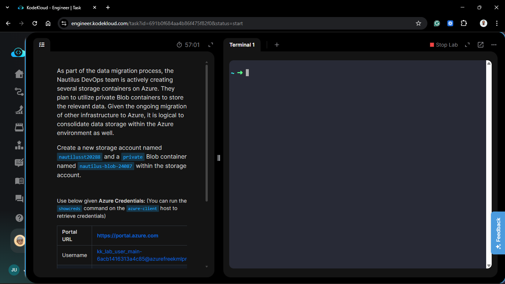
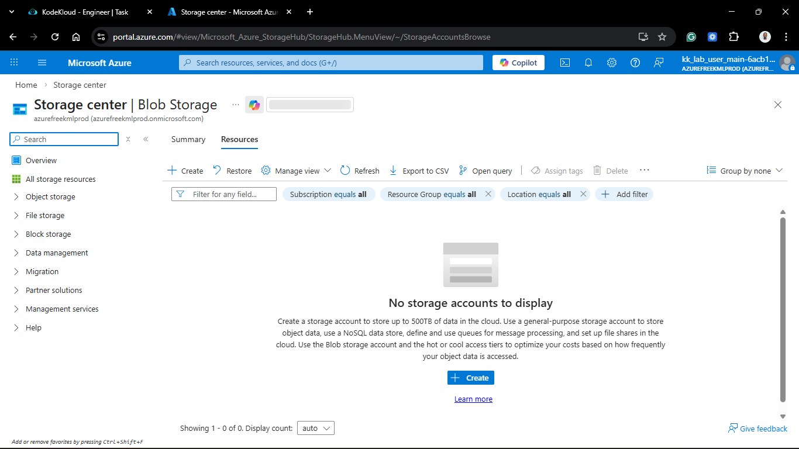
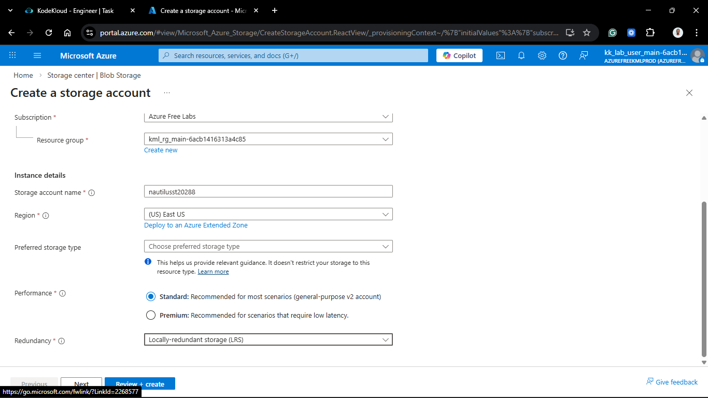
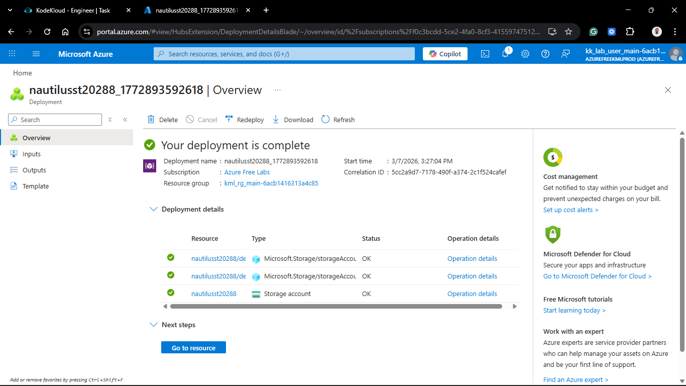
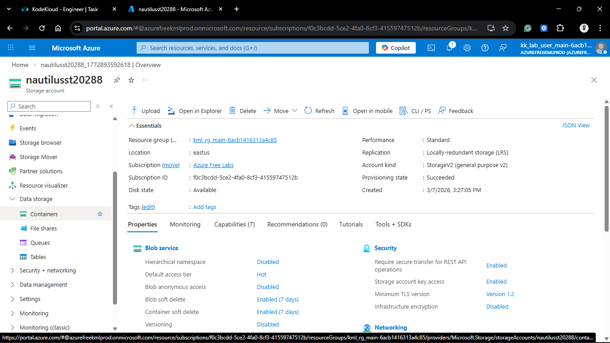
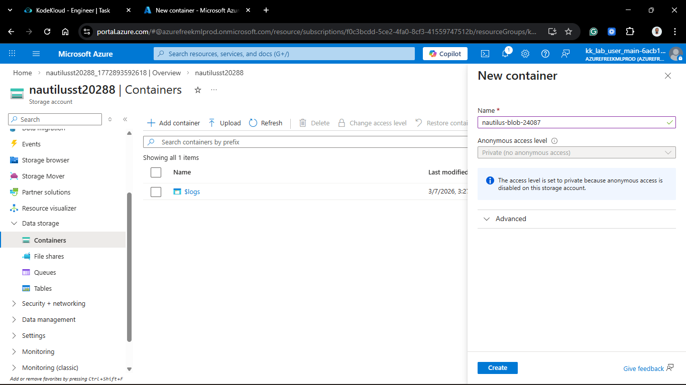
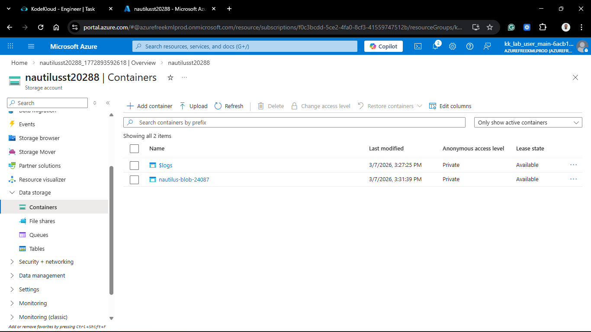
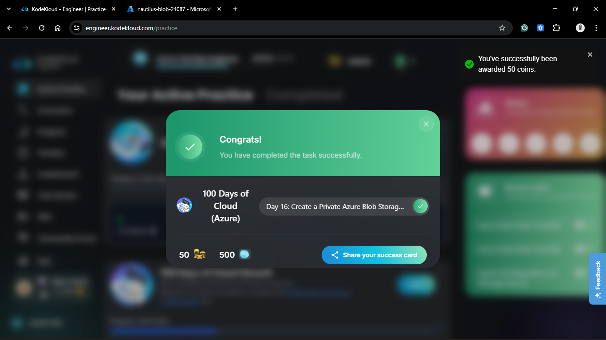

# Day 66: Create a Private Azure Blob Storage Container

## Project Description

As the Nautilus DevOps team transitions from compute and networking to data persistence, the focus has shifted to **Object Storage**. To support the migration of unstructured data (logs, backups, and application artifacts), we are provisioning an Azure Storage Account and a specialized Blob container. Security is the priority here; the container must be strictly **private** to ensure data remains isolated from the public internet.

**The Goal:**

Deploy a globally unique Storage Account named `nautilusst20288` and initialize a private Blob container named `nautilus-blob-24087` for secure data archival.

## Technical Specifications

| Requirement              | Specification                     |
| :----------------------- | :-------------------------------- |
| **Storage Account Name** | `nautilusst20288`                 |
| **Container Name**       | `nautilus-blob-24087`             |
| **Region**               | `eastus` (Matching project scope) |
| **Performance Tier**     | Standard                          |
| **Replication**          | LRS (Locally Redundant Storage)   |
| **Access Level**         | Private (no anonymous access)     |

---

## Steps & Configuration

### 1. Create the Storage Account

1. Log in to the **Azure Portal**.
2. Search for **Storage accounts** and click **+ Create**.
   

3. **Project Details:**
   - **Resource Group:** Selected `kml_rg_main-xxxxxxxxxxx`.
4. **Instance Details:**
   - **Storage account name:** `nautilusst20288` (Must be globally unique and lowercase).
   - **Region:** `East US`.
   - **Performance:** `Standard`.
   - **Redundancy:** `Locally-redundant storage (LRS)`.
     
     

5. Click **Review + create** and then **Create**.

### 2. Provision the Private Blob Container

Once the storage account was deployed:

1. Navigate to the **nautilusst20288** resource.

2. In the sidebar, under **Data storage**, select **Containers**.
   

3. Click **+ Container**.
   

4. **New Container Details:**
   - **Name:** `nautilus-blob-24087`.
   - **Public access level:** **Private (no anonymous access)**.
5. Click **Create**.
   

## Verification

1. **Account Status:** Verified `nautilusst20288` is "Online" and accessible.
2. **Container Properties:** Confirmed `nautilus-blob-24087` is listed with the "Private" access level.
3. **Security Check:** Attempted to access the container URL anonymously; verified that the request is rejected with a `403 Forbidden` error, as expected.

## 🧠 Theory: Blob Storage and Access Tiers

- **Globally Unique Naming:** Unlike VNets or VMs, Storage Account names are part of a public DNS (e.g., `nautilusst20288.blob.core.windows.net`). Therefore, the name must be unique across all of Azure, not just your subscription.
- **Private Access Level:** By setting the container to "Private," we ensure that every request to read or write data must be authenticated via an Account Key, Shared Access Signature (SAS), or Azure AD (Entra ID).
- **LRS Redundancy:** Standard_LRS provides three copies of your data within a single physical location in the primary region. It is the most cost-effective way to protect against server rack or drive failures during the initial migration phase.

