# Day 67: Create a Public Azure Blob Storage Container

## Project Description

As the Nautilus DevOps team expands its cloud footprint, the need for publicly accessible data has emerged. While private storage is the standard for sensitive logs and backups, certain application assets—such as static website images, public documentation, or software binaries—require **Anonymous Read Access**. Today's task involves provisioning a Storage Account and a Blob container specifically configured to allow external users to view data without authentication.

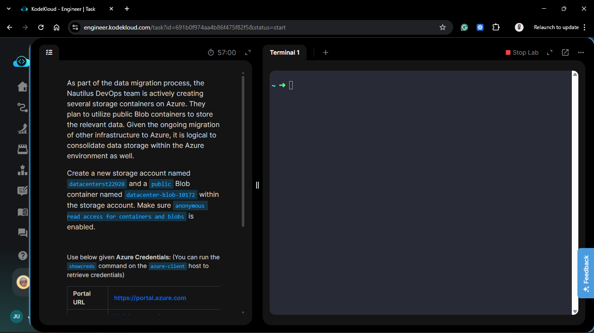

**The Goal:**

Provision a globally unique Storage Account named `datacenterst22928` and a Blob container named `datacenter-blob-10172` with public access enabled for seamless data distribution.

## Technical Specifications

| Requirement              | Specification                                              |
| :----------------------- | :--------------------------------------------------------- |
| **Storage Account Name** | `datacenterst22928`                                        |
| **Container Name**       | `datacenter-blob-10172`                                    |
| **Region**               | `eastus` (Matching project scope)                          |
| **Public Access Level**  | Container (Anonymous read access for containers and blobs) |
| **Replication**          | LRS (Locally Redundant Storage)                            |

---

## Steps & Configuration

### 1. Create the Storage Account with Public Access Enabled

1. Log in to the **Azure Portal**.
2. Search for **Storage accounts** and click **+ Create**.
   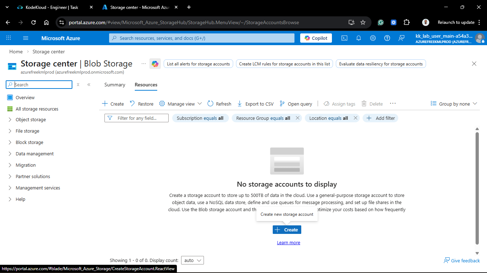
3. **Project Details:**
   - **Resource Group:** Selected `kml_rg_main-xxxxxxxxxxxxxxx`.
4. **Instance Details:**
   - **Storage account name:** `datacenterst22928` (Globally unique).
   - **Region:** `East US`.
     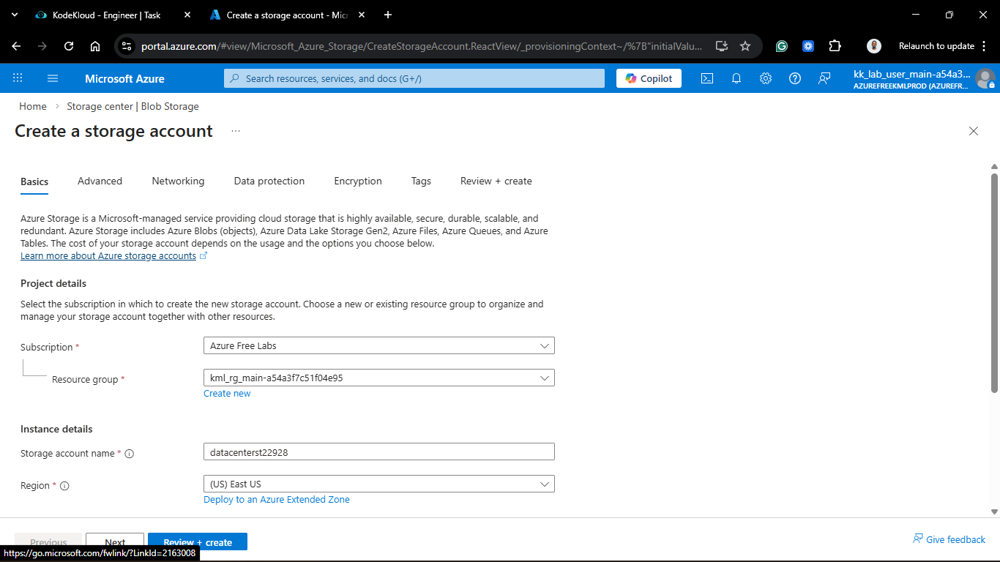

5. **Advanced Tab (Crucial Step):**
   - Ensured **"Allow anonymous access for individual container"** is checked/enabled. Without this setting at the account level, individual containers cannot be made public.
     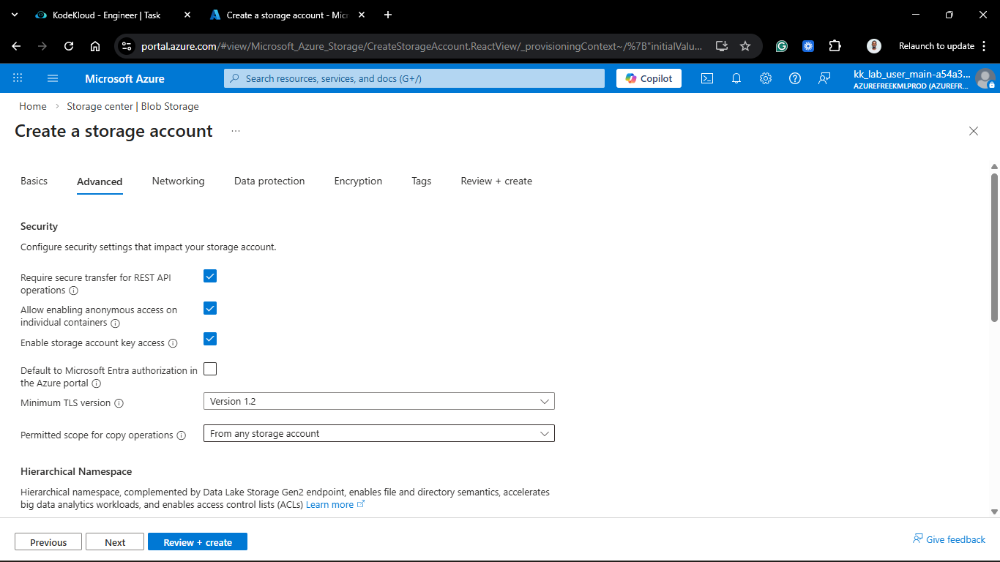

6. Click **Review + create** and then **Create**.
   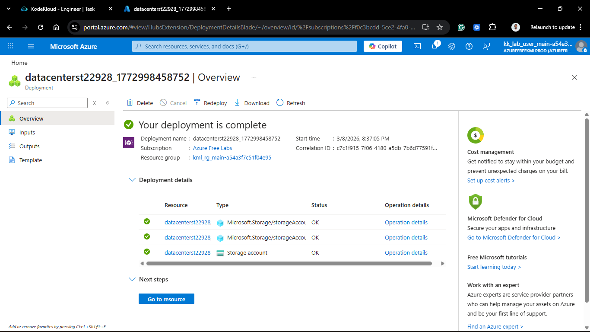

### 2. Provision the Public Blob Container

Once the account was ready:

1. Navigate to the **datacenterst22928** resource.
2. Under **Data storage**, select **Containers**.
3. Click **+ Container**.
4. **New Container Details:**
   _**Name:** `datacenter-blob-10172`.
   _ **Anonymous access level:** Selected **Container (anonymous read access for containers and blobs)**.
   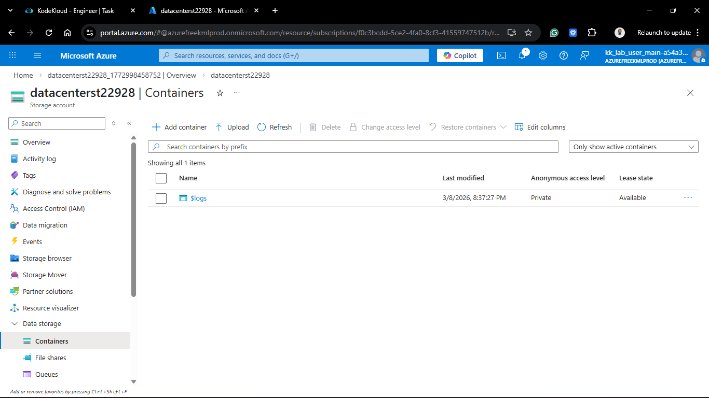
   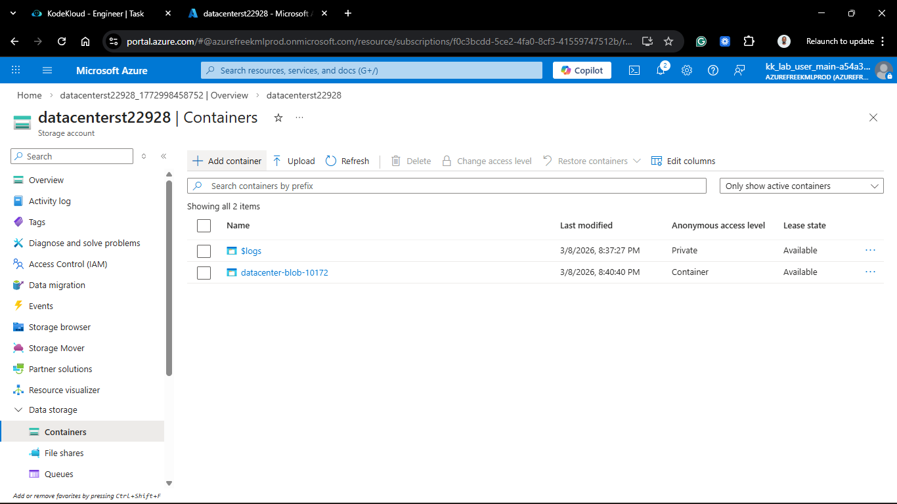

5. Click **Create**.

---

## Verification

1. **External Access Test:** _Uploaded a test file (e.g., `image.png`).
   _ Copied the **URL** of the blob (e.g., `https://datacenterst22928.blob.core.windows.net/datacenter-blob-10172/image.png`). \* Opened the URL in an Incognito/Private browser window.
   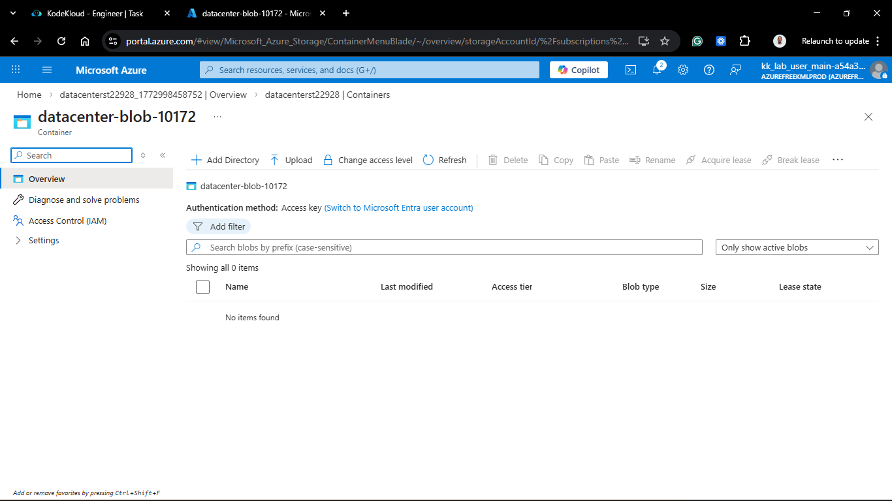
   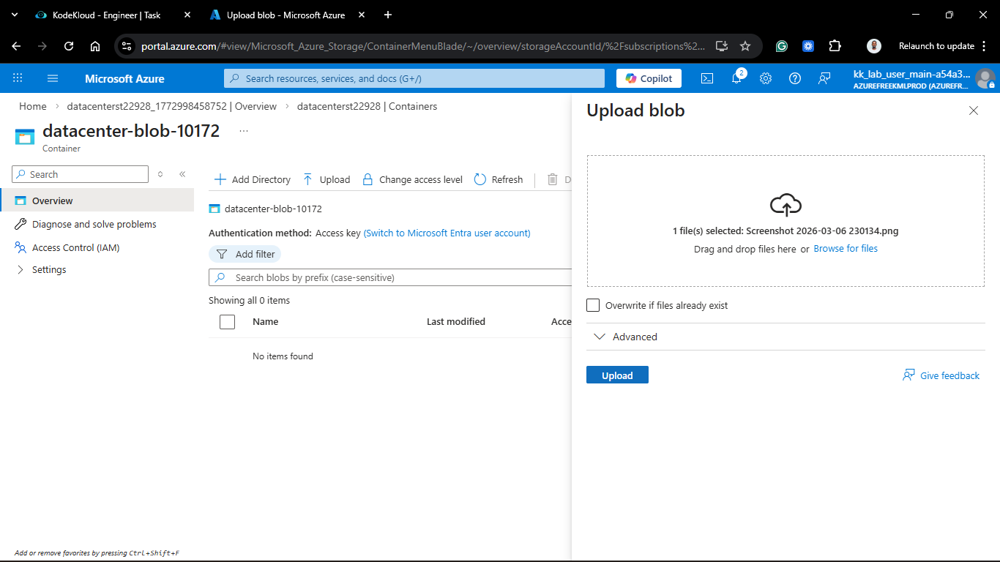
   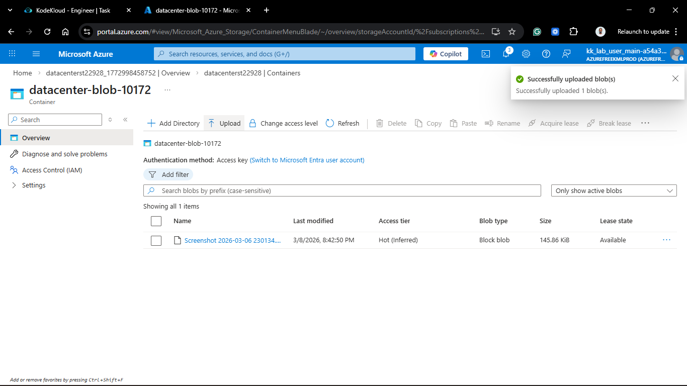
   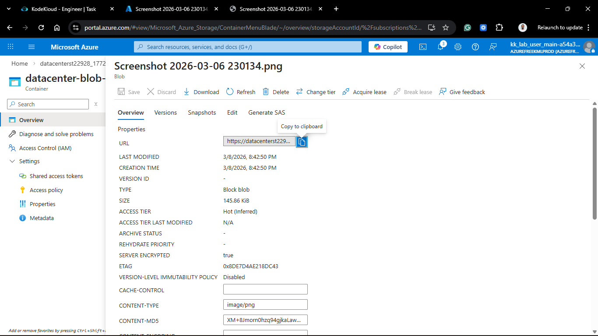

2. **Result:** The file loaded successfully without requiring a login or a Shared Access Signature (SAS) token.
   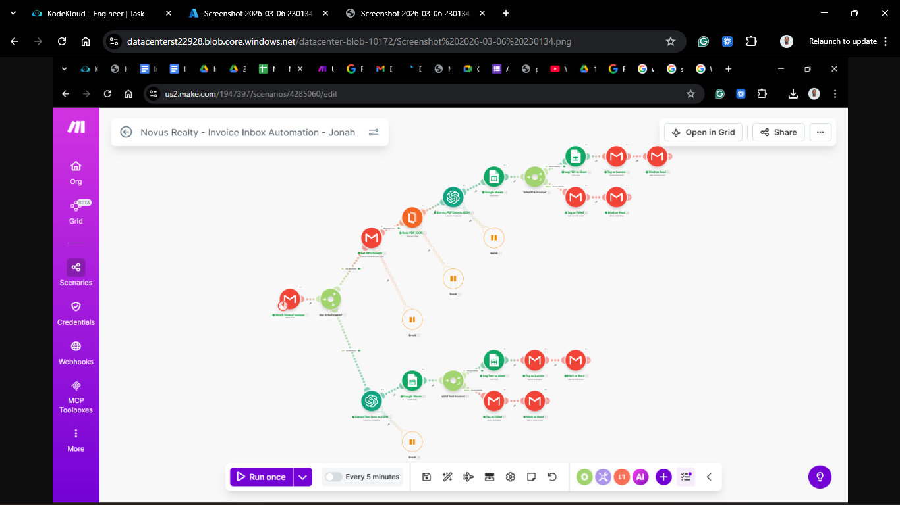

## 🧠 Theory: Public vs. Private Storage

- **Account-Level Override:** Azure recently started disabling public access by default at the storage account level for security. To create a public container, you must first toggle the "Allow Blob anonymous access" setting in the **Configuration** blade of the storage account.
- **Access Scopes:**
  - **Private:** No anonymous access.
  - **Blob:** Anonymous read access for blobs only.
  - **Container:** Anonymous read and list access for the entire container.
- **Use Case:** This configuration is ideal for CDN (Content Delivery Network) origins or public-facing documentation where ease of access outweighs the need for strict authentication.

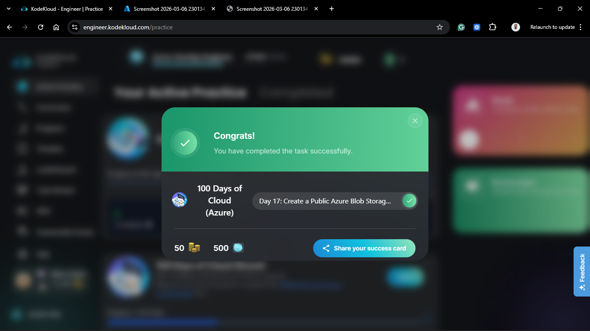
