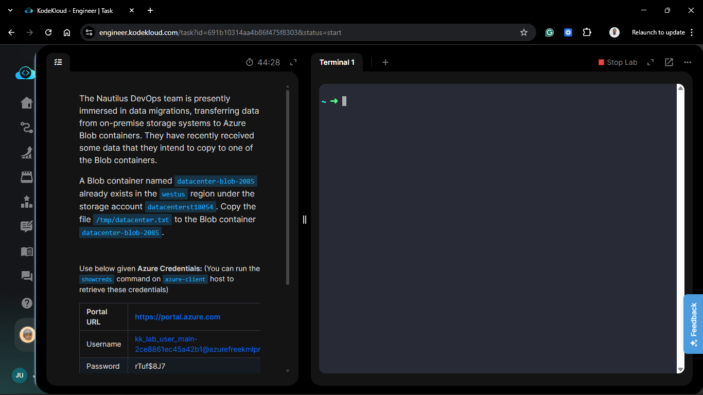
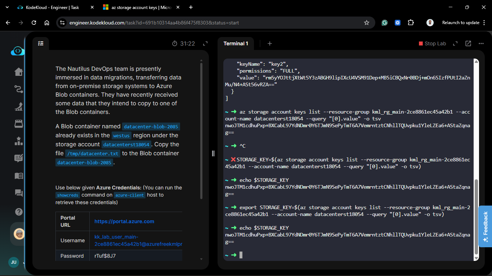
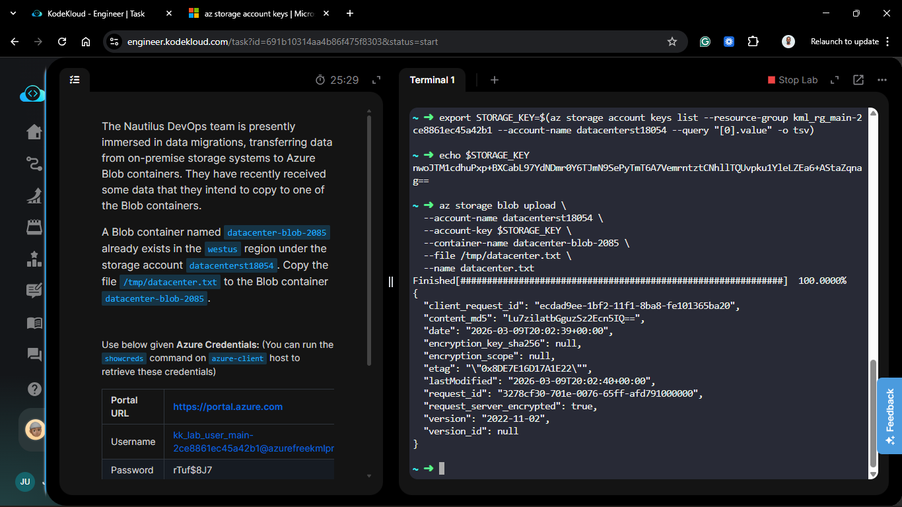
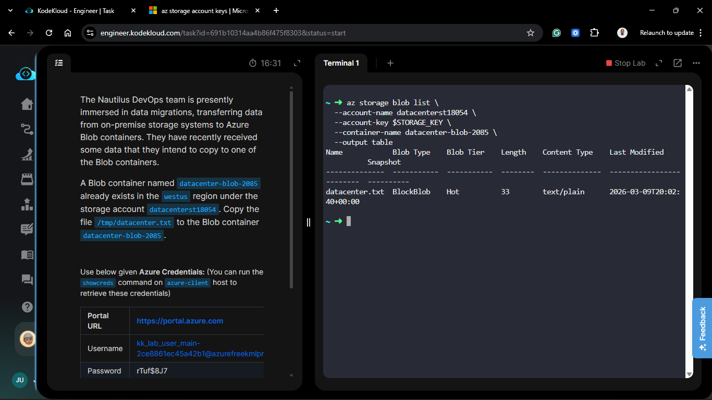
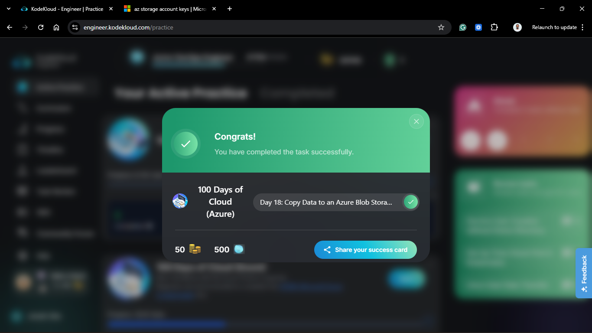

# Day 68: Copy Data to an Azure Blob Storage Container

## Project Description

With the storage infrastructure provisioned, the Nautilus DevOps team is executing the physical data migration phase. Moving data from local/on-premise environments to the cloud is a critical step in decommissioning legacy hardware. This task focuses on utilizing the **Azure CLI** to upload a specific data artifact (`datacenter.txt`) from a local temporary directory to a regional Blob container.



**The Goal:**

Successfully migrate the local file `/tmp/datacenter.txt` to the existing `datacenter-blob-2085` container within the `datacenterst18054` storage account in the `westus` region.

## Technical Specifications

| Requirement | Specification |
| :--- | :--- |
| **Storage Account** | `datacenterst18054` |
| **Container Name** | `datacenter-blob-2085` |
| **Source File** | `/tmp/datacenter.txt` |
| **Destination Blob** | `datacenter.txt` |
| **Region** | `westus` |

---

## Steps & Configuration (Azure CLI)

### 1. Authenticate and Retrieve Access Key

To perform data operations via CLI, we need the storage account's access key. This ensures the upload is authorized.

```bash
# Retrieve the primary access key
export STORAGE_KEY=$(az storage account keys list --resource-group kml_rg_main-2
ce8861ec45a42b1 --account-name datacenterst18054 --query "[0].value" -o tsv)

echo $STORAGE_KEY
```



### 2. Execute the Data Copy (Upload)

Using the `az storage blob upload` command, I transferred the file from the local `/tmp` directory to the target Azure container.

```bash
az storage blob upload \
  --account-name datacenterst18054 \
  --account-key $STORAGE_KEY \
  --container-name datacenter-blob-2085 \
  --file /tmp/datacenter.txt \
  --name datacenter.txt
```



### 3. Verify the Blob Existence

I confirmed the file was successfully received by listing the blobs within the container.

```bash
az storage blob list \
  --account-name datacenterst18054 \
  --account-key $STORAGE_KEY \
  --container-name datacenter-blob-2085 \
  --output table
```



## 🧠 Theory: Data Plane vs. Control Plane

- **Control Plane:** Creating the storage account or container (performed on Day 16/17) is a "Control Plane" operation managed via Azure Resource Manager (ARM).

- **Data Plane:** Uploading or downloading files is a "Data Plane" operation. This interacts directly with the storage service's specific endpoints.

- **AzCopy vs. CLI:** For single files like datacenter.txt, the Azure CLI is fast and convenient. For massive data migrations involving terabytes of data, AzCopy is the preferred tool as it handles concurrency and resumable transfers more efficiently.

- **Storage Keys:** Access keys provide full administrative access to the data plane. In production environments, it is safer to use Shared Access Signatures (SAS) or Azure AD/Entra ID roles to grant time-limited or identity-based access.


