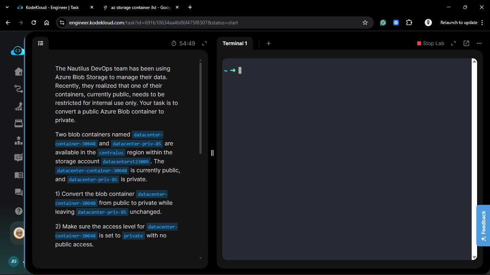
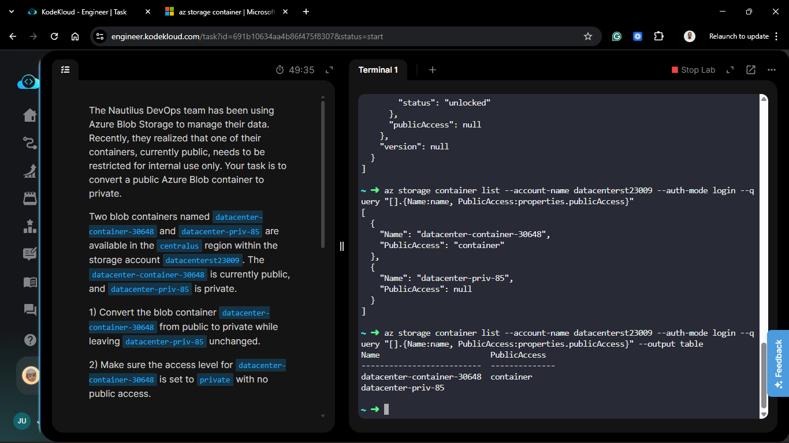
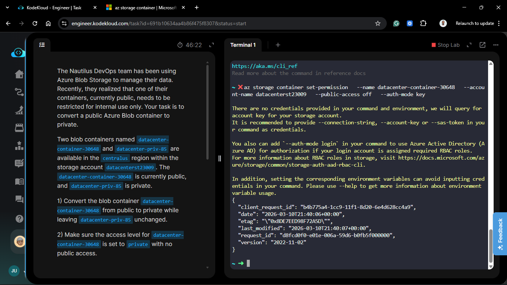
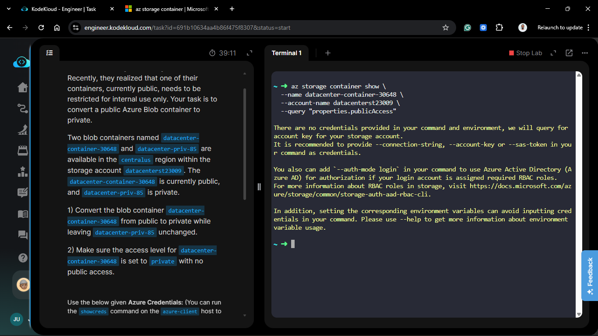
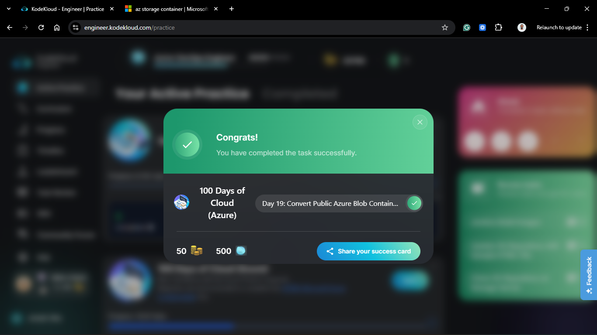

# Day 69: Convert Public Azure Blob Container to Private

## Project Description

As the Nautilus DevOps migration matures, security audits are becoming a regular part of the workflow. During a recent review, the team identified a potential data exposure risk: the `datacenter-container-30648` was configured with public access, but it contained internal-only data. Today's task involves **Security Hardening** by restricting this container to a private access level, ensuring that all data within it requires explicit authentication.



**The Goal:**

Modify the access policy of `datacenter-container-30648` from Public to **Private** within the `datacenterst23009` storage account, while maintaining the existing private state of `datacenter-priv-85`.

## Technical Specifications

| Requirement             | Specification                             |
| :---------------------- | :---------------------------------------- |
| **Storage Account**     | `datacenterst23009`                       |
| **Target Container**    | `datacenter-container-30648`              |
| **Action**              | Change Public Access Level to **Private** |
| **Untouched Container** | `datacenter-priv-85` (Already Private)    |
| **Region**              | `centralus`                               |

---

## Steps & Configuration (Azure CLI)

### 1. Identify Current Access Levels

Before making changes, I verified the current public access settings for all containers in the storage account.

```bash
az storage container list --account-name datacenterst23009 --auth-mode login --query "[].{Name:name, PublicAccess:properties.publicAccess}" --output table
```



### 2. Update Access Level to Private

I executed the `az storage container set-permission` command to strip the anonymous read access from the target container. Setting the `--public-access` parameter to `off` effectively makes the container private.

```bash
az storage container set-permission --name datacenter-container-30648 --account-name datacenterst23009 --public-access off --auth-mode key
```



### 3. Verification of Results

I ran the list command again to ensure the change was applied correctly without affecting the other private container.

```bash
az storage container show \
 --name datacenter-container-30648 \
 --account-name datacenterst23009 \
 --query "properties.publicAccess"

# Result should be null or 'off'
```



## 🧠 Theory: Public Access Levels vs. Account Settings

Azure Blob Storage offers three levels of public access for containers:

- **Off (Private):** No anonymous access. This is the most secure setting and is recommended for sensitive data.
- **Blob:** Allows anonymous read access to blobs within the container, but not to the container itself.
- **Container:** Allows anonymous read and list access to the entire container, including all blobs.

The choice of access level should align with the intended use case:

- **Private (Off):** Best for internal applications, sensitive data, or when access should be tightly controlled.
- **Blob:** Suitable for scenarios where individual blobs need to be shared publicly without exposing the entire container.
- **Container:** Ideal for public-facing content where ease of access is a priority, such as hosting static websites or public documentation.


