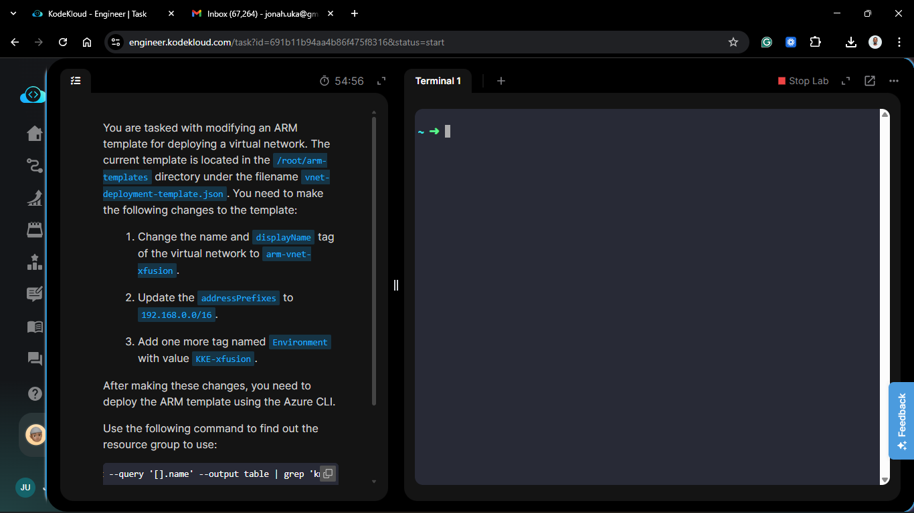
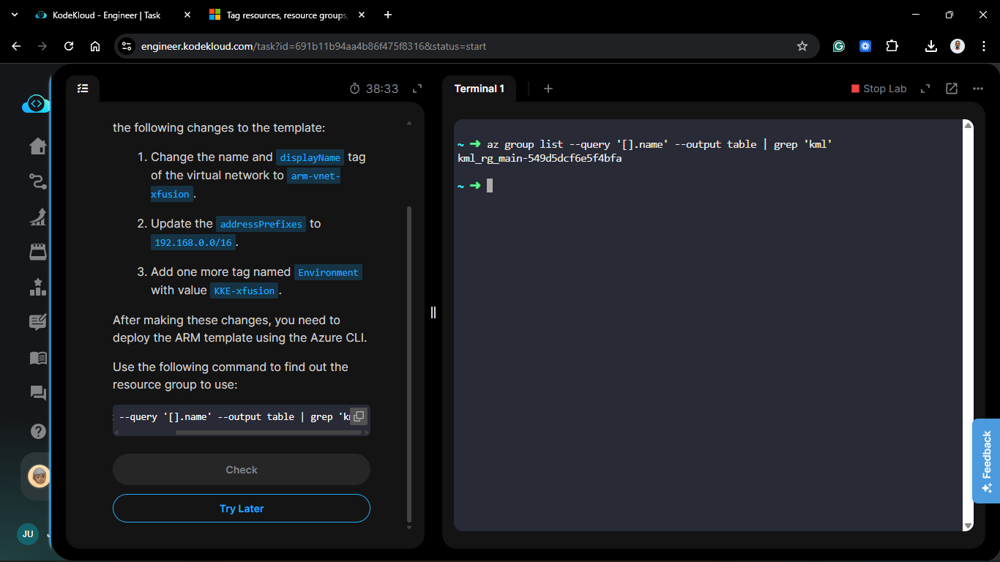
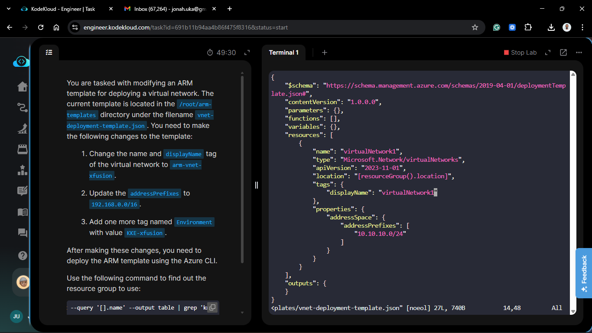
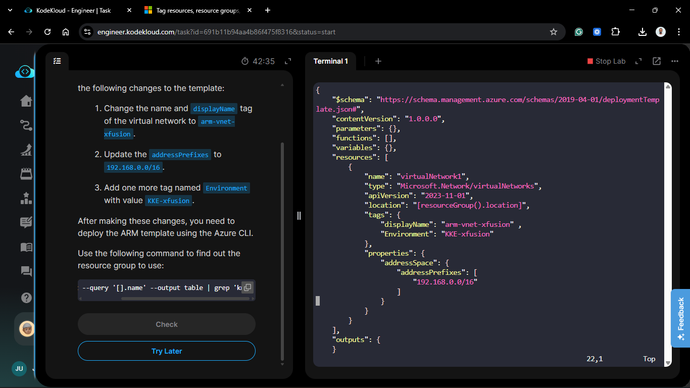
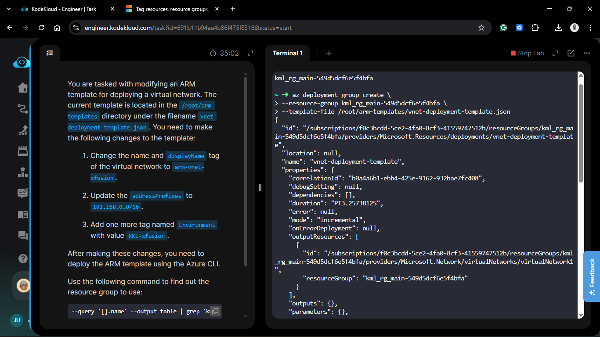

# Day 70: Deploy Azure Resources Using ARM Template

## Project Description

As the Nautilus DevOps team scales the Azure migration, manual resource creation is being replaced by **Infrastructure as Code (IaC)**. Today's task involves modifying and deploying an **Azure Resource Manager (ARM) Template**. By moving from CLI commands to declarative templates, we ensure that our networking environment—the foundation of our migration—is version-controlled, repeatable, and consistent across environments.



**The Goal:**

Update an existing JSON template to reflect new naming conventions and IP address schemas, then deploy the `arm-vnet-xfusion` Virtual Network into the designated resource group.

## Technical Specifications

| Requirement | Specification |
| :--- | :--- |
| **VNet Name** | `arm-vnet-xfusion` |
| **Display Name Tag** | `arm-vnet-xfusion` |
| **Address Space** | `192.168.0.0/16` |
| **Environment Tag** | `KKE-xfusion` |
| **Template File** | `/root/arm-templates/vnet-deployment-template.json` |

---

## Steps & Configuration

### 1. Identify the Target Resource Group

Before deployment, I identified the specific lab-assigned resource group using the provided filter:

```bash
az group list --query '[].name' --output table | grep 'kml'
# Output: kml_rg_main-xxxxxxxxxxxxxx
```



### 2. Modify the ARM Template

I edited the `vnet-deployment-template.json` file to update the resource definition according to the project specifications.

```json
{
    "$schema": "<https://schema.management.azure.com/schemas/2019-04-01/deploymentTemplate.json#>",
    "contentVersion": "1.0.0.0",
    "parameters": {},
    "functions": [],
    "variables": {},
    "resources": [
        {
            "name": "arm-vnet-xfusion",
            "type": "Microsoft.Network/virtualNetworks",
            "apiVersion": "2023-11-01",
            "location": "[resourceGroup().location]",
            "tags": {
                "displayName": "arm-vnet-xfusion" ,
                "Environment": "KKE-xfusion"
            },
            "properties": {
                "addressSpace": {
                    "addressPrefixes": [
                        "192.168.0.0/16"
                    ]
                }
            }
        }
    ],
    "outputs": {
    }
}
```




### 3. Deploy the Template via Azure CLI

Using the `az deployment group create` command, I submitted the modified template to the Azure Resource Manager (ARM) for provisioning.

```bash
az deployment group create \
  --resource-group <IDENTIFIED_KML_RG> \
  --template-file /root/arm-templates/vnet-deployment-template.json
```



## 🧠 Theory: Declarative Infrastructure with ARM

- **Declarative vs. Imperative:** While CLI commands are imperative (telling Azure how to build), ARM templates are declarative (telling Azure what the final state should look like). If the VNet already exists, Azure will simply update its properties to match the template.

- **JSON Structure:** ARM templates consist of `parameters`, `variables`, and `resources`. By modifying the `resources` section, we define the exact geometry of our network.

- **Idempotency:** One of the biggest advantages of ARM is idempotency. You can run the same template deployment multiple times, and if no changes are detected, Azure will take no action, preventing configuration drift.
