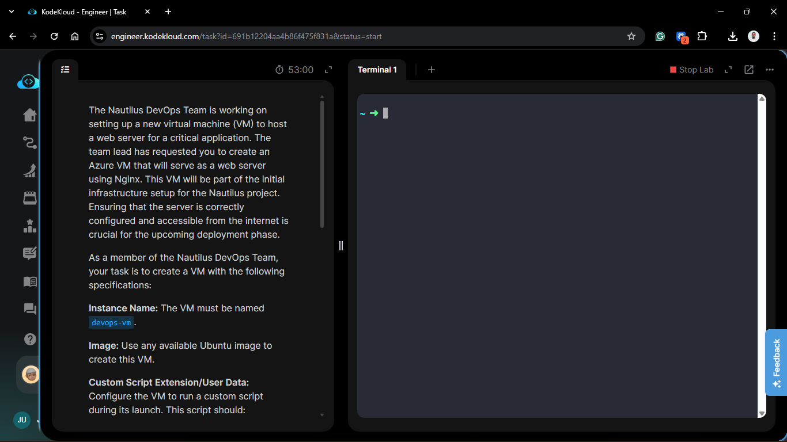
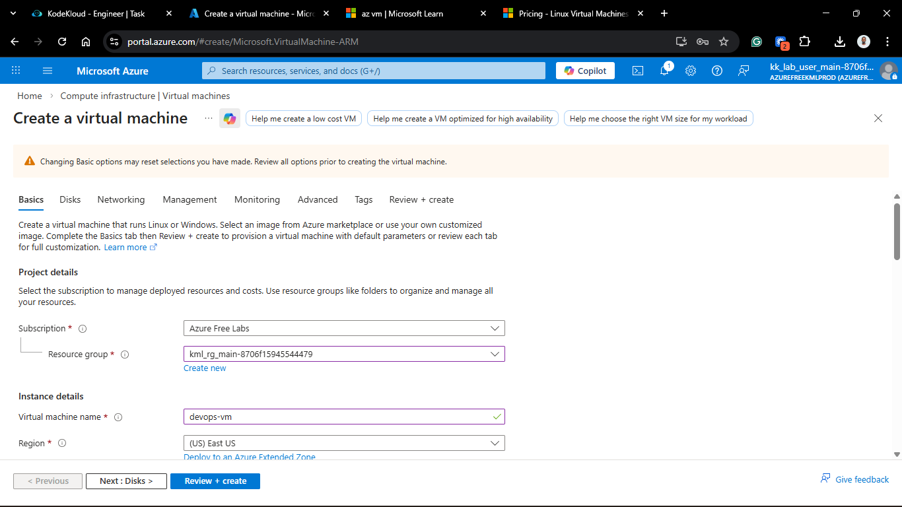
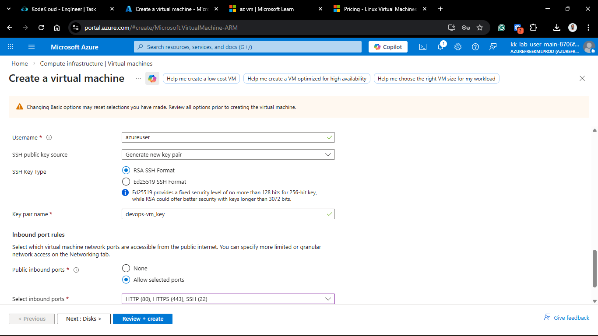
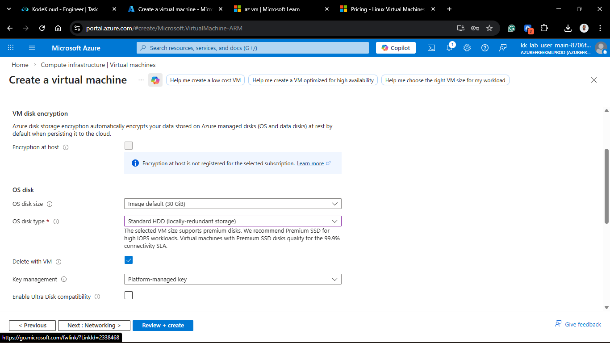
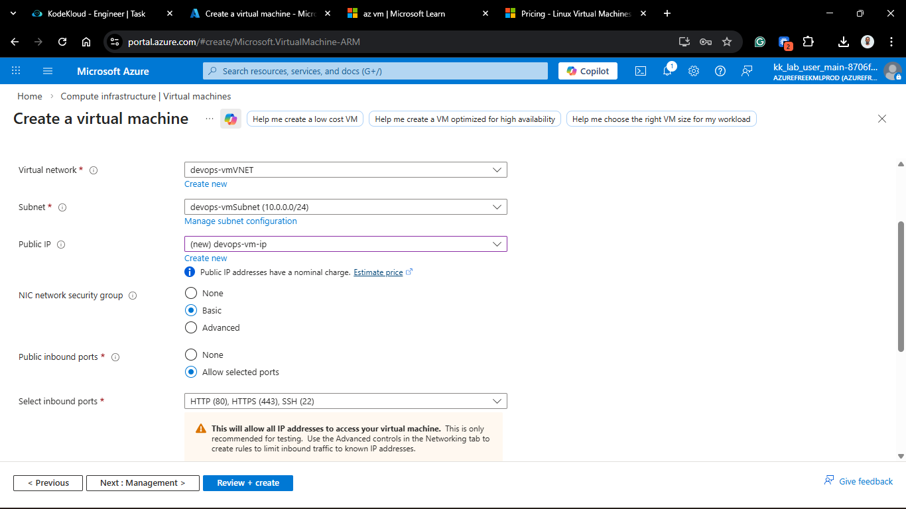
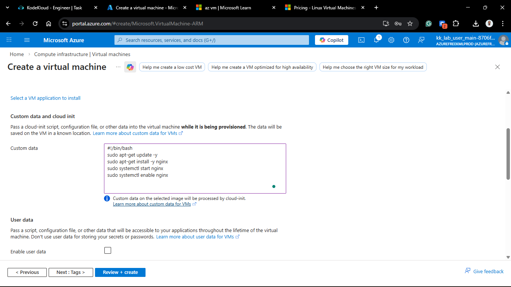
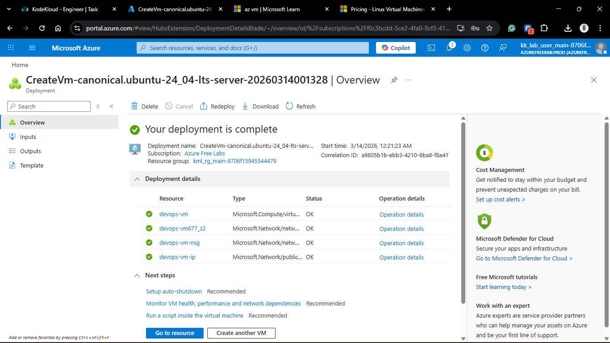
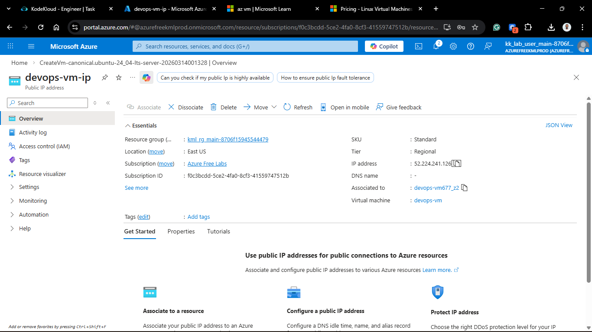
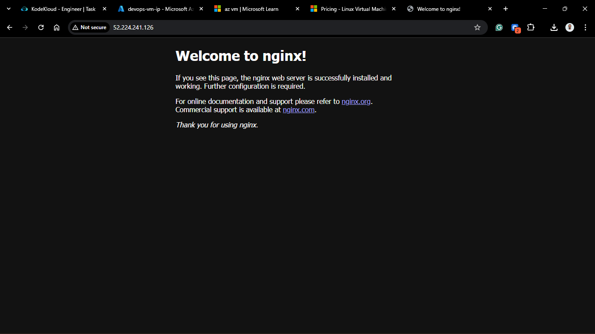

# Day 72: Configuring Instances with User Data

## Project Description

To accelerate the Nautilus project's deployment phase, the DevOps team is moving toward **Bootstrapping**. Instead of manually installing software after a VM is created, we now utilize **User Data** (Cloud-Init) to automate the configuration during the initial launch. Today's task involves provisioning a web server via the **Azure Portal** that self-configures with Nginx and is immediately accessible to the internet.



**The Goal:**

Deploy an Ubuntu VM named `devops-vm`, inject a bootstrap script via the "Advanced" settings tab to install and start Nginx, and configure the Network Security Group (NSG) to allow public HTTP traffic.

## Technical Specifications

| Requirement         | Specification          |
| :------------------ | :--------------------- |
| **Instance Name**   | `devops-vm`            |
| **Image**           | Ubuntu 22.04 LTS       |
| **Automation Tool** | User Data (Cloud-Init) |
| **Service**         | Nginx                  |
| **Port Security**   | Port 80 (HTTP)         |

---

## Steps & Configuration (Azure Portal)

### 1. Basics Configuration

1. Log in to the **Azure Portal**.
2. Navigate to **Virtual Machines** > **+ Create**.
3. **Project Details:** Selected the existing resource group.
4. **Instance Details:**
   - **VM Name:** `devops-vm`.
   - **Region:** `East US`.
   - **Image:** `Ubuntu Server 22.04 LTS`.
   - **Size:** `Standard_B1s`.
5. **Administrator Account:** Configured SSH public key access.




### 2. Networking Configuration (Allow HTTP)

1. Navigate to the **Networking** tab.
2. **NIC network security group:** Basic.
3. **Public inbound ports:** Allow selected ports.
4. **Select inbound ports:** Added **HTTP (80)** to the existing SSH (22) default.


### 3. Advanced Configuration (The Bootstrap)

1. Navigate to the **Advanced** tab.
2. Scroll down to the **User data** section.
3. Check the box **Enable user data**.
4. Paste the following script into the **User data** field:

```bash
#!/bin/bash
sudo apt-get update -y
sudo apt-get install -y nginx
sudo systemctl start nginx
sudo systemctl enable nginx
```



### 4. Review + Create

1. Click Review + create.

2. Verify the summary and click Create.

## Verification

1. **Deployment State:** Confirmed the VM reached the "Running" state.

2. **Service Validation:** \* Copied the Public IP address from the VM Overview page.
   - Opened a new browser tab and entered: `http://<VM_PUBLIC_IP>`.
  
  

3. **Result:** The "Welcome to nginx!" page was displayed instantly, confirming the User Data script executed during the first boot.

## 🧠 Theory: Cloud-Init and the Advanced Tab

- **Cloud-Init:** This is the industry-standard method for cross-platform cloud instance initialization. It identifies the User Data passed by Azure and executes it as the final stage of the provisioning process.

- **Why Port 80?** By default, Azure blocks all inbound traffic. By toggling "HTTP" in the Networking tab, we created a high-priority rule in the Network Security Group to allow world-wide access to our web service.

- **Ephemeral Automation:** User Data is ideal for installing "static" foundations (like Nginx). For dynamic, ongoing changes, we would typically layer on a configuration management tool like Ansible.


