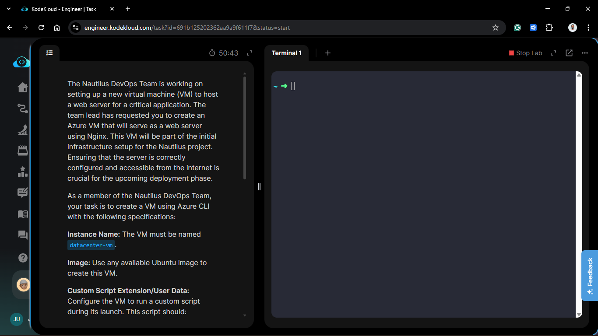
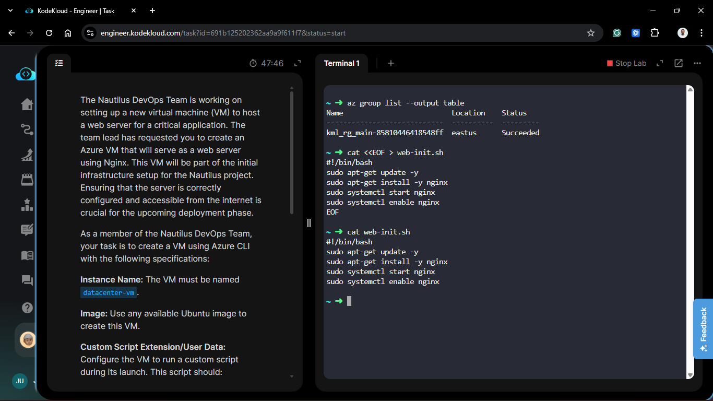
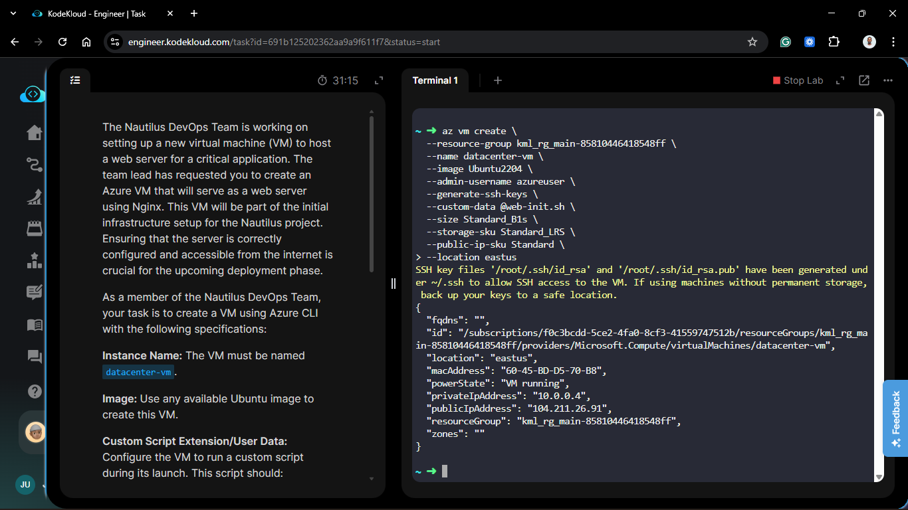
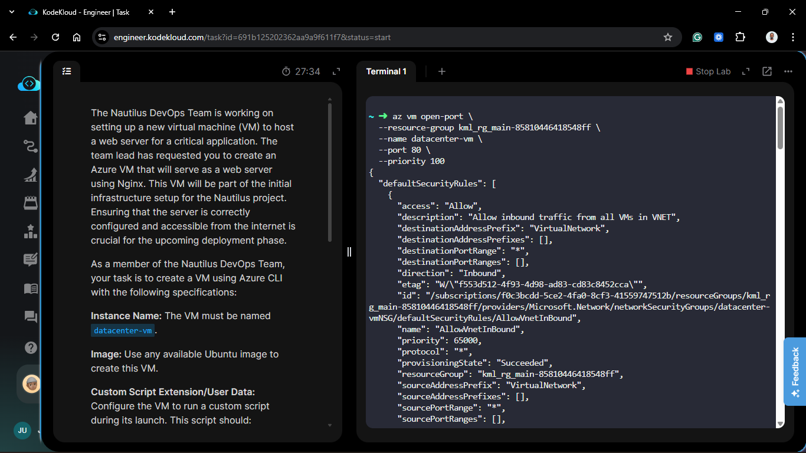
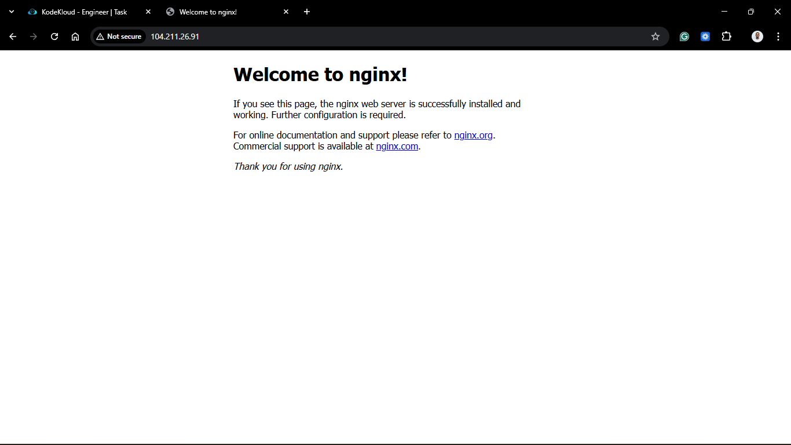

# Day 73: Automating User Data Configuration Using the CLI

## Project Description

As the Nautilus DevOps team standardizes its deployment workflows, the move from the Azure Portal to the **Azure CLI** is essential for scripting and CI/CD integration. Today's task involves the end-to-end automation of a web server provisioning process. By passing a local configuration script directly through the CLI, we eliminate manual console steps and ensure that our `datacenter-vm` is production-ready the moment it enters the "Running" state.



**The Goal:**

Provision an Ubuntu VM named `datacenter-vm` in the **East US** region, inject a bootstrap script via the CLI to install Nginx, and programmatically open the network perimeter for HTTP traffic.

## Technical Specifications

| Requirement | Specification |
| :--- | :--- |
| **Instance Name** | `datacenter-vm` |
| **Region** | `eastus` |
| **Image** | `Ubuntu2204` |
| **Automation Tool** | User Data / Cloud-Init (`--custom-data`) |
| **Network Port** | 80 (HTTP) |

---

## Steps & Configuration (Azure CLI)

### 1. Create the Bootstrap Script

I created a local file named `web-init.sh` to handle the Nginx installation and service management.

```bash
cat <<EOF > web-init.sh
#!/bin/bash
sudo apt-get update -y
sudo apt-get install -y nginx
sudo systemctl start nginx
sudo systemctl enable nginx
EOF
```



### 2. Deploy VM with User Data

Using the `az vm create` command, I referenced the local script. The `@` symbol is critical here as it tells the CLI to read the contents of the file and pass it as the `custom-data` payload.

```bash
az vm create \
  --resource-group kml_rg_main-xxxxxxxxxx \
  --name datacenter-vm \
  --location eastus \
  --image Ubuntu2204 \
  --admin-username azureuser \
  --generate-ssh-keys \
  --custom-data @web-init.sh \
  --public-ip-sku Standard
  --size Standard_B1s \
  --storage-sku Standard_LRS
```



### 3. Open Port 80 via CLI

To ensure the web server is reachable, I added an inbound security rule to allow HTTP traffic.

```bash
az vm open-port \
  --resource-group kml_rg_main-xxxxxxxxxxxx \
  --name datacenter-vm \
  --port 80 \
  --priority 100
```



## Verification

1. **Deployment Check**: Confirmed `provisioningState: Succeeded`.

2. **End-to-End Test**: Go to the VM's public IP address in a web browser: `http://<VM_PUBLIC_IP>`.

3. **Result**: You should see the default Nginx welcome page, confirming that the User Data script executed successfully during the first boot.

## 🧠 Theory: CLI Custom-Data and Script Encoding

- **The `@` Operator**: In the Azure CLI, using @filename ensures the file is read and correctly Base64 encoded before being sent to the Azure Resource Manager (ARM). Azure's internal agents then decode and execute this as the root user during the first boot.

- **Idempotent Network Rules**: Using `az vm open-port` is a simplified wrapper for creating an NSG rule. If a rule for port 80 already exists, the CLI handles the conflict gracefully, ensuring our "Security as Code" remains stable.

- **Boot Order**: User Data scripts run late in the boot process. While the VM might show as "Running" in the CLI, the Nginx installation may take an additional 30-60 seconds to complete.


