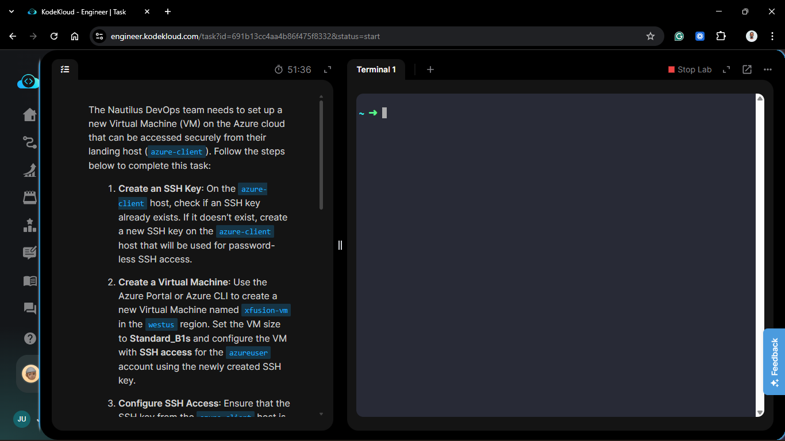
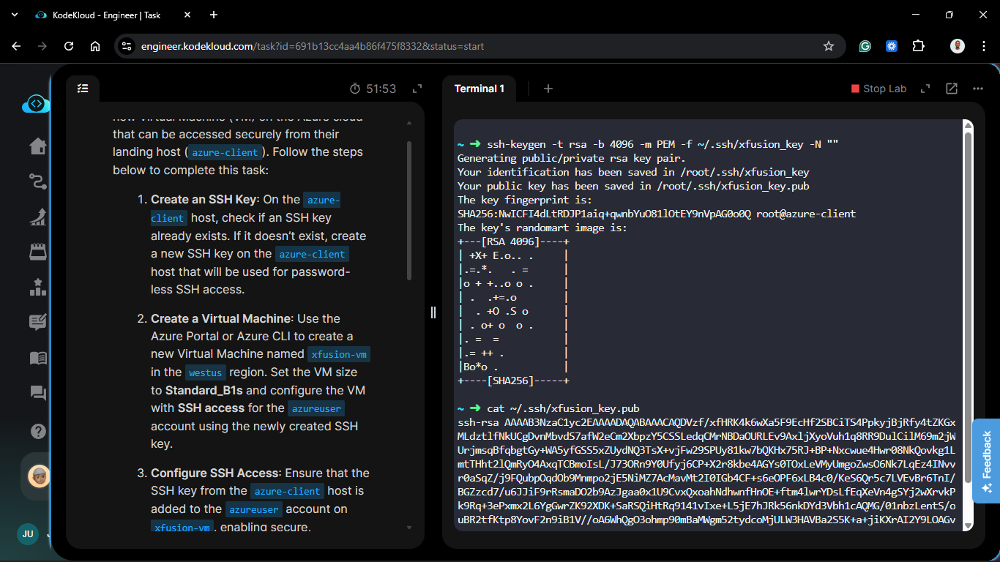
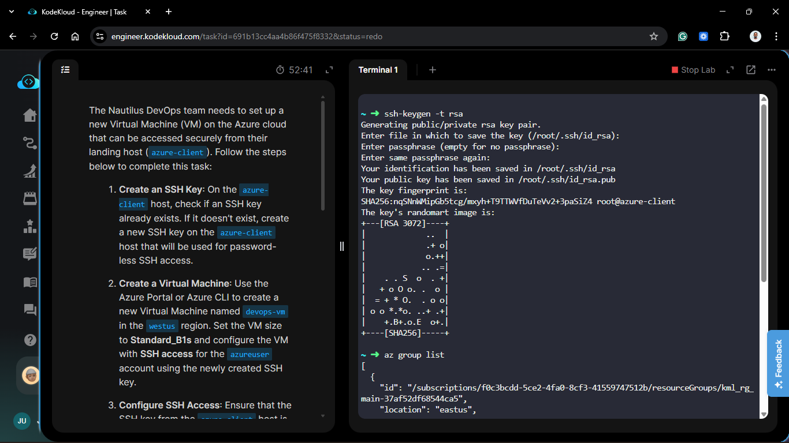
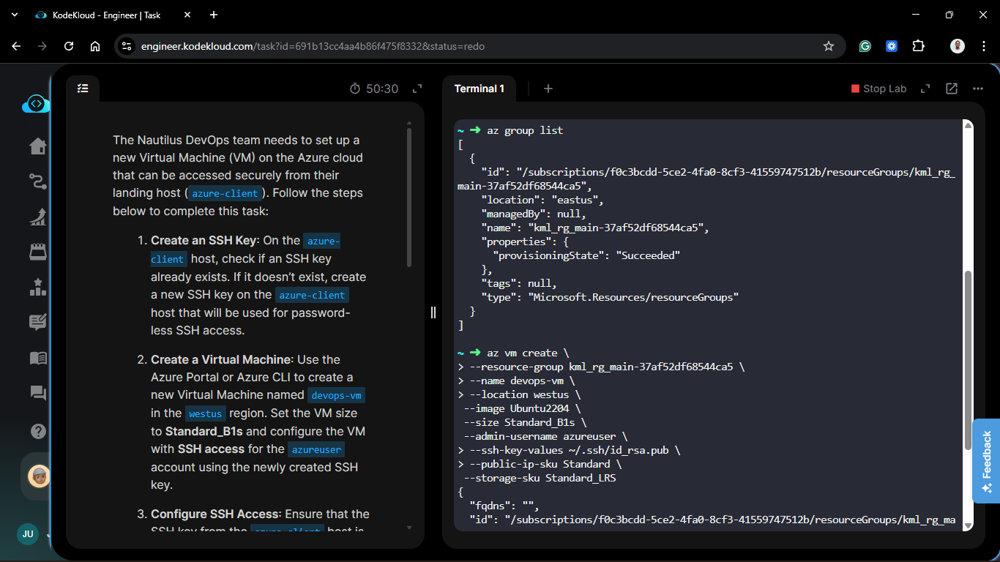
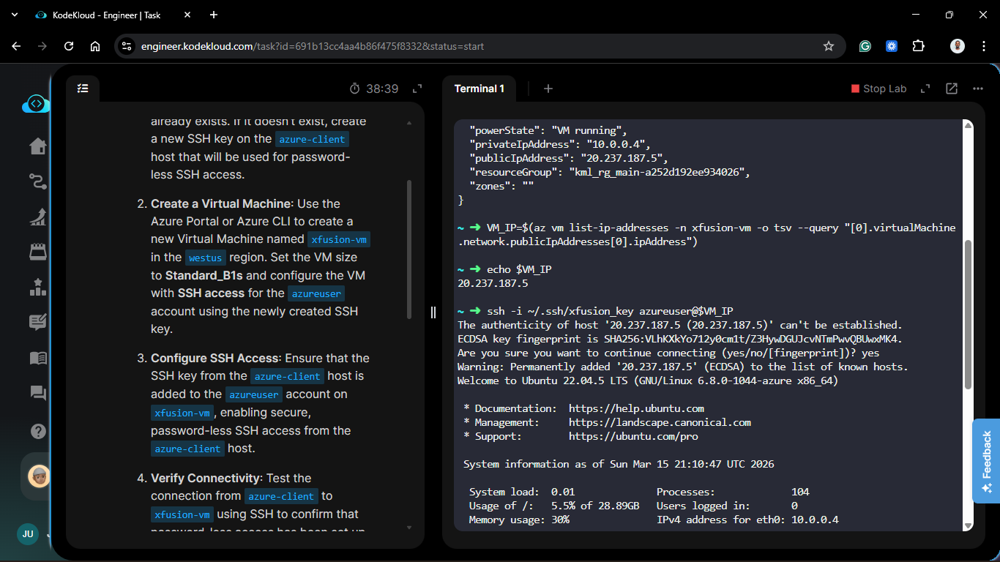
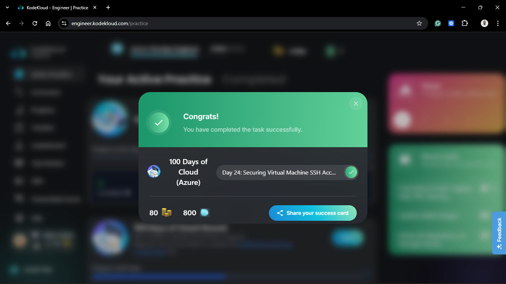

# Day 74: Securing Virtual Machine SSH Access

## Project Description

As the Nautilus DevOps team standardizes secure access across the Azure cloud, establishing a "Chain of Trust" between management hosts and target workloads is a top priority. Today's task involves provisioning the `devops-vm` in the **West US** region with strictly enforced key-based authentication. By generating a fresh key pair on our `azure-client` host and injecting it during the VM's birth, we eliminate the risks associated with passwords and ensure seamless, automated management.



<!--  -->
**The Goal:**

Provision a `Standard_B1s` Ubuntu VM named `devops-vm`, configure it for password-less SSH access using a new RSA key pair, and verify the secure handshake from the landing host.

## Technical Specifications

| Requirement | Specification |
| :--- | :--- |
| **Instance Name** | `devops-vm` |
| **Region** | `westus` |
| **VM Size** | `Standard_B1s` |
| **Admin User** | `azureuser` |
| **Auth Method** | SSH Public Key (RSA 4096) |

---

## Steps & Configuration (CLI Workflow)

### 1. Key Generation on Azure-Client

I first checked for existing keys on the landing host. Since none were present for this specific project, I generated a new 4096-bit RSA key pair.

```bash
# Generate the key pair
ssh-keygen -t rsa
```



### 2. Create the Virtual Machine

Using the `az vm create` command, I provisioned the instance. By passing the public key file directly, Azure automatically configures the `authorized_keys` file for the `azureuser` during provisioning.

```bash
az vm create \
    --resource-group kml_rg_main-37af52df68544ca5 \
    --name devops-vm \
    --location westus \
    --image Ubuntu2204 \
    --size Standard_B1s \
    --admin-username azureuser \
    --ssh-key-values ~/.ssh/id_rsa.pub \
    --public-ip-sku Standard \
    --storage-sku Standard_LRS
```



### 3. Verification of Connectivity

I retrieved the Public IP address and performed the first SSH handshake to verify the "Password-less" requirement.

```bash
# Retrieve the Public IP

VM_IP=$(az vm list-ip-addresses -n devops-vm -o tsv --query "[0].virtualMachine.network.publicIpAddresses[0].ipAddress")

# SSH into the VM using the private key

ssh azureuser@$VM_IP
```

<!--  -->

## Verification

Deployment State: Confirmed the VM is "Running" and the provisioning state is "Succeeded."

SSH Handshake: Successfully accessed the azureuser shell without being prompted for a password.

## 🧠 Theory: The Chain of Trust

- **Public Key Injection**: When you provide an SSH key during VM creation, Azure's Linux Agent takes that string and writes it into the target user's `.ssh/authorized_keys` file. This happens before the VM is even reachable on the network.

- **Why RSA 4096?**: While 2048-bit keys are standard, 4096-bit keys offer significantly higher resistance to brute-force attacks, making them the preferred choice for long-term "landing host to workload" trust relationships.

- **Identity Management**: By generating the key on the azure-client host, we ensure that the Private Key never leaves the source machine. This follows the principle of least privilege—the target VM knows the "lock" (public key), but only our secure landing host holds the "key" (private key).

<!--  -->


