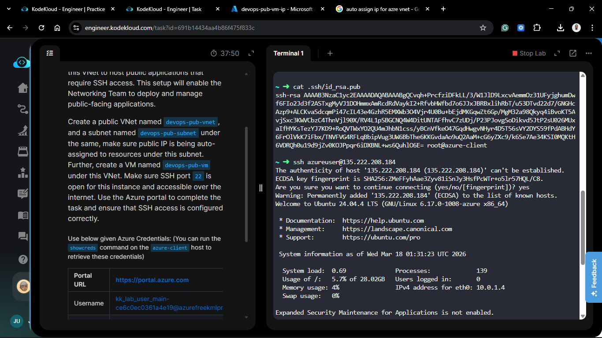

# Day 76: Deploying Virtual Machines in a Public Virtual Network

## Project Description

As the Nautilus DevOps team scales its cloud presence, the demand for internet-facing services has increased. Today's mission is to establish a **Public Virtual Network (VNet)** infrastructure specifically designed to host accessible resources. Unlike private-only segments, this architecture focuses on seamless external connectivity by ensuring that resources deployed within this zone are automatically reachable via public endpoints.

**The Goal:**
Provision the `devops-pub-vnet` and `devops-pub-subnet`, ensuring that the `devops-pub-vm` is launched with a Public IP and open SSH access (Port 22) for immediate remote management via the Azure Portal.

## Technical Specifications

| Requirement | Specification |
| :--- | :--- |
| **VNet Name** | `devops-pub-vnet` |
| **Subnet Name** | `devops-pub-subnet` |
| **VM Name** | `devops-pub-vm` |
| **Region** | `eastus` (or preferred region) |
| **Security Rule** | SSH (Port 22) - Inbound |
| **Addressing** | IPv4 with Public IP assignment |

---

## Steps & Configuration (Azure Portal)

### 1. Provision the Virtual Network

1. Navigate to **Virtual Networks** and click **+ Create**.
2. **Basics:** Name it `devops-pub-vnet` in your target resource group.
3. **IP Addresses:**
    * Create a subnet named `devops-pub-subnet`.
    * Ensure the address space allows for sufficient resource scaling (e.g., `10.1.0.0/16`).
4. Click **Review + create** and **Create**.

### 2. Launch the Virtual Machine

1. Search for **Virtual Machines** and click **+ Create**.
2. **Basics:**
    * **VM Name:** `devops-pub-vm`.
    * **Image:** Ubuntu Server 22.04 LTS.
    * **Size:** `Standard_B1s`.
3. **Networking:**
    * **Virtual network:** Select `devops-pub-vnet`.
    * **Subnet:** Select `devops-pub-subnet`.
    * **Public IP:** Select **(new) devops-pub-vm-ip**. This ensures the "auto-assign" requirement is met for the instance.
    * **NIC network security group:** Select **Basic**.
    * **Public inbound ports:** Select **Allow selected ports** and choose **SSH (22)**.

### 3. Finalize and Deploy

1. Complete the **Management** and **Advanced** tabs with default settings.
2. Click **Review + create**.
3. Download the private key (if prompted) and click **Create**.

---

## Verification

1. **Network Check:** Confirmed `devops-pub-vnet` is active and the subnet is correctly mapped.
2. **IP Verification:** Verified that `devops-pub-vm` has been assigned a Public IP address in the **Overview** blade.
3. **SSH Handshake:**

    ```bash
        ssh -i <your-key>.pem azureuser@<VM_PUBLIC_IP>
    ```

    *Result: Successful login to the shell.*



## 🧠 Theory: Public Subnets in Azure

* **Subnet Connectivity:** In Azure, any subnet can be "public" if its resources are associated with a Public IP and the Network Security Group (NSG) permits inbound traffic from the `Internet` service tag.
* **Auto-Assignment Logic:** While some clouds have a "Subnet-level" toggle for public IPs, Azure handles this primarily at the **Network Interface (NIC)** level during the VM creation wizard.
* **Security Best Practices:** Opening Port 22 to `0.0.0.0/0` (the entire internet) is useful for testing but should be restricted to specific management IPs or protected by **Azure Bastion** in production to prevent brute-force attempts.
