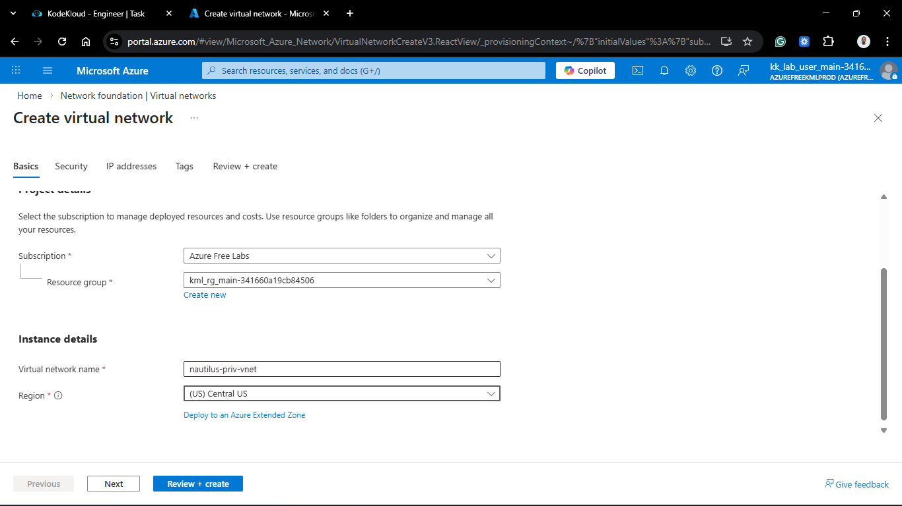
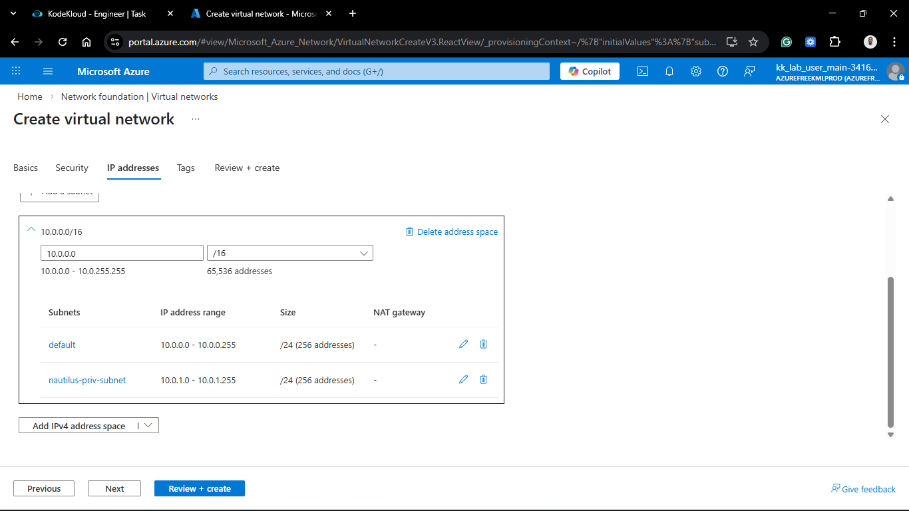
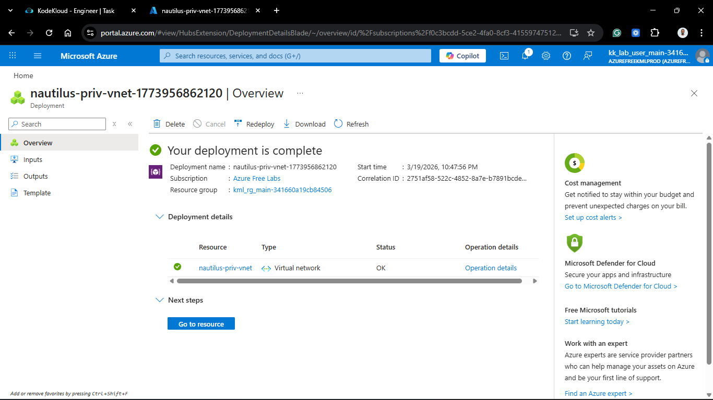
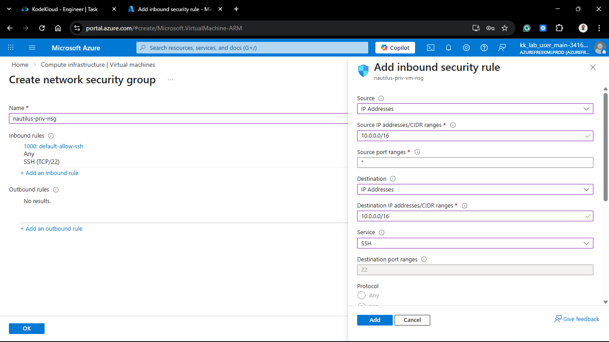
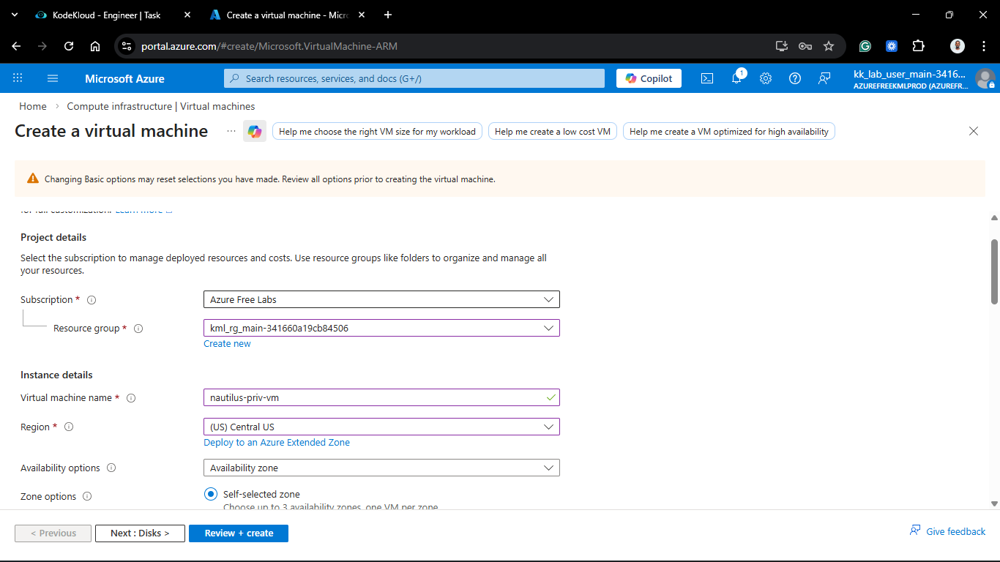
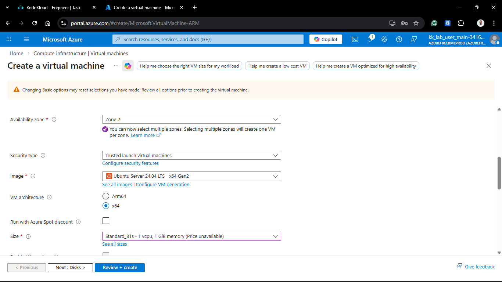
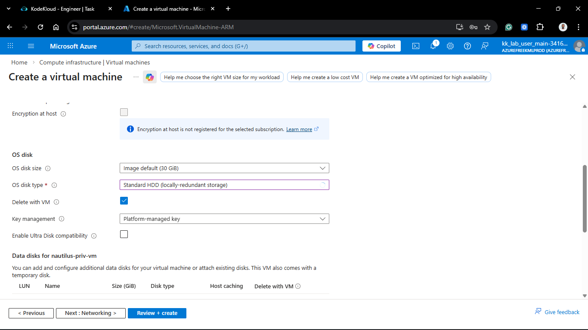
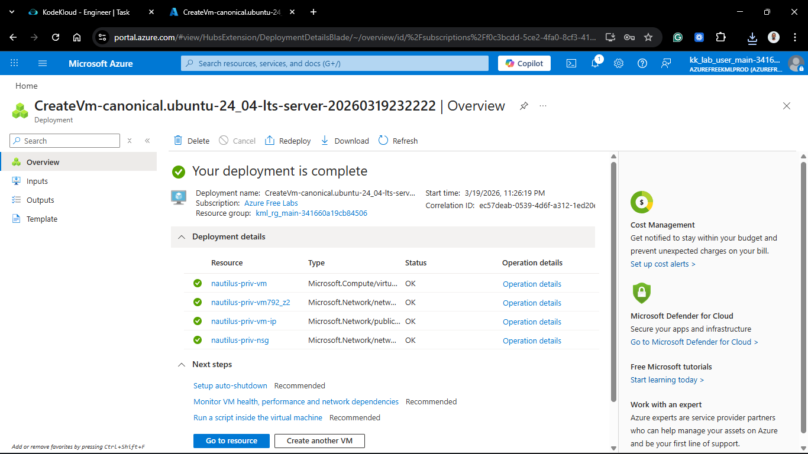
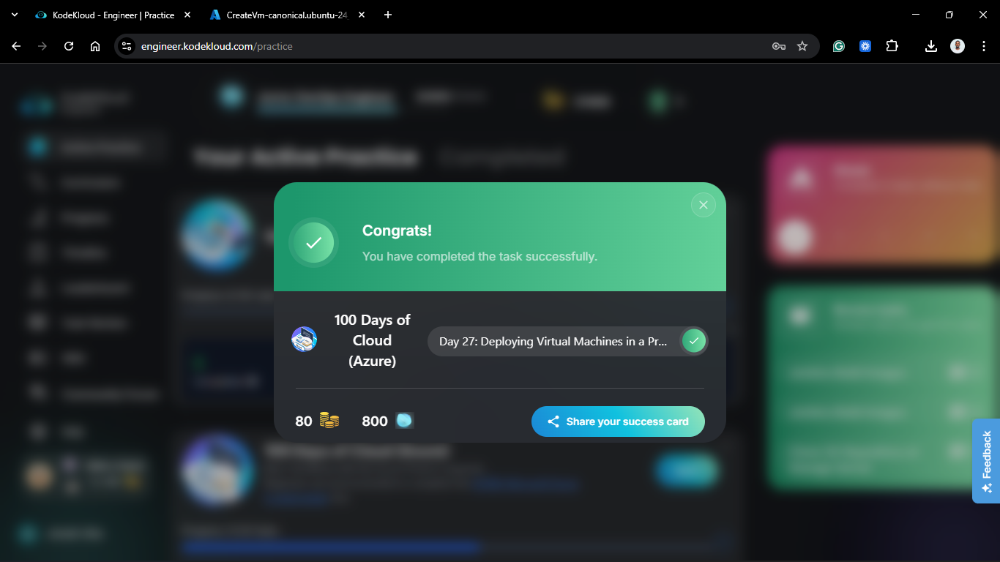

# Day 77: Deploying Virtual Machines in a Private Virtual Network

## Project Description

As the Nautilus DevOps team matures its security posture, the shift toward **Zero Trust Networking** is essential. Today's task involves the architecture of a completely isolated environment. Unlike previous "Public" setups, the `nautilus-priv-vnet` is designed for backend workloads that should never be directly reachable from the internet. This setup ensures that our `nautilus-priv-vm` resides behind a hardened perimeter, accessible only from trusted internal sources.

**The Goal:**
Provision a private networking stack in **Central US**, including an isolated VM and a custom Network Security Group (NSG) configured to drop all external traffic while permitting internal SSH management.

## Technical Specifications

| Requirement | Specification |
| :--- | :--- |
| **VNet Name** | `nautilus-priv-vnet` |
| **Subnet Name** | `nautilus-priv-subnet` |
| **VM Name** | `nautilus-priv-vm` |
| **Region** | `centralus` |
| **NSG Name** | `nautilus-priv-nsg` |
| **CIDR Block** | `10.0.0.0/16` (VNet) / `10.0.1.0/24` (Subnet) |

---

## Steps & Configuration (Azure Portal)

### 1. Provision the Private VNet

1. Navigate to **Virtual Networks** > **+ Create**.
2. **Basics:** Name it `nautilus-priv-vnet` in the **Central US** region.
3. **IP Addresses:**
    * VNet CIDR: `10.0.0.0/16`.
    * Subnet: `nautilus-priv-subnet` (`10.0.1.0/24`).
4. **Security:** Ensure "Bastion" and "Firewall" are disabled for this specific isolated lab requirement.
   

### 2. Create the Network Security Group (NSG)

1. Search for **Network security groups** > **+ Create**.
2. **Name:** `nautilus-priv-nsg`.
3. **Inbound Rules:**
    * **Priority:** 100
    * **Source:** `IP Addresses` ->  `10.0.0.0/16`.
    * **Destination Port:** `22`.
    * **Protocol:** `TCP`.
    * **Action:** `Allow`.
    * **Name:** `Allow-VNET-SSH`.
4. **Note:** The default `DenyAllInBound` rule (Priority 65500) will automatically handle the "no external access" requirement.
   

### 3. Launch the Private Virtual Machine

1. Navigate to **Virtual Machines** > **+ Create**.
2. **Basics:** Name it `nautilus-priv-vm`.
3. **Networking:**
    * **VNet:** `nautilus-priv-vnet`.
    * **Subnet:** `nautilus-priv-subnet`.
    * **Public IP:** **None**. (Crucial for true isolation).
    * **NIC NSG:** Select **Advanced** and pick `nautilus-priv-nsg`.

---

## Verification

1. **Isolation Check:** Confirmed `nautilus-priv-vm` has no Public IP address assigned.
2. **NSG Audit:** Verified that only the `VirtualNetwork` tag is permitted for port 22.
3. **Connectivity Test:**
    * Attempted SSH from a local machine ➡️ **Connection Timed Out** (Success).
    * SSH from another VM *within* the same VNet ➡️ **Successful Login** (Success).

## 🧠 Theory: Internal-Only Networking

* **No Public IP:** By omitting a Public IP, the VM has no direct "front door" on the internet. It can only send traffic outbound via a NAT Gateway or Load Balancer (if configured), and can only receive traffic from its internal VNet peers.
* **Service Tags:** Using the `VirtualNetwork` service tag in the NSG is a best practice. It dynamically includes all CIDR ranges defined in the VNet, making the security rule "future-proof" even if we add more subnets later.
* **The Jump Box Pattern:** To manage this VM, the team will typically use a "Jump Box" or **Azure Bastion**. You log into the public-facing Jump Box first, and then SSH into the `nautilus-priv-vm` using its private internal IP.

