# Day 78: Troubleshooting Public Virtual Network Configurations

## Project Description

Infrastructure is rarely "set and forget." Today, the Nautilus DevOps team faced a common migration hurdle: a deployed Nginx server on `datacenter-vm` was isolated and unreachable from the internet. This task involved a systematic troubleshooting workflow to identify gaps in the networking stack—specifically moving from a private-only interface to a public-facing endpoint.

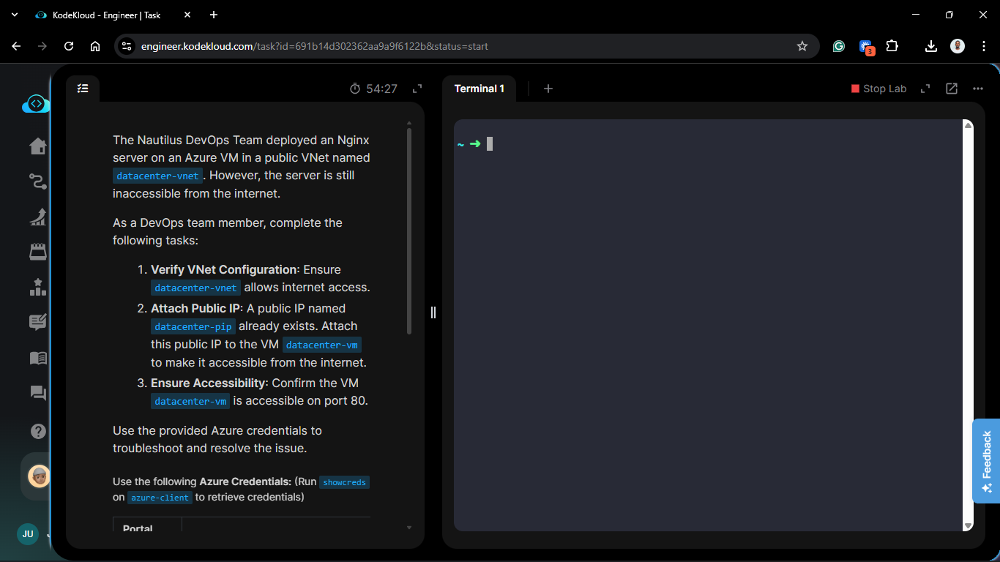

**The Goal:**

1. Verify the `datacenter-vnet` routing logic.
2. Associate the existing `datacenter-pip` (Public IP) to the VM.
3. Audit and update the Network Security Group (NSG) to permit Port 80 (HTTP) traffic.

## Technical Specifications

| Requirement | Specification |
| :--- | :--- |
| **VNet Name** | `datacenter-vnet` |
| **VM Name** | `datacenter-vm` |
| **Public IP** | `datacenter-pip` |
| **Target Port** | 80 (HTTP) |
| **Status** | Resolved |

---

## Troubleshooting & Resolution (Azure Portal)

### 1. Verification of VNet Internet Access

I reviewed the `datacenter-vnet` and its associated **Route Table**. In Azure, the default system route `0.0.0.0/0` points to the "Internet" gateway. I verified no User Defined Routes (UDRs) were overriding this, ensuring the VNet was capable of handling external traffic.
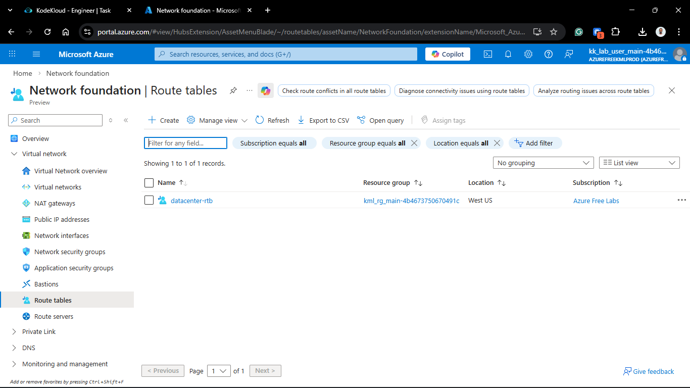
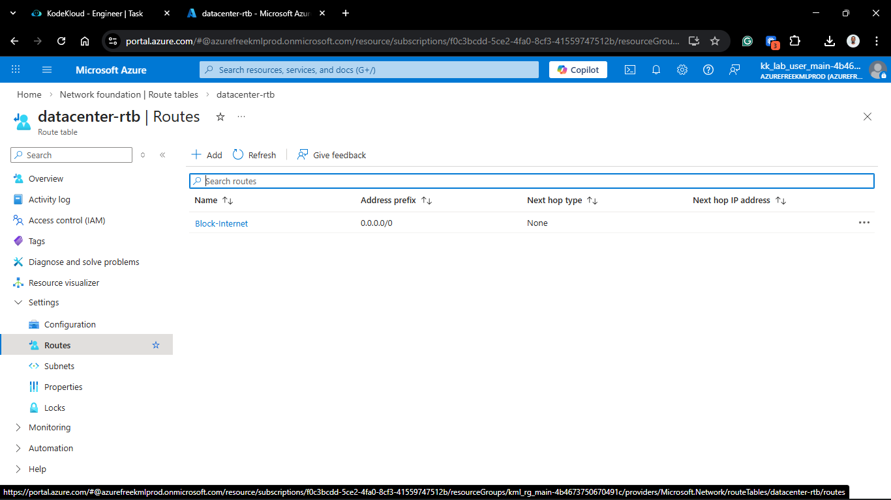
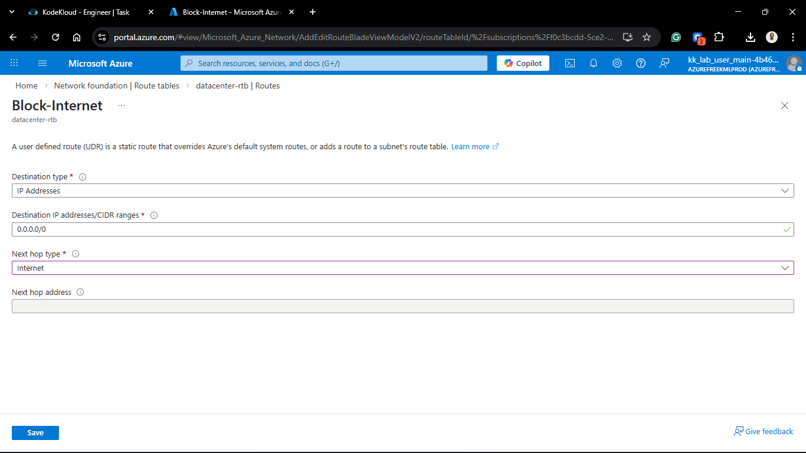
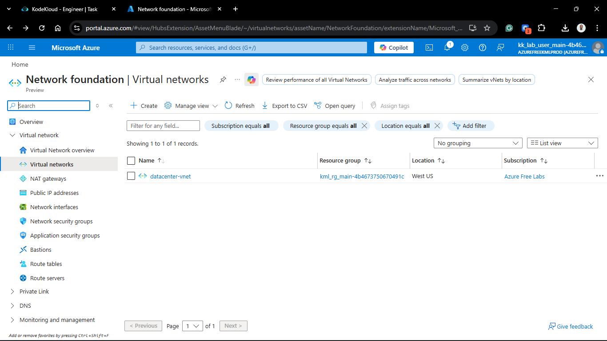

### 2. Attaching the Public IP (The Missing Link)

The VM was running with only a private IP. I performed the following to bridge the gap:

1. Navigated to **Virtual Machines** > `datacenter-vm` > **Networking**.
2. Clicked on the **Network Interface (NIC)** name.
3. In the NIC sidebar, selected **IP configurations**.
4. Selected the primary configuration (usually `ipconfig1`).
5. Changed **Public IP address** to **Associate**.
6. Selected the existing `datacenter-pip` from the dropdown and clicked **Save**.
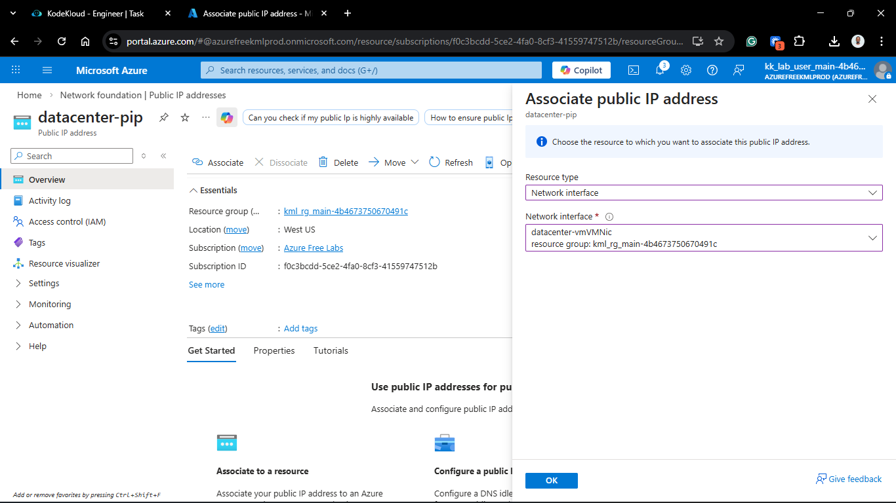
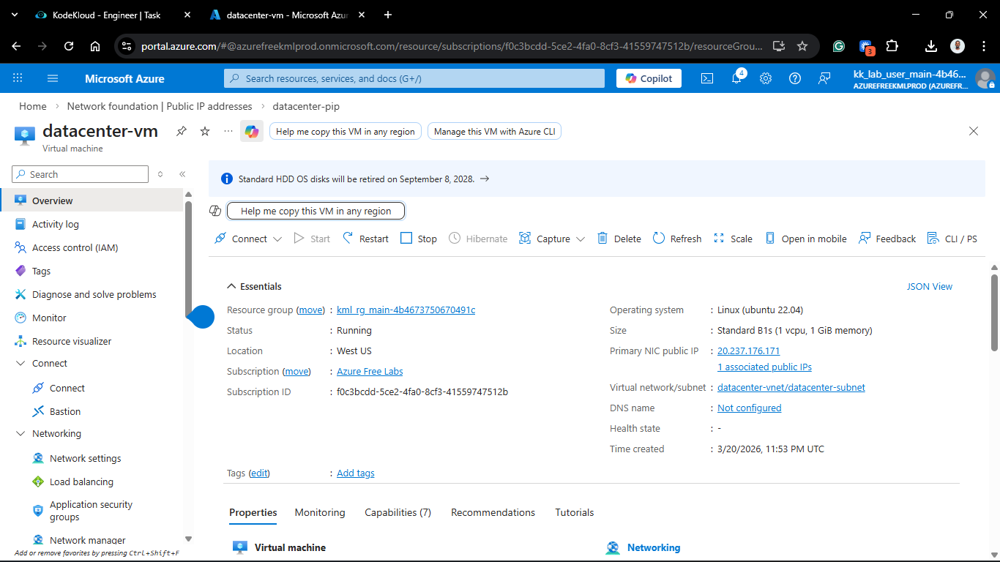

### 3. Ensuring Port 80 Accessibility

Even with a Public IP, the default Azure security posture is "Deny All Inbound."

1. In the VM's **Networking** blade, I identified the associated NSG.
2. Added a new **Inbound security rule**:
    * **Source:** `Any`
    * **Destination Port Ranges:** `80`
    * **Protocol:** `TCP`
    * **Action:** `Allow`
    * **Priority:** `100`
    * **Name:** `Allow-HTTP-All`
  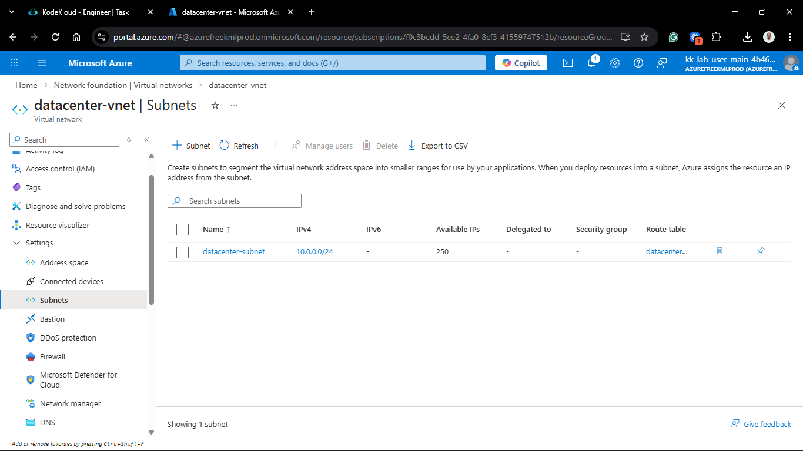
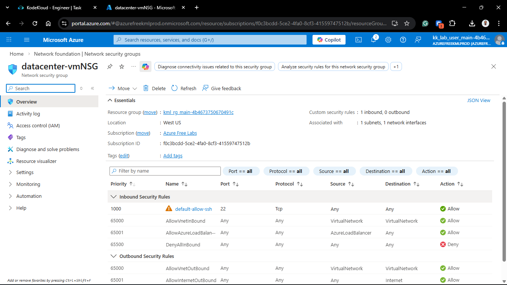
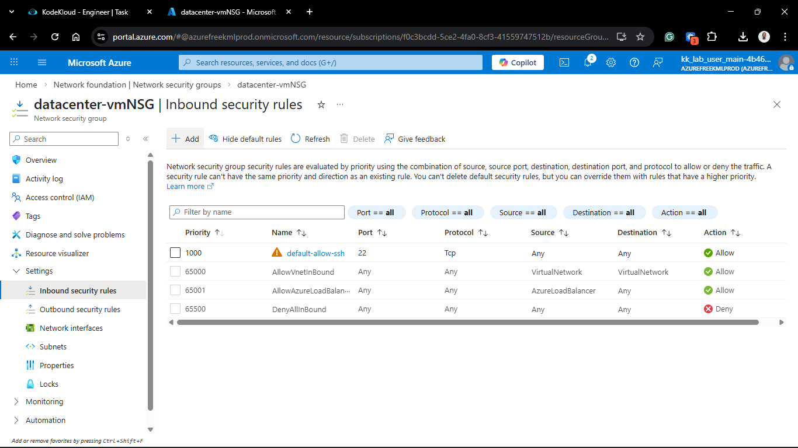

### 4. Install and enable Nginx on the `datacenter-vm`

1. SSH into the VM using public ip.

2. Install Nginx on the VM.

   ```bash
   sudo apt install nginx -y
   ```

3. Enable Nginx on the VM.

    ```bash
    sudo systemctl enable nginx
    ```

4. Verify HTTP access from internet using curl.

    ```bash
    curl <datacenter-vm-public-ip>
    ```

---

## Verification

1. **IP Connectivity:** Pinged the newly associated `datacenter-pip` to verify the NIC was responding.
2. **Web Service Check:** Navigated to `http://<datacenter-pip>` in a browser.
3. **Result:** The "Welcome to Nginx" page loaded successfully. The troubleshooting path from "Isolated" to "Accessible" is complete.

## 🧠 Theory: Troubleshooting the "Path to the Packet"

* **Layer 1: The NIC.** A VM cannot talk to the internet without a Public IP resource attached to its Network Interface. This is the physical-to-logical bridge in Azure.
* **Layer 2: The NSG.** Even if the "wire" is connected, the firewall (NSG) acts as the gatekeeper. Troubleshooting must always verify both the Public IP association AND the Security Rules.
* **Stateful Firewalling:** Remember that NSGs are stateful. Once I allowed Port 80 Inbound, Azure automatically handled the outbound response traffic.

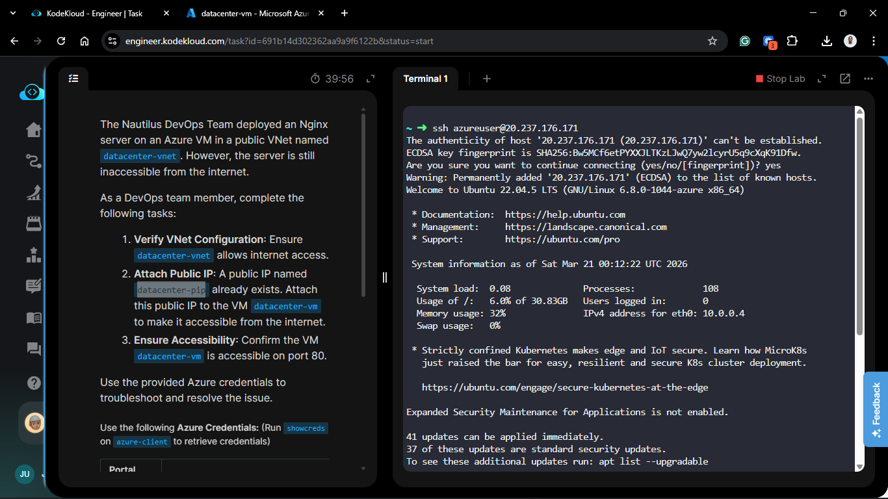

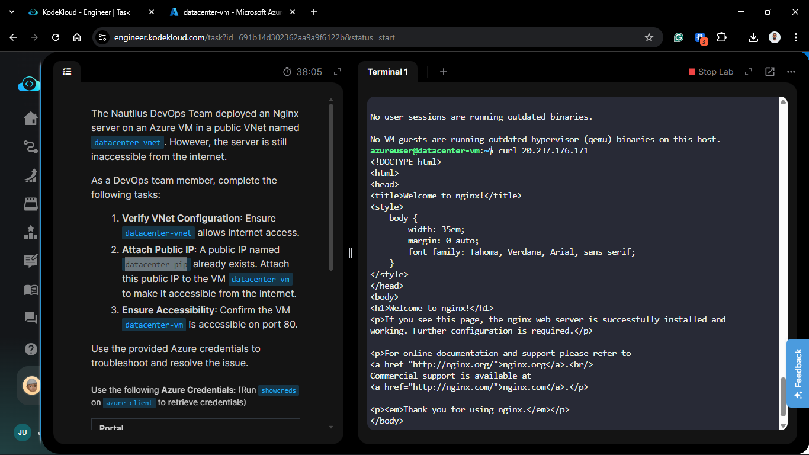

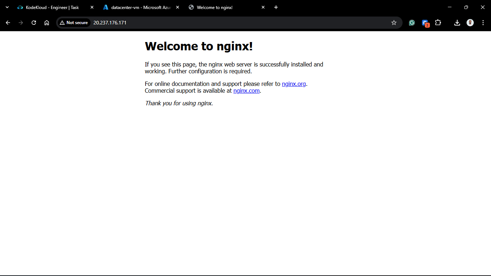

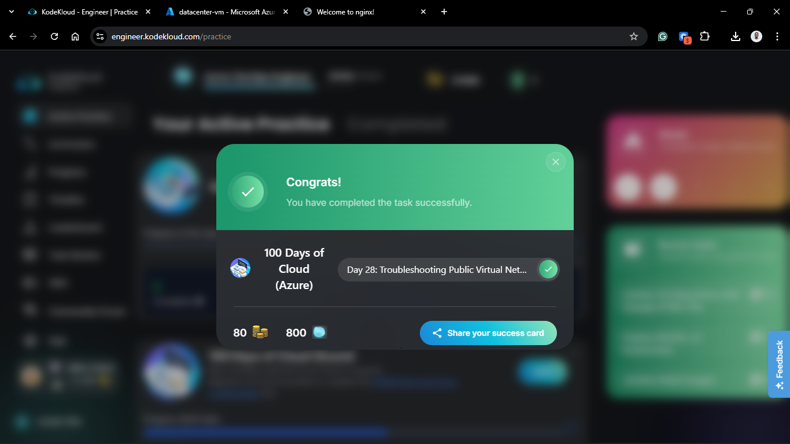
