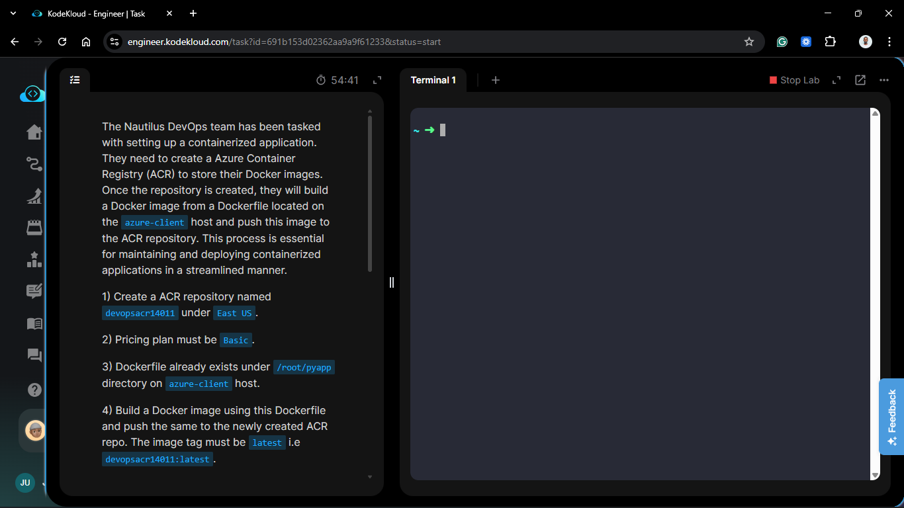
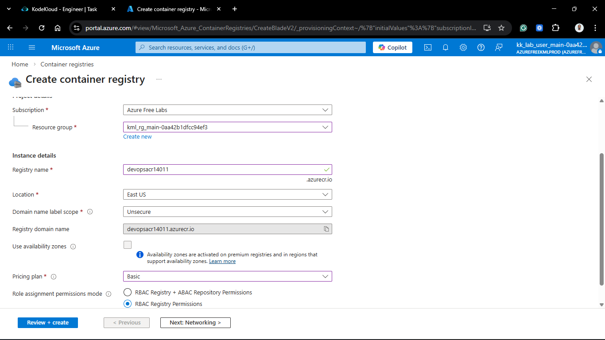
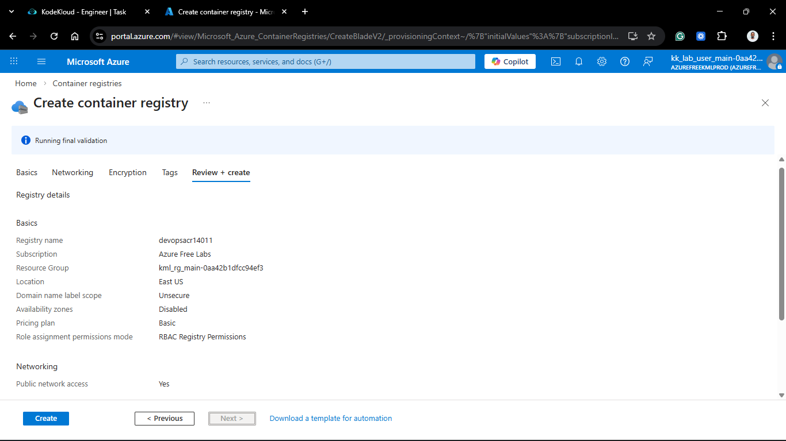
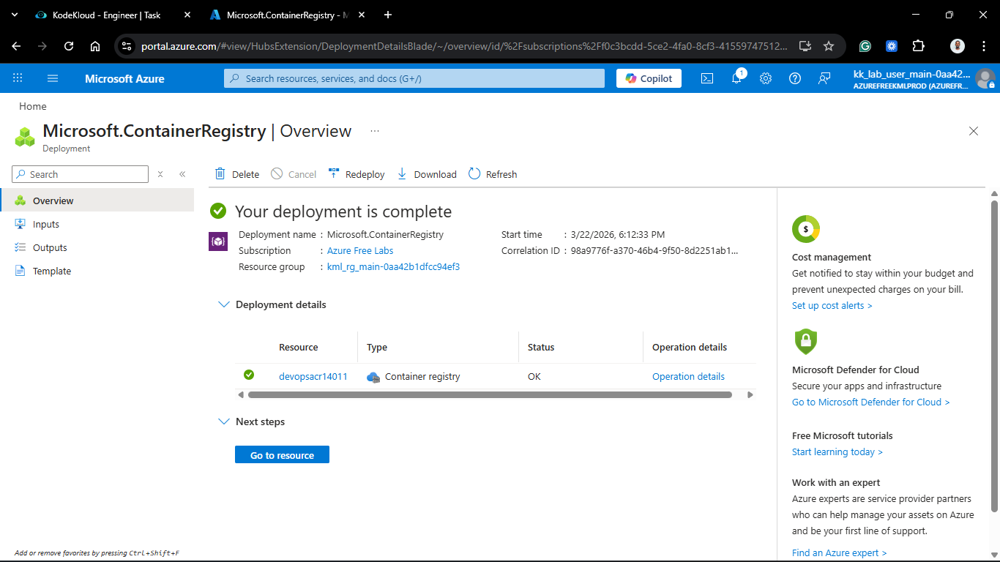
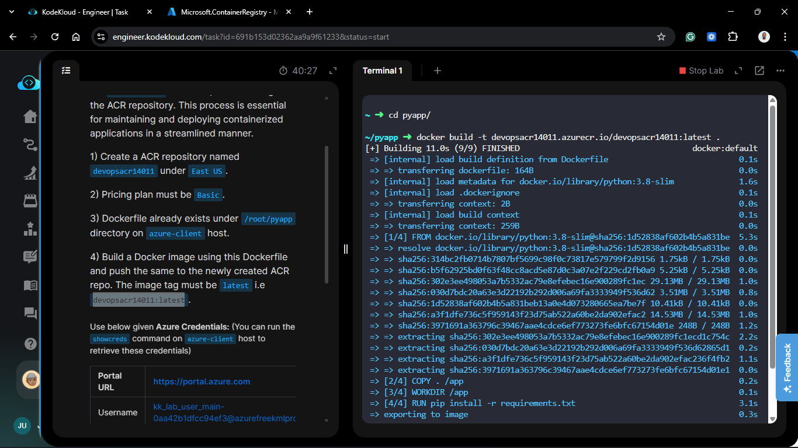
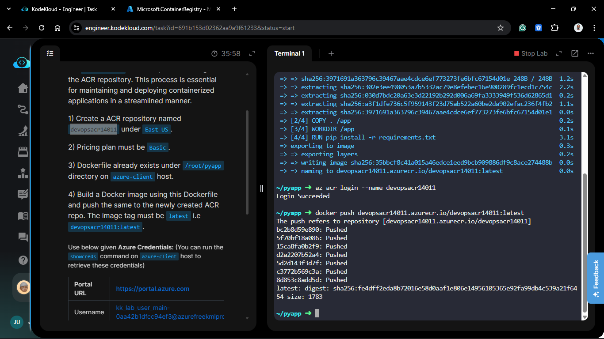
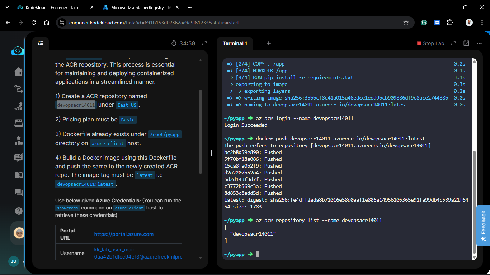

# Day 79: Working with Azure Container Registry (ACR)

## Project Description

As the Nautilus project transitions toward microservices, the need for a private, secure, and scalable container image management system is critical. Today's task involves the deployment of an **Azure Container Registry (ACR)**. This registry acts as our private "Docker Hub" within the Azure ecosystem, allowing the team to build, store, and manage container images for the `pyapp` application safely behind the corporate perimeter.



**The Goal:**

1. Provision a `Basic` tier ACR named `devopsacr14011` in the **East US** region.
2. Automate the build and push process of the `pyapp` Docker image using the provided Dockerfile.

## Technical Specifications

| Requirement | Specification |
| :--- | :--- |
| **ACR Name** | `devopsacr14011` |
| **Pricing Tier** | `Basic` |
| **Region** | `eastus` |
| **Dockerfile Path** | `/root/pyapp` |
| **Image Tag** | `devopsacr14011:latest` |

---

## Steps & Configuration (Azure CLI)

### 1. Create the Registry

I initialized the ACR using the `Basic` SKU, which provides a cost-effective entry point for development and small-scale deployments.





### 2. Build using Docker

I used docker build to create the image locally and tagged it with the ACR login server name to ensure it can be pushed directly to the registry.

```bash
# Navigate to the application directory

cd /root/pyapp

# Build and push directly to the registry

docker build -t devopsacr14011.azurecr.io/devopsacr14011:latest .
```



### 3. Push to ACR

```bash
az acr login --name devopsacr14011

docker push devopsacr14011.azurecr.io/devopsacr14011:latest
```



### 3. Verification of Image Repository

I confirmed the image was successfully stored and tagged in the ACR repository.

```bash
az acr repository list --name devopsacr14011
```



### Verification

- **Deployment Check:** Verified the registry `devopsacr14011.azurecr.io` is active.

- **Image Check:** Confirmed the `devopsacr14011` repository contains the latest tag.

- **Result:** The `pyapp` container is now versioned and ready for deployment to AKS or Azure App Service.

## 🧠 Theory: Why Azure Container Registry?

- **Native Integration:** ACR is tightly coupled with Azure Kubernetes Service (AKS) and Azure Web Apps, allowing for seamless image pulling using Managed Identities (RBAC) rather than static Docker secrets.

- **Basic SKU Benefits:** The Basic tier offers 10 GB of storage and 2 operation units, making it ideal for the Nautilus project's current migration phase where cost-efficiency is a priority.


