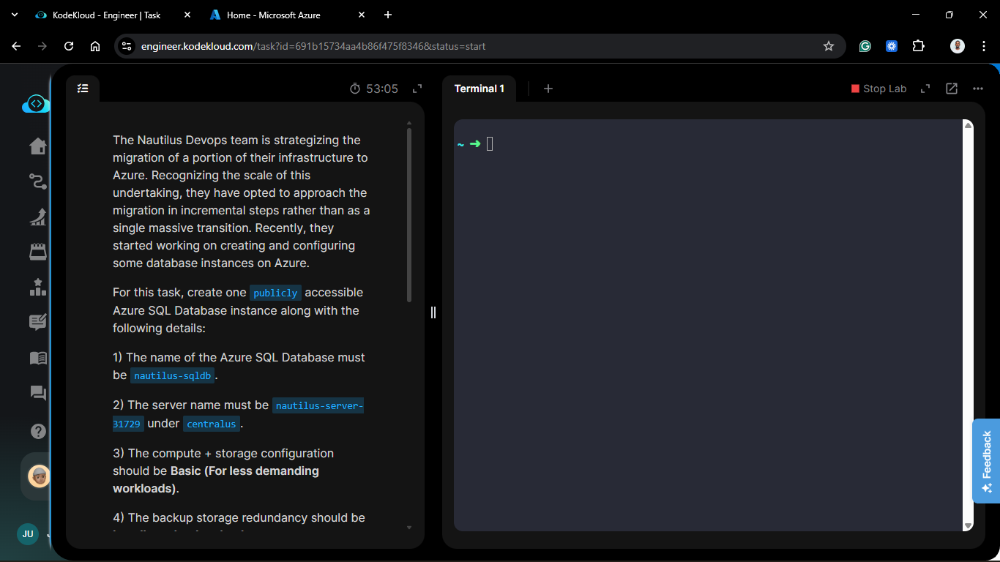
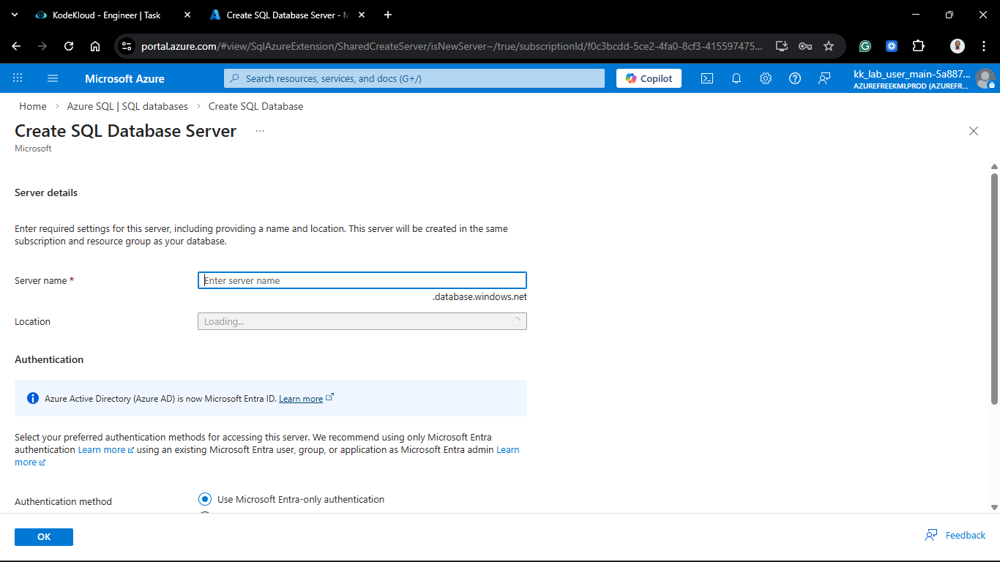
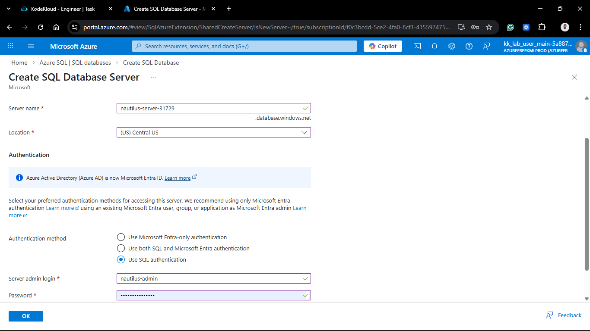
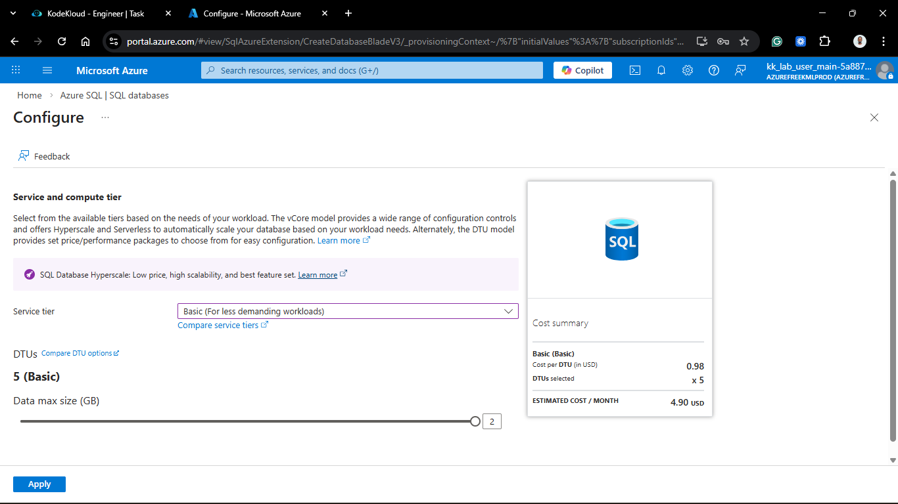
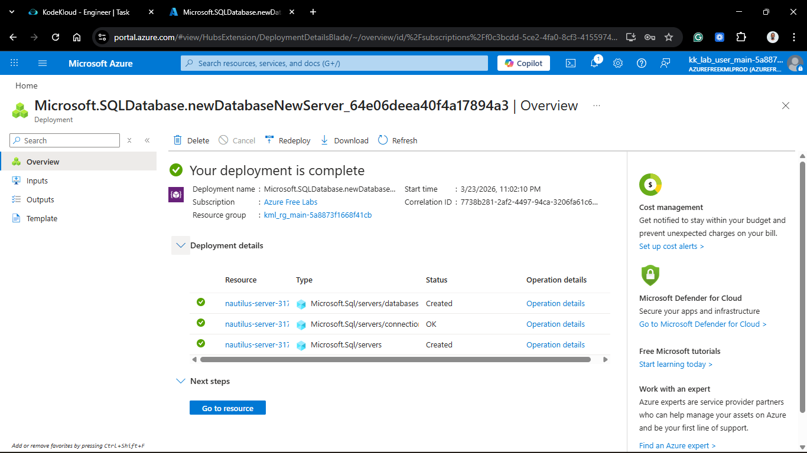
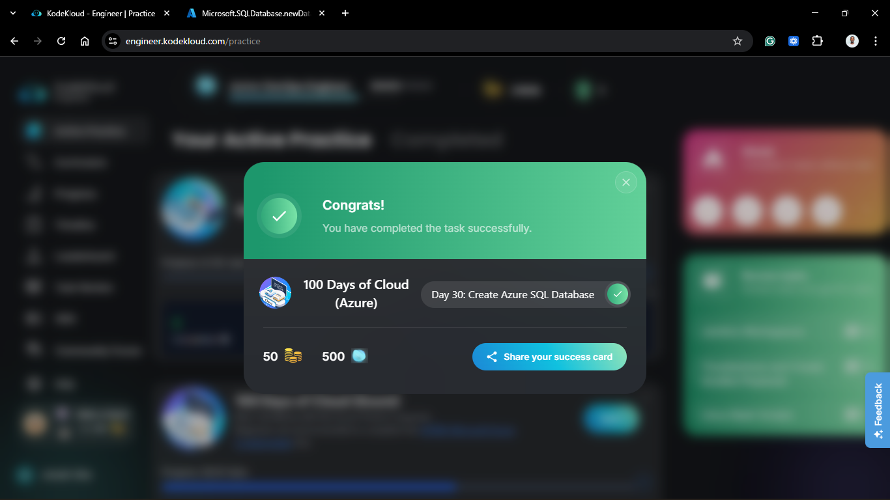

# Day 80: Create and Configure Azure SQL Database

## Project Description

As the Nautilus DevOps team reaches the 30-day mark of the Azure migration, the focus has shifted from infrastructure and containers to **Data Persistence**. Today's task involves provisioning a managed relational database using **Azure SQL Database**. By moving to a PaaS (Platform as a Service) model, we eliminate the overhead of managing OS patching or VM maintenance, allowing the development team to focus entirely on their schema and queries.

**The Goal:**

Provision a cost-optimized, publicly accessible SQL instance named `nautilus-sqldb` on a new logical server in the **Central US** region.

## Technical Specifications

| Requirement | Specification |
| :--- | :--- |
| **Database Name** | `nautilus-sqldb` |
| **Server Name** | `nautilus-server-31729` |
| **Region** | `centralus` |
| **Compute Tier** | `Basic` (5 DTUs) |
| **Storage Limit** | `2 GiB` |
| **Admin Login** | `nautilus-admin` |
| **Backup Redundancy** | `Locally-redundant (LRS)` |

---

## Steps & Configuration

### 1. Initialize SQL Database Creation

1. Log in to the **Azure Portal** with the provided lab credentials.
2. Search for **SQL databases** and click **+ Create**.

### 2. Configure Project & Server Details

1. **Project Details:** Selected the existing `kml_rg_main-...` resource group.
2. **Database Details:**
    * **Database name:** `nautilus-sqldb`.
    * **Server:** Clicked **Create new**.
        * **Server name:** `nautilus-server-31729`.
        * **Location:** `Central US`.
        * **Authentication:** SQL authentication.
        * **Login:** `nautilus-admin`.
        * **Password:** `[SECURE_PASSWORD]`.
    

3. **Compute + Storage:**
    * Clicked **Configure database**.
    * Selected **Looking for basic, standard, premium?**.
    * Chose **Basic** (For less demanding workloads).
    * Set Max Size to **2 GB**.
    * Clicked **Apply**.

### 3. Networking & Backups

1. **Networking Tab:**
    * **Connectivity method:** Public endpoint.
    * **Allow Azure services and resources to access this server:** Yes (for internal app connectivity).
2. **Security Tab:** Kept Microsoft Defender for SQL as default (or disabled for lab).
3. **Additional Settings:** Set Backup storage redundancy to **Locally-redundant backup storage**.

### 4. Review and Create

1. Clicked **Review + create**.
2. Verified that estimated cost and specifications matched the "Basic" tier.
3. Clicked **Create** and waited for the status to reach **Ready**.

---

## Verification

1. **Deployment Check:** Confirmed "Your deployment is complete" notification.
2. **Status Audit:** Navigated to the `nautilus-sqldb` resource and verified the status is **Online**.
3. **Connectivity:** Verified the Server admin login is set to `nautilus-admin`.

## 🧠 Theory: PaaS vs. IaaS for Databases

* **Platform as a Service (PaaS):** Azure SQL is a fully managed service. Unlike running SQL Server on a VM (IaaS), Azure handles high availability, backups, and software updates automatically. This reduces the "Administrative Tax" on the DevOps team.
* **DTU Model (Basic Tier):** The Database Transaction Unit (DTU) is a blended measure of CPU, Memory, and I/O. The **Basic** tier provides 5 DTUs, which is perfect for the Nautilus project's pilot phase—low cost but consistent performance for small datasets.
* **Locally Redundant Backups (LRS):** By choosing LRS for backup redundancy, we store three copies of our backups within a single data center. It’s the most economical option, providing durability without the cost of cross-region replication (GRS).

