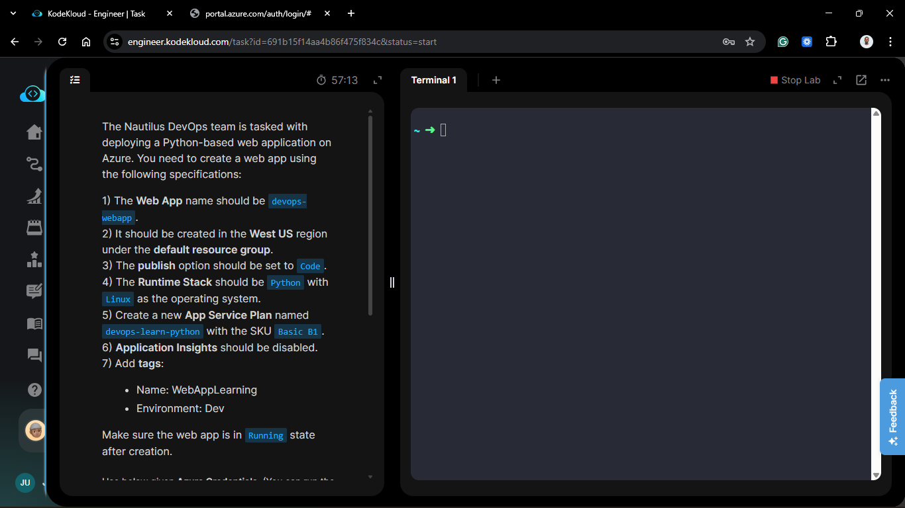
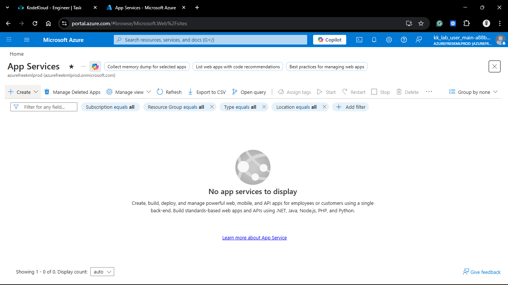
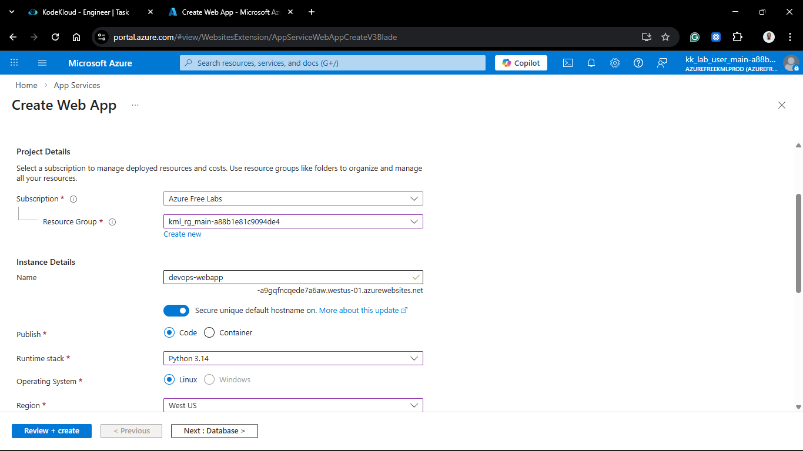
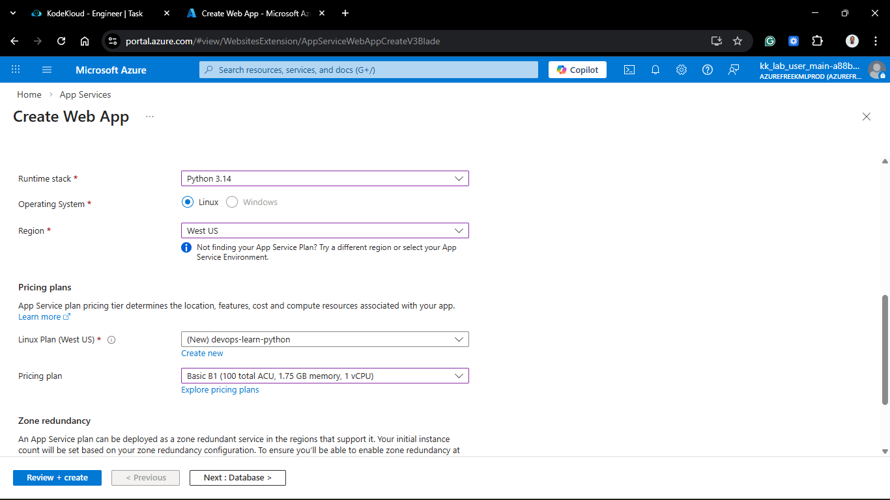
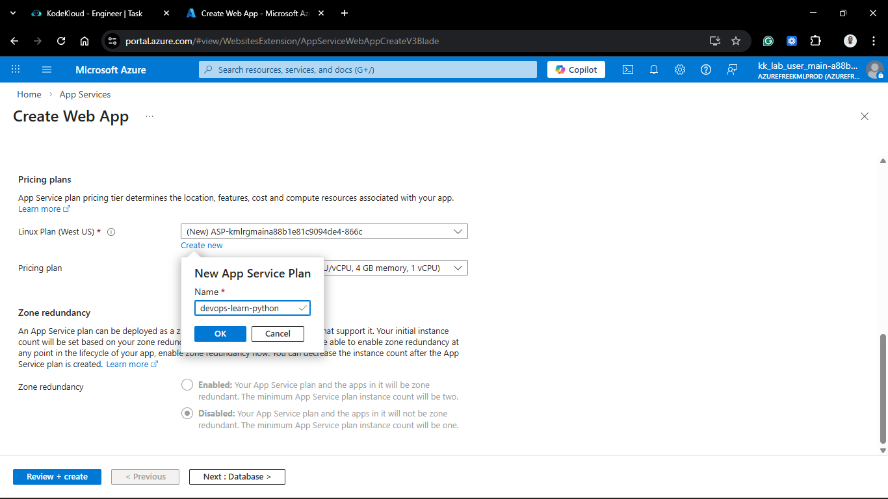
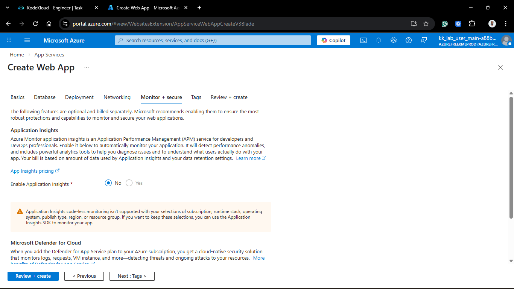
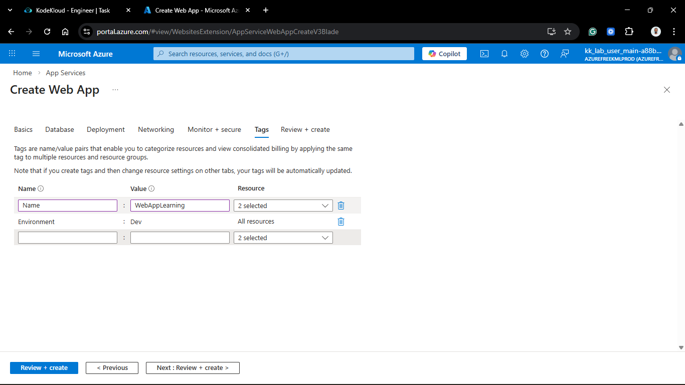
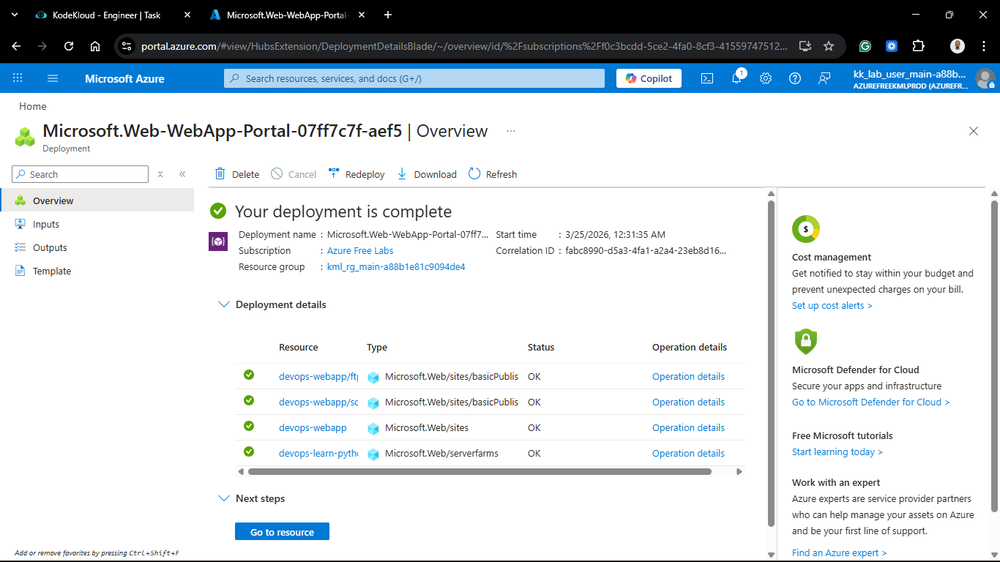
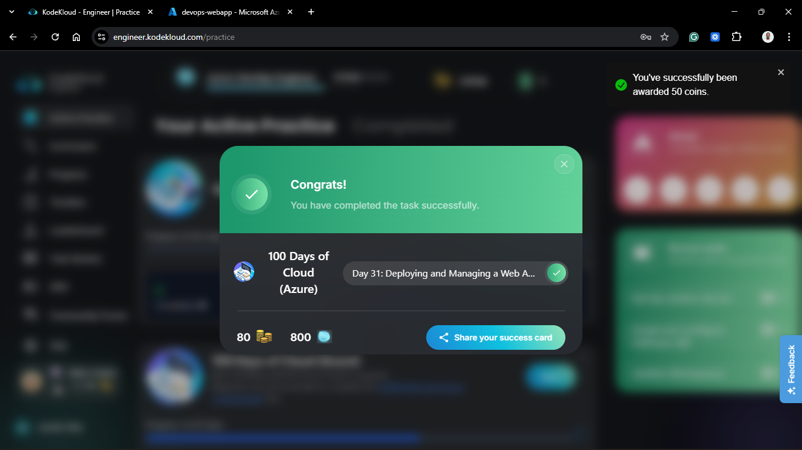

# Day 81: Deploying and Managing a Web Application

## Project Description

As the Nautilus project moves into the application delivery phase, the team is leveraging **Azure App Service** to host our Python-based web applications. This Platform as a Service (PaaS) offering allows us to deploy code directly without the overhead of managing underlying Virtual Machines, web servers, or OS updates. Today's task involves provisioning a scalable environment for a Python runtime, ensuring our deployment is tagged for lifecycle management and optimized for cost.

**The Goal:**

Deploy a Linux-based Python Web App named `devops-webapp` using a `Basic B1` App Service Plan in the **West US** region.

## Technical Specifications

| Requirement | Specification |
| :--- | :--- |
| **Web App Name** | `devops-webapp` |
| **Runtime Stack** | `Python 3.x` (Linux) |
| **Region** | `West US` |
| **App Service Plan** | `devops-learn-python` |
| **Pricing Tier** | `Basic B1` |
| **Application Insights**| Disabled |
| **Tags** | `Name: WebAppLearning`, `Environment: Dev` |

---

## Steps & Configuration

### 1. Create Web App

1. Navigate to **App Services** in the Azure Portal and click **+ Create** > **Web App**.
   

2. **Project Details:**
    * **Subscription:** Lab Subscription.
    * **Resource Group:** Default (e.g., `kml_rg_main-...`).
  

3. **Instance Details:**
    * **Name:** `devops-webapp` (Note: If this was taken globally, a unique suffix was added).
    * **Publish:** `Code`.
    * **Runtime stack:** `Python 3.12` (or latest available).
    * **Operating System:** `Linux`.
    * **Region:** `West US`.

### 2. Configure Hosting (App Service Plan)

1. Under the **Linux Plan** section, clicked **Create new**.
2. **Name:** `devops-learn-python`.
3. **Pricing plan:** Clicked **Explore pricing tiers** and selected **Basic B1** (1.75 GB memory, 100 total ACU).
   

### 3. Monitoring & Tags

1. **Monitoring Tab:** Set **Enable Application Insights** to **No**.
2. **Tags Tab:** Added the required metadata:
    * `Name`: `WebAppLearning`
    * `Environment`: `Dev`

### 4. Review and Create

1. Clicked **Review + create** and then **Create**.
2. Monitored the deployment until the resource reached the **Running** state.

---

## Verification

1. **Status Check:** Confirmed the Web App status is **Running** in the Overview blade.
2. **URL Validation:** Navigated to `https://devops-webapp.azurewebsites.net`.
3. **Result:** The default Azure App Service splash page loaded, confirming the Python environment is ready for code deployment.

## 🧠 Theory: PaaS and App Service Plans

* **Platform as a Service (PaaS):** Azure Web Apps abstract the infrastructure layer. We don't manage the Linux kernel or Nginx configuration; we simply provide the code, and Azure handles the execution environment.
* **App Service Plan (ASP):** Think of the ASP as the "Server Farm" or the hardware resources. The Web App is the "Software" running on that hardware. Multiple apps can share a single ASP to optimize costs.
* **Basic B1 SKU:** The Basic tier is designed for low-traffic apps or development environments. It provides dedicated compute resources (unlike the Free/Shared tiers), allowing for better performance testing before moving to Standard or Premium tiers.

