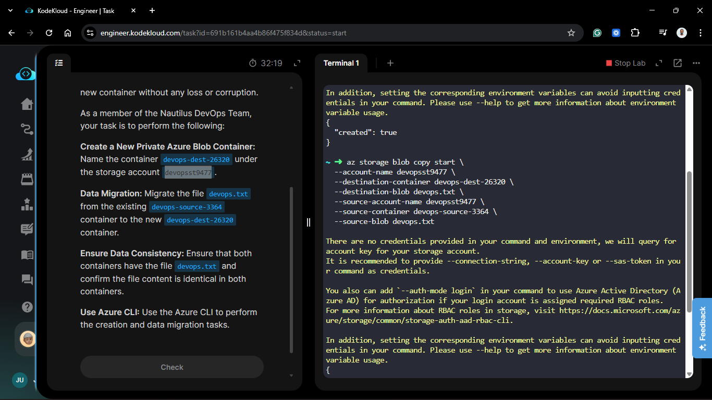
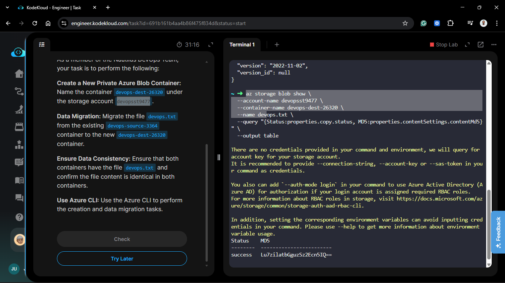
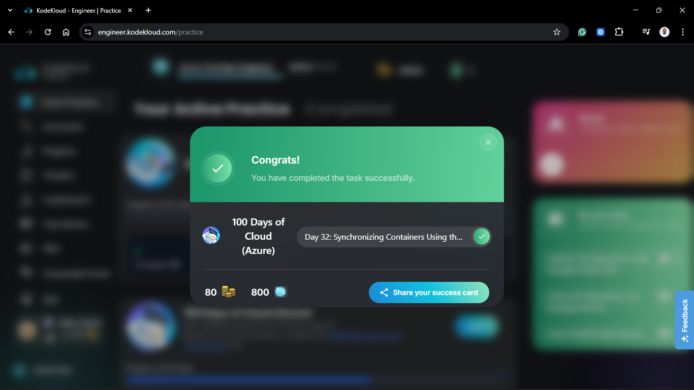

# Day 82: Synchronizing Containers Using the CLI

## Project Description

Data migration is a high-stakes operation in any cloud environment. As the Nautilus DevOps team restructures its storage architecture, transferring data between Blob containers with 100% accuracy is non-negotiable. Today’s task focuses on **Server-Side Data Synchronization**. By using the Azure CLI to orchestrate a copy between two containers within the same storage account, we ensure a high-speed transfer that doesn't rely on local bandwidth or intermediate downloads.

**The Goal:**
Provision a new private container `devops-dest-26320` and accurately sync the `devops.txt` file from the source container `devops-source-3364` while verifying data integrity.

## Technical Specifications

| Requirement | Specification |
| :--- | :--- |
| **Storage Account** | `devopsst9477` |
| **Source Container** | `devops-source-3364` |
| **Destination Container** | `devops-dest-26320` |
| **Target File** | `devops.txt` |
| **Access Level** | Private (no anonymous access) |

---

## Steps & Configuration

### 1. Create the Destination Container

I initialized the new container with private access settings to ensure the migrated data remains secure.

```bash
az storage container create \
  --account-name devopsst9477 \
  --name devops-dest-26320 \
  --public-access off
```

### 2. Execute Server-Side Copy

Instead of downloading and re-uploading, I used the `az storage blob copy start` command. This triggers an asynchronous server-side copy within the Azure backbone, which is significantly faster and more reliable.

```bash
az storage blob copy start \
  --account-name devopsst9477 \
  --destination-container devops-dest-26320 \
  --destination-blob devops.txt \
  --source-account-name devopsst9477 \
  --source-container devops-source-3364 \
  --source-blob devops.txt
```



### 3. Verification & Consistency Check

To ensure data consistency, I checked the status of the copy and compared the metadata (specifically the Content-MD5 hash) to verify the files are identical.

```bash
# Check destination blob properties

az storage blob show \
  --account-name devopsst9477 \
  --container-name devops-dest-26320 \
  --name devops.txt \
  --query "{Status:properties.copy.status, MD5:properties.contentSettings.contentMd5}" \
  --output table
```



### Verification

1. **Existence Check:** Confirmed `devops.txt` is visible in the `devops-dest-26320` container.
2. **Integrity Check:** Verified that the `copy.status` is `success`.
3. **Content Match:** Compared file sizes and timestamps; the destination file matches the source exactly, confirming no data corruption occurred during the sync.

## 🧠 Theory: Asynchronous Copy Operations

-**Server-Side Copy:** When we trigger a copy via the CLI, Azure handles the data movement internally. The data never "leaves" the Azure data center, which minimizes latency and prevents "middle-man" errors.

- **Asynchronous Nature:** The copy operation is non-blocking. This means that while the copy is in progress, you can perform other tasks or even trigger multiple copies simultaneously without waiting for each to complete.
  
- **MD5 Verification:** For mission-critical migrations, checking the contentMd5 property is a best practice. It provides a cryptographic fingerprint of the file, guaranteeing that the bits at the destination are an exact replica of the bits at the source.


