# Day 83: Integrating Virtual Machines with Application Load Balancer

## Project Description

As the Nautilus project scales, ensuring high availability and traffic management for our web tier is essential. Today's task focuses on implementing an **Azure Load Balancer** to act as a single point of entry for our Nginx web server. By decoupling the public entry point from the backend virtual machine, we establish a scalable architecture that allows us to distribute traffic, perform health checks, and maintain service availability even during individual node failures.

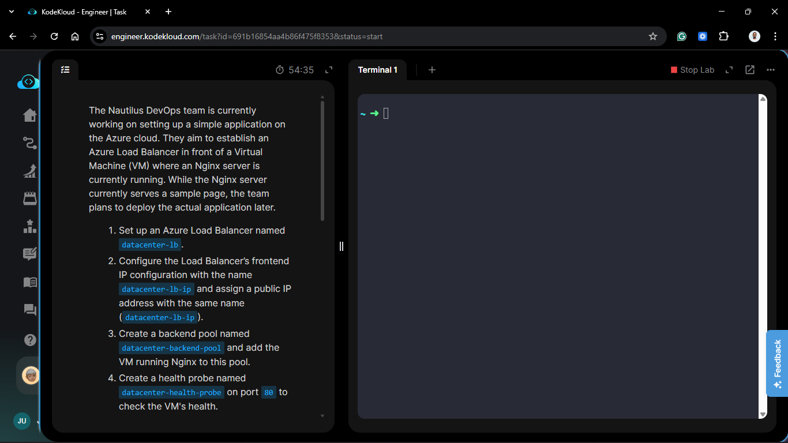

**The Goal:**

Provision a public Azure Load Balancer named `datacenter-lb`, configure a frontend IP, establish a backend pool containing our Nginx VM, and define health probes and load balancing rules to manage HTTP traffic on Port 80.

## Technical Specifications

| Requirement | Specification |
| :--- | :--- |
| **Load Balancer Name** | `datacenter-lb` |
| **Frontend IP Name** | `datacenter-lb-ip` |
| **Public IP Name** | `datacenter-lb-ip` |
| **Backend Pool** | `datacenter-backend-pool` |
| **Health Probe** | `datacenter-health-probe` (Port 80) |
| **Load Balancing Rule** | `datacenter-lb-rule` (Port 80 ➡️ Port 80) |
| **Security Rule** | Allow HTTP (Port 80) in the VM's NSG |

---

## Steps & Configuration (Azure Portal)

### 1. Provision the Public IP and Load Balancer

1. Search for **Load balancers** in the Azure Portal and click **+ Create**.
   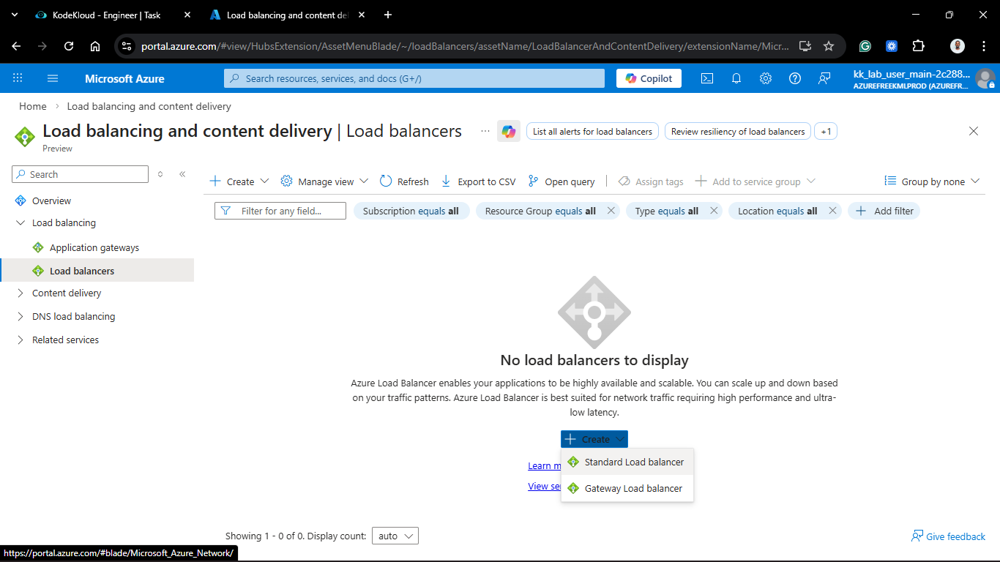

2. **Basics Tab:**
    * **Resource Group:** Selected the existing lab resource group.
    * **Name:** `datacenter-lb`.
    * **Region:** (Matches existing VM region, e.g., East US).
    * **SKU:** `Standard`.
    * **Type:** `Public`.
  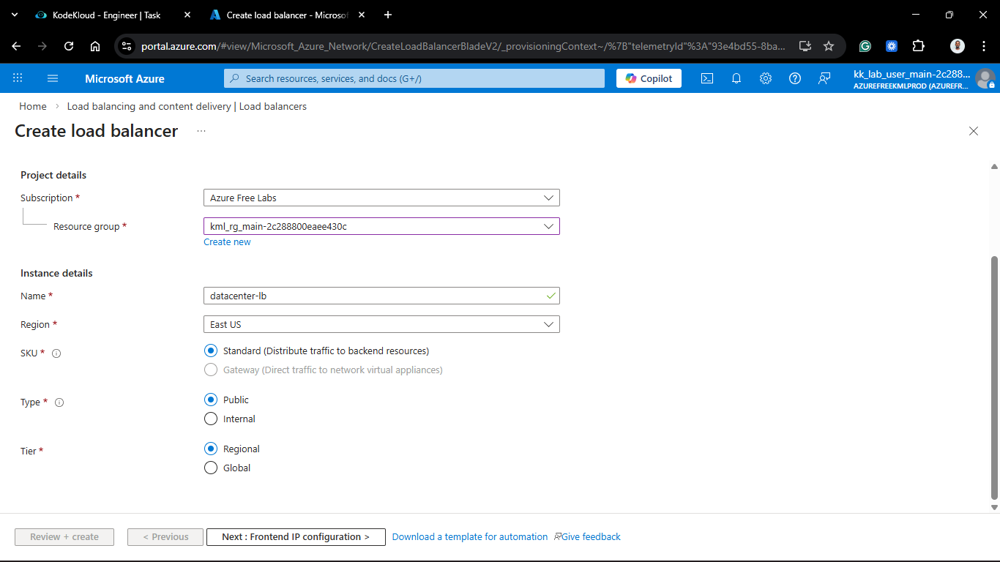

3. **Frontend IP Configuration Tab:**
    * Click **+ Add a frontend IP**.
    * **Name:** `datacenter-lb-ip`.
    * **Public IP address:** Clicked **Create new** and named it `datacenter-lb-ip`.
    * **Assignment:** `Static`.
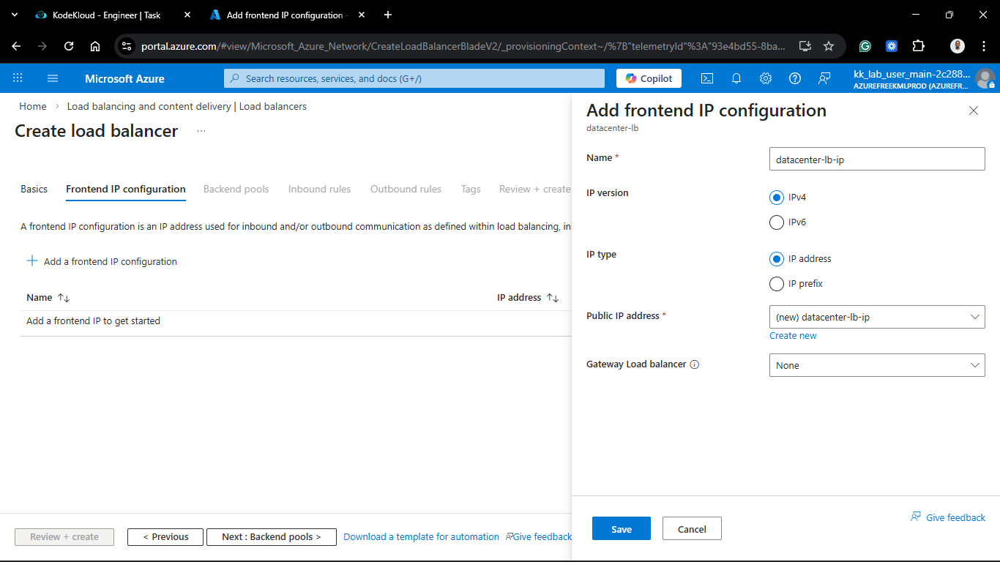

### 2. Configure the Backend Pool

1. Navigate to the **Backend pools** tab (or the resource blade after creation).
2. Click **+ Add**.
3. **Name:** `datacenter-backend-pool`.
4. **Virtual network:** Selected the VNet where the Nginx VM resides.
5. **Backend Port:** `80`.
6. **IP configurations:** Clicked **+ Add** and selected the specific VM running Nginx.
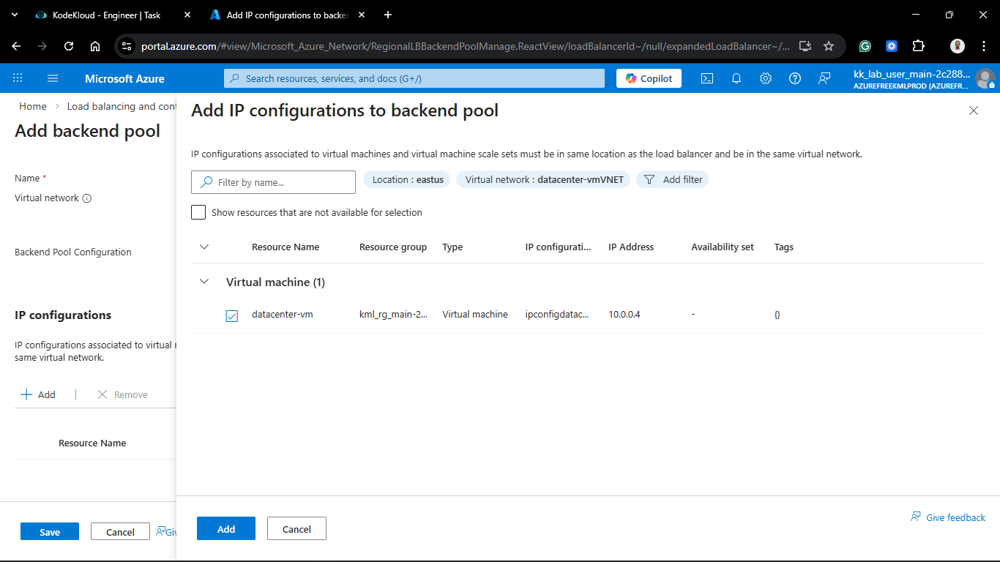
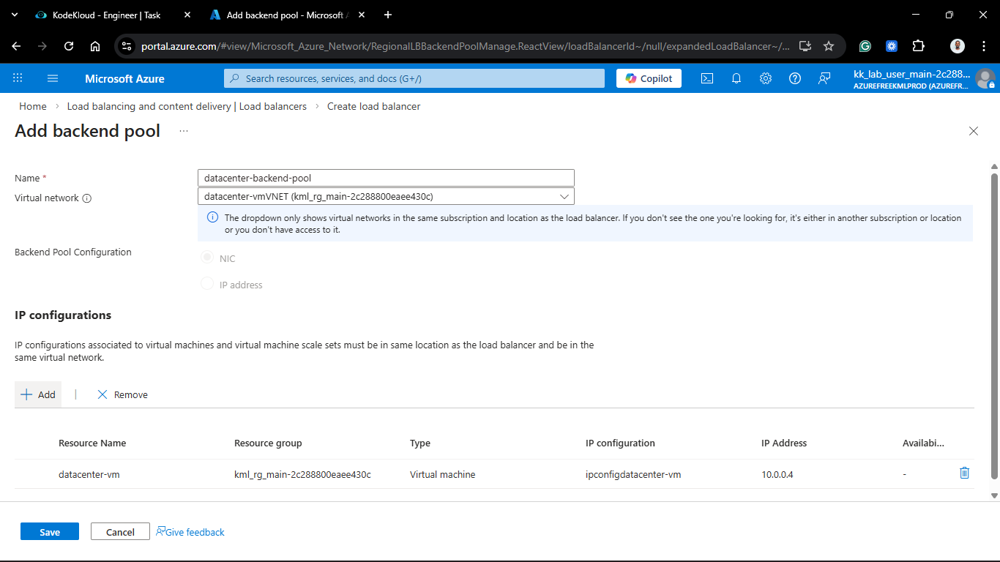

### 3. Establish Health Probes and Rules

1. **Health Probes:** Clicked **+ Add**.
    * **Name:** `datacenter-health-probe`.
    * **Protocol:** `TCP`.
    * **Port:** `80`.
2. **Load Balancing Rules:** Clicked **+ Add**.
    * **Name:** `datacenter-lb-rule`.
    * **Frontend IP address:** `datacenter-lb-ip`.
    * **Backend pool:** `datacenter-backend-pool`.
    * **Health probe:** `datacenter-health-probe`.
    * **Protocol:** `TCP`.
    * **Port:** `80`.
    * **Backend port:** `80`.
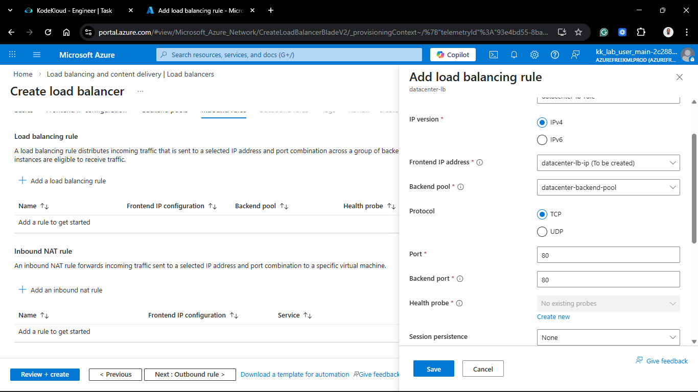
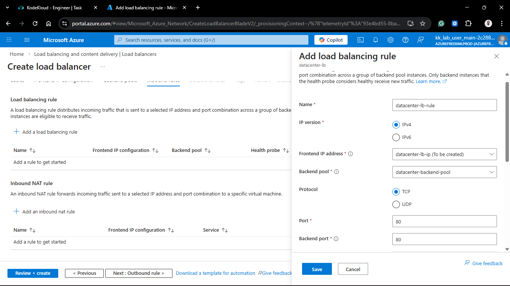
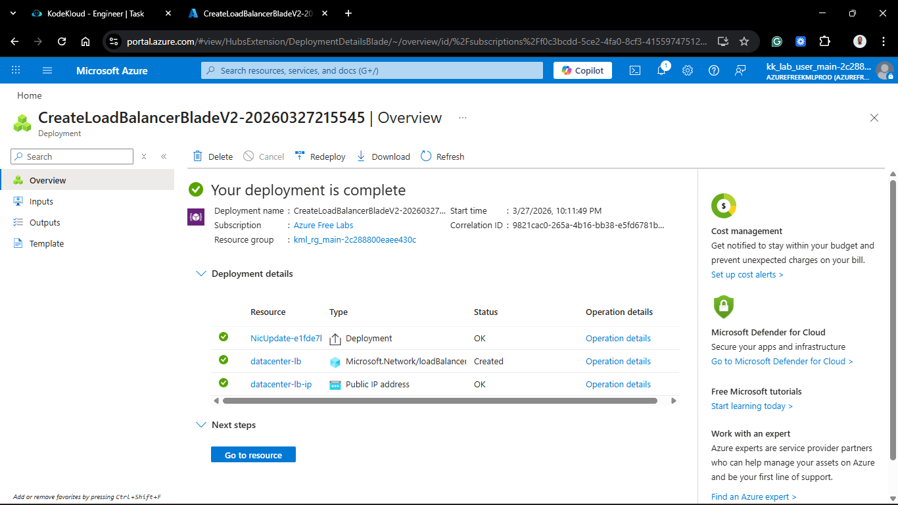

### 4. Update Network Security Group (NSG)

1. Navigated to the **Networking** blade of the backend VM.
2. Added an **Inbound security rule**:
    * **Destination port ranges:** `80`.
    * **Protocol:** `TCP`.
    * **Action:** `Allow`.
    * **Priority:** `100` (or next available).
    * **Name:** `Allow-HTTP-Inbound`.
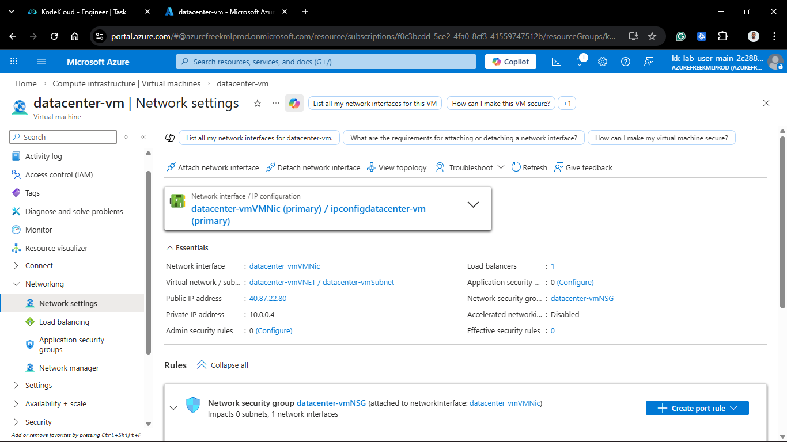

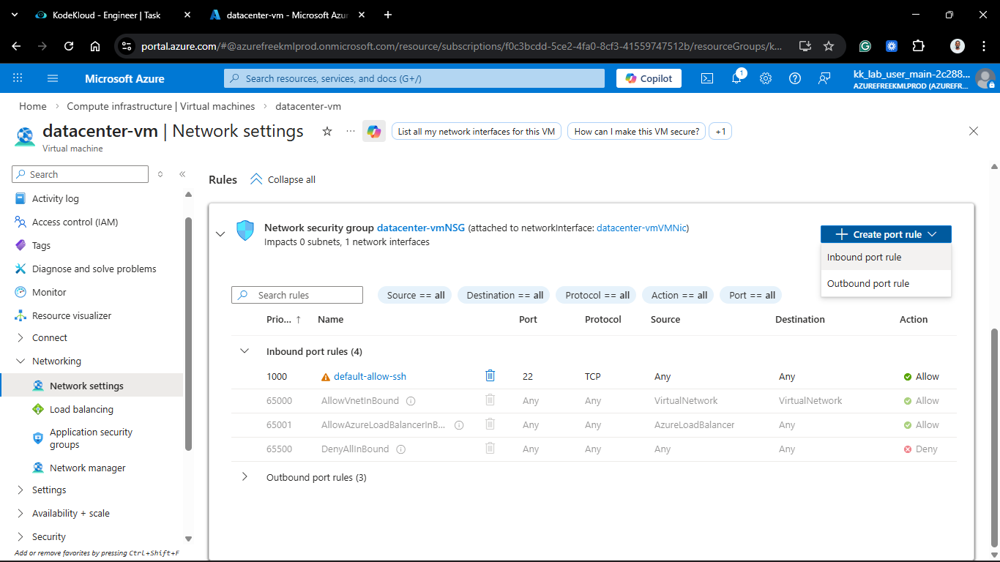

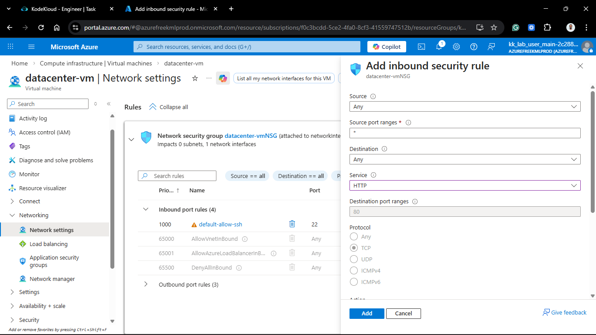

---

## Verification

1. **Connectivity Check:** Retrieved the Public IP from the `datacenter-lb-ip` resource.
2. **Browser Test:** Navigated to `http://<LOAD_BALANCER_IP>`.
3. **Result:** The Nginx sample page loaded successfully via the Load Balancer's IP, confirming the traffic is being correctly routed to the backend pool.
4. **Health Status:** Verified in the Portal that the backend instance is reporting as **Healthy** in the load balancer metrics.
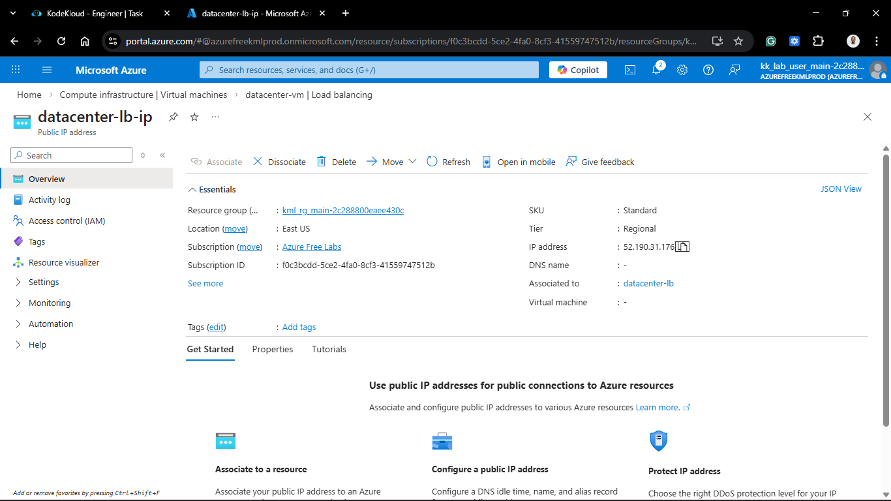
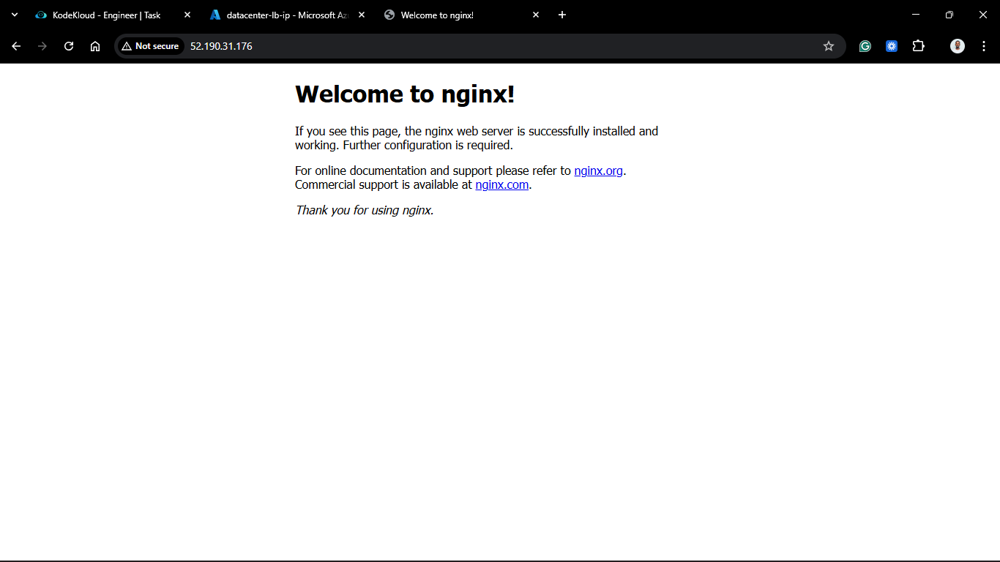

## 🧠 Theory: Azure Load Balancer Components

* **Frontend IP:** This is the "Front Door." Clients send requests to this IP, shielding the actual backend server IPs from the public internet.
* **Backend Pool:** A logical grouping of your compute resources (VMs or Virtual Machine Scale Sets) that receive the balanced traffic.
* **Health Probes:** The Load Balancer's "Pulse Check." It continually pings the backend on the specified port. If a probe fails, the LB stops sending traffic to that specific instance to prevent service disruption.
* **Load Balancing Rules:** These define the relationship between the frontend and backend. It dictates which port traffic arrives on and where it should be sent.

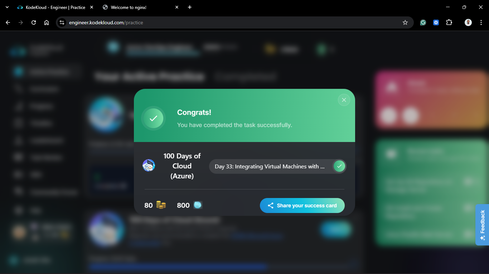
