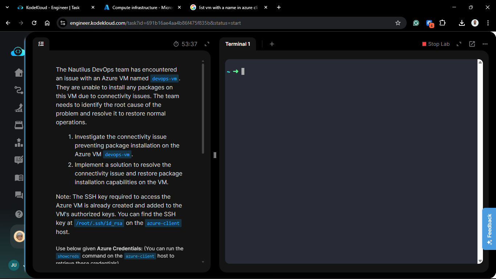
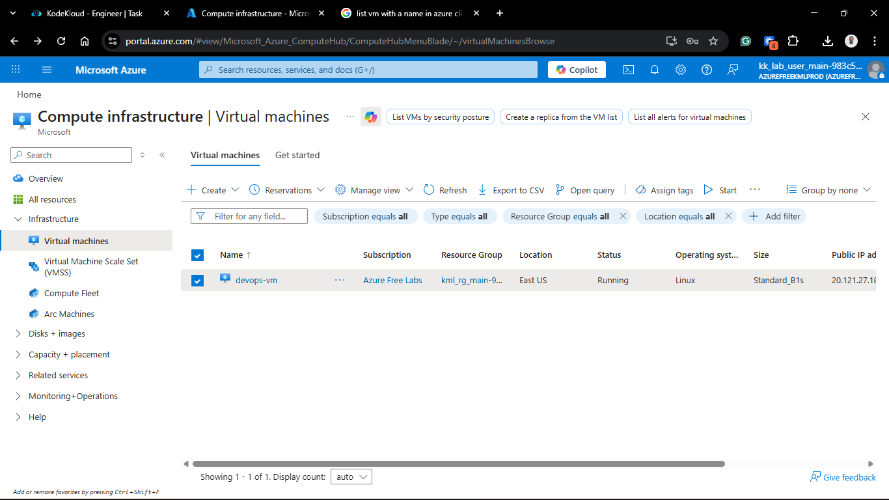
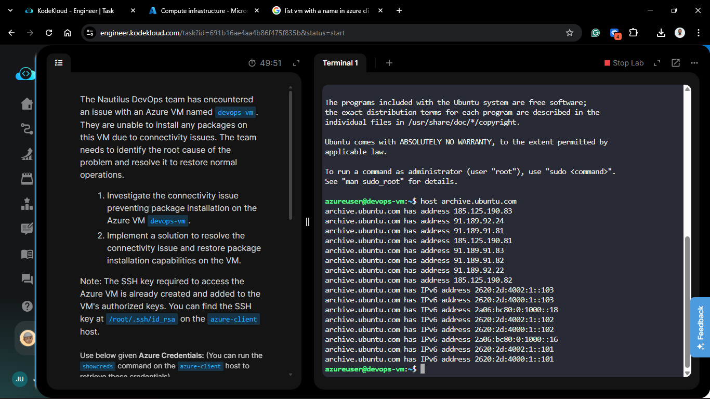
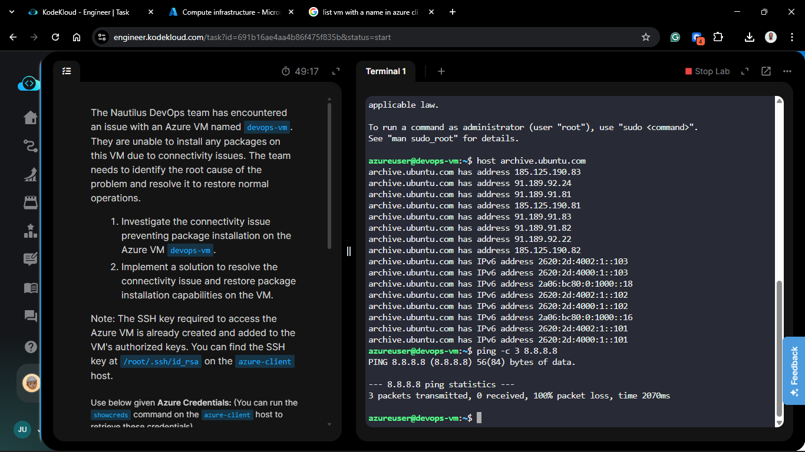
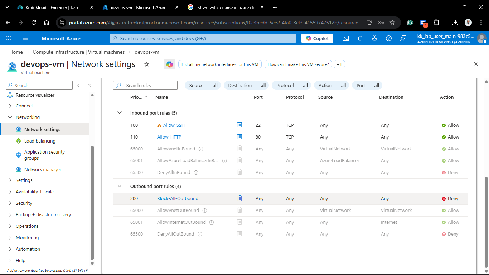
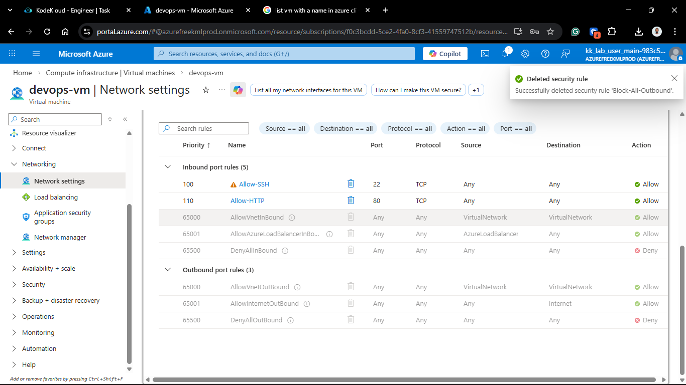
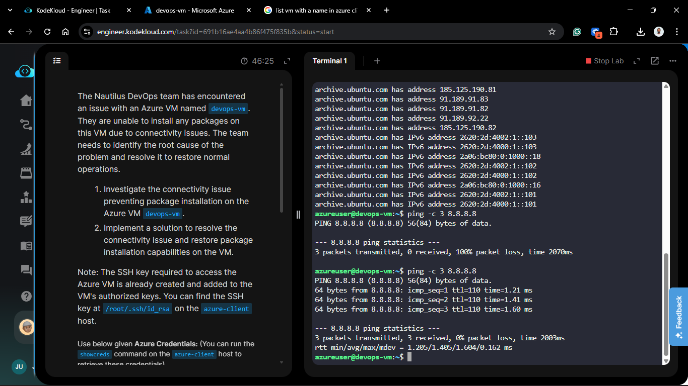
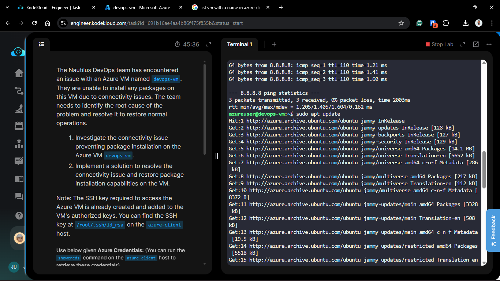
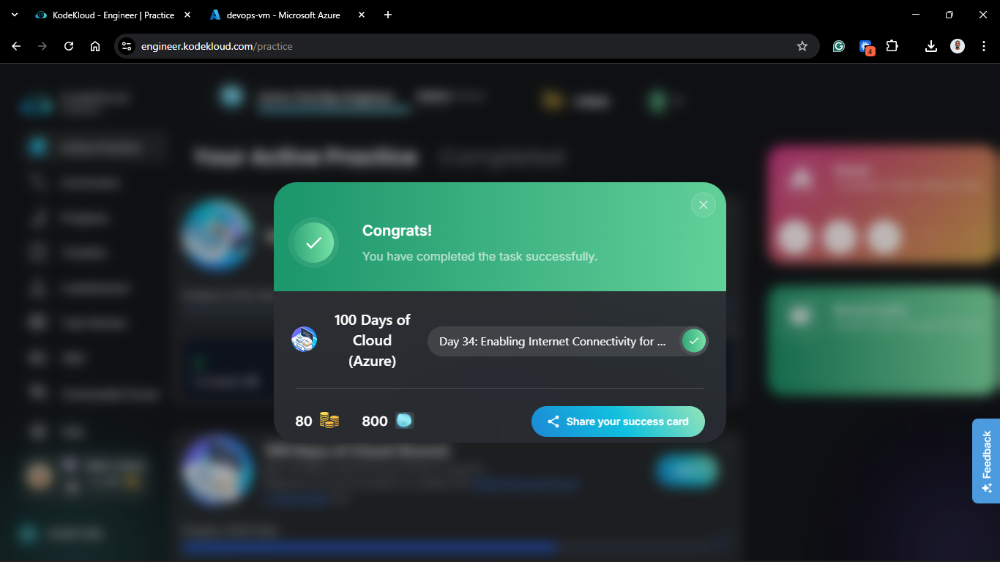

# Day 84: Enabling Internet Connectivity for Virtual Machines

## Project Description

Maintaining the health of a cloud environment requires the ability to update and patch software. The Nautilus DevOps team recently encountered a critical blocker: `devops-vm` was unable to reach external repositories, preventing any `apt` package installations. This task involved a systematic investigation of the **Outbound Networking Path** to identify and remove the bottleneck preventing the VM from reaching the internet.



**The Goal:**
Diagnose the connectivity failure on `devops-vm` and implement a solution to restore outbound access for package management while maintaining a secure perimeter.

## Technical Specifications

| Requirement | Specification |
| :--- | :--- |
| **VM Name** | `devops-vm` |
| **Connectivity Type** | Outbound (Internet) |
| **Primary Goal** | Restore `apt-get install` functionality |
| **Auth Method** | SSH Key (`/root/.ssh/id_rsa` on azure-client) |

---

## Troubleshooting & Resolution

### 1. Initial Investigation (The Terminal)

I accessed the `azure-client` host and established an SSH connection to `devops-vm` to verify the symptoms.



```bash
ssh -i /root/.ssh/id_rsa azureuser@<VM_PRIVATE_OR_PUBLIC_IP>

# Test 1: DNS Resolution
host archive.ubuntu.com
# Result: Connection Timed Out (No DNS)

# Test 2: IP Connectivity
ping -c 3 8.8.8.8
# Result: 100% packet loss (No Outbound Path)
```




### 2. Identifying the Root Cause (Portal)

I navigated to the Azure Portal to audit the networking components associated with `devops-vm`.

- **Outbound NSG Rules:** I discovered a high-priority (Priority 100) Deny rule named `Deny-All-Outbound` targeting the `Internet` Service Tag.


- **Effective Routes:** Verified that the system route for `0.0.0.0/0` was correctly pointing to the "Internet" gateway, confirming the issue was a firewall (NSG) block, not a routing loop.

### 3. Implementing the Fix

I deleted the `Deny-All-Outbound` NSG rule. Removing this rule allowed the VM to establish outbound connection.



### Verification

1. **Connectivity Check:** Ran `ping -c 3 google.com` from the VM; 0% packet loss.

2. **Package Installation:**

```bash
sudo apt-get update
```



## 🧠 Theory: Azure Outbound Connectivity

- **Default Outbound Access:** By default, VMs in Azure have outbound access to the internet. However, enterprise environments often implement a "Lockdown" policy (Deny All) to prevent data exfiltration.

- **Service Tags:** Instead of allowing individual IP ranges for every Ubuntu repository, we use the `Internet` Service Tag. This simplifies management by allowing Azure to maintain the massive list of public IP addresses.

- **Stateful Rules:** Even though we are trying to download a package, the request starts inside the VM. Therefore, an Outbound rule is required to let the request out. Because NSGs are stateful, the incoming data from the repository is automatically allowed back in.


