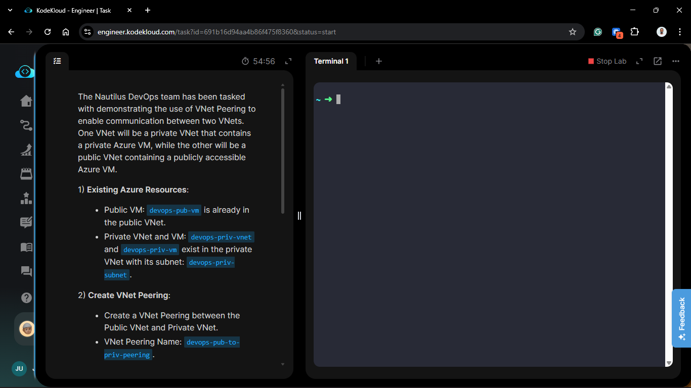
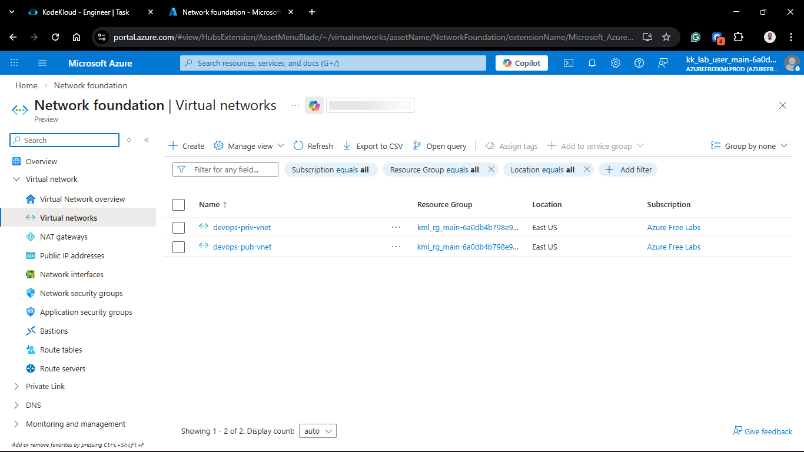
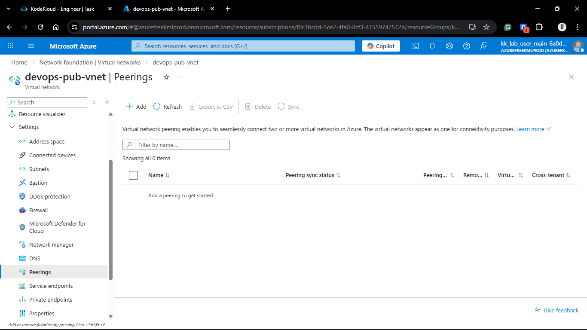
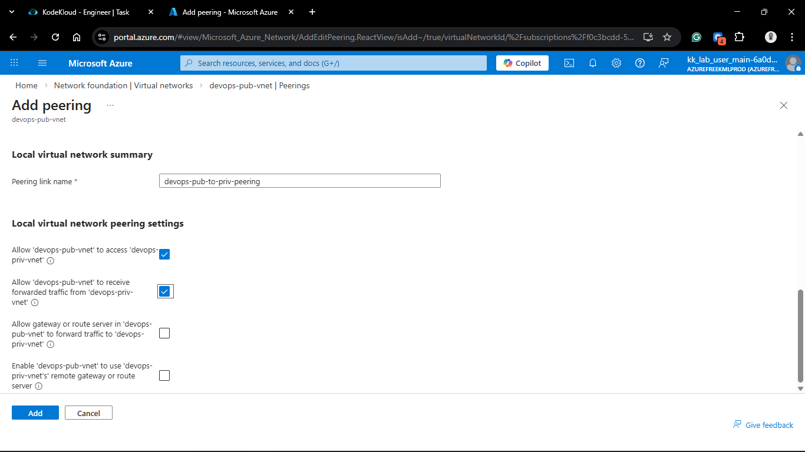
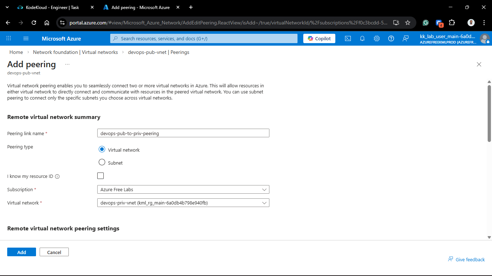
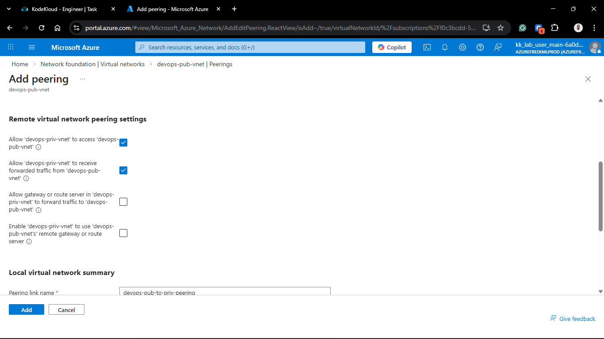
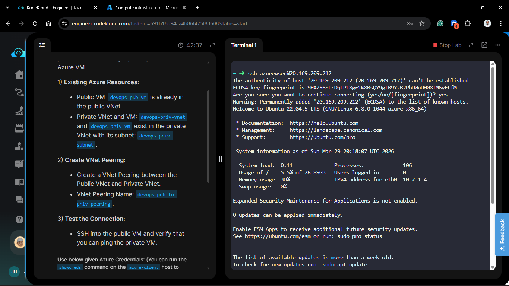
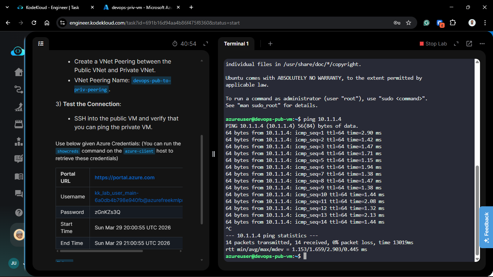
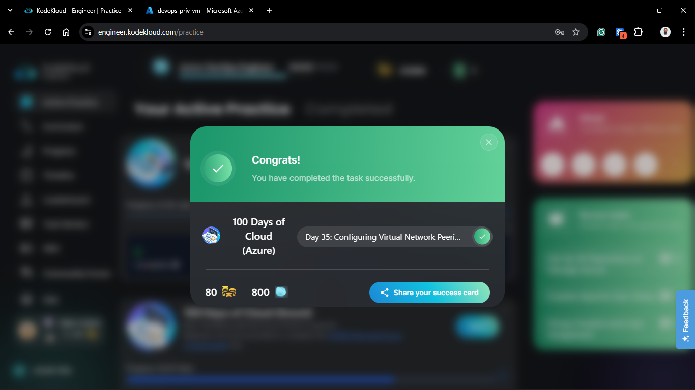

# Day 85: Configuring Virtual Network Peering

## Project Description

In a production environment, isolation is key, but communication is necessary. Today’s task for the Nautilus DevOps team is to bridge the gap between our **Public VNet** (the DMZ) and our **Private VNet** (the backend) using **Virtual Network Peering**. By peering these networks, we allow resources in both VNets to communicate over the Azure backbone with low latency and high bandwidth, as if they were part of the same network.



**The Goal:**

Establish a secure, private connection between `devops-pub-vnet` and `devops-priv-vnet` and verify that the public-facing VM can "see" the private backend VM.

## Technical Specifications

| Requirement | Specification |
| :--- | :--- |
| **Public VM** | `devops-pub-vm` |
| **Private VNet** | `devops-priv-vnet` |
| **Private Subnet** | `devops-priv-subnet` |
| **Private VM** | `devops-priv-vm` |
| **Peering Name** | `devops-pub-to-priv-peering` |

---

## Steps & Configuration



### 1. Initiate Peering from the Public VNet

1. Navigate to **Virtual Networks** and select the VNet containing the public VM (e.g., `devops-pub-vnet`).
2. In the sidebar under **Settings**, select **Peerings**.
3. Click **+ Add**.


### 2. Configure Peering Links

Azure peering requires a "link" in both directions.

1. **This Virtual Network (Local):**
    * **Peering link name:** `devops-pub-to-priv-peering`.
    * Traffic to remote virtual network: **Allow (Default)**.
    * Traffic forwarded from remote virtual network: **Allow (Default)**.
  

2. **Remote Virtual Network:**
    * **Peering link name:** `devops-priv-to-pub-peering`.
    * **Virtual network deployment model:** Resource manager.
    * **Virtual network:** Select `devops-priv-vnet`.
    * Traffic to remote virtual network: **Allow (Default)**.
    * Traffic forwarded from remote virtual network: **Allow (Default)**.
  
  

3. Click **Add**. Wait for the status to show **Connected**.

### 3. Verification

1. **Retrieve Private IP:** Go to the `devops-priv-vm` overview page and copy its **Private IP address** (e.g., `10.0.1.4`).
2. **SSH Access:** SSH into the `devops-pub-vm` using its public IP.

    ```bash
    ssh azureuser@<PUBLIC_IP>
    ```



1. **Ping Test:** Attempt to ping the private IP of the backend VM.

    ```bash
    ping <PRIVATE_IP_OF_DEVOPS_PRIV_VM>
    ```



---

## Troubleshooting Note: ICMP

If the ping fails but the peering status is "Connected," check the **Network Security Group (NSG)** of the `devops-priv-vm`. By default, Azure allows VNet-to-VNet traffic, but many Linux distros or custom NSG rules may block **ICMP** (Ping). You may need to add an inbound rule to allow ICMP traffic from the public VNet's CIDR range.

## 🧠 Theory: VNet Peering vs. VPN Gateway

* **Backbone Performance:** VNet Peering uses the Microsoft backbone network. Traffic never touches the public internet, ensuring extremely low latency.
* **Transitive Peering:** Peering is **not** transitive. If VNet A is peered with VNet B, and VNet B is peered with VNet C, VNet A and VNet C *cannot* talk to each other unless you create a direct peering between them or use a VPN Gateway/NVA as a hub.
* **Cost Efficiency:** Peering is generally more cost-effective and simpler to manage than a VPN Gateway for intra-Azure connectivity.


