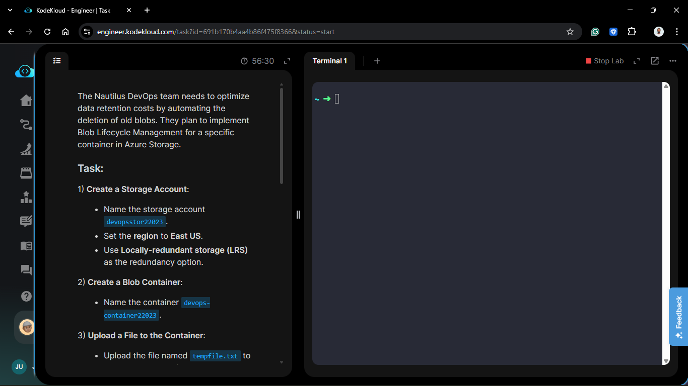
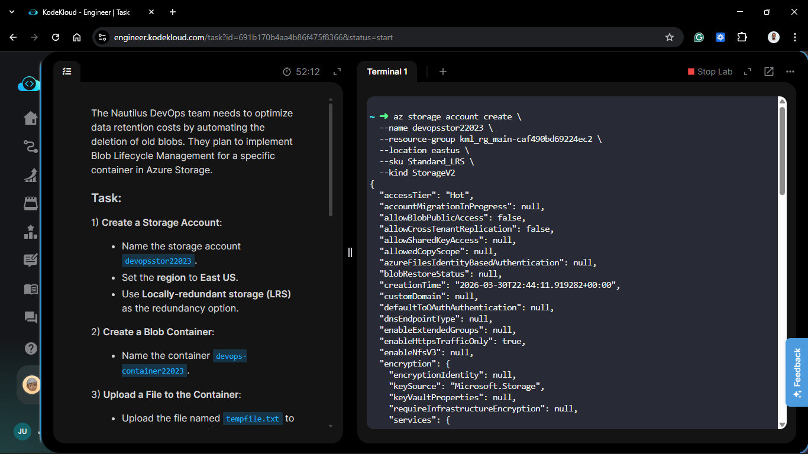
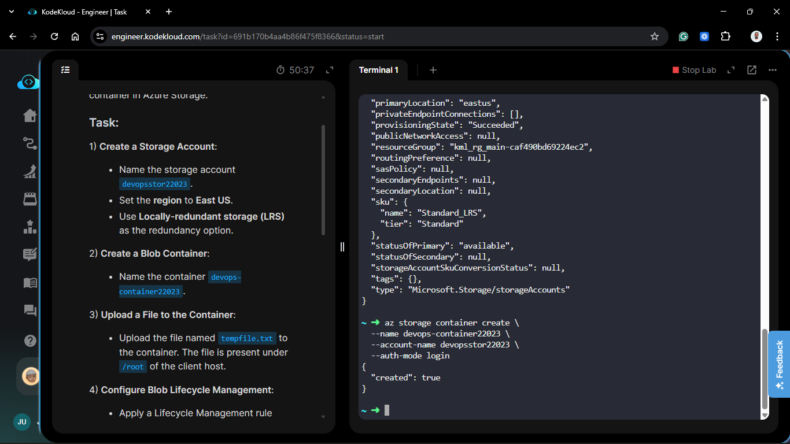
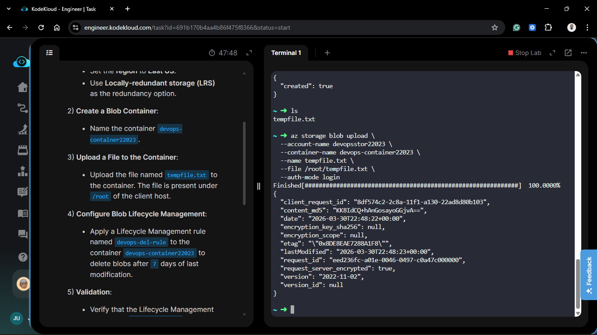
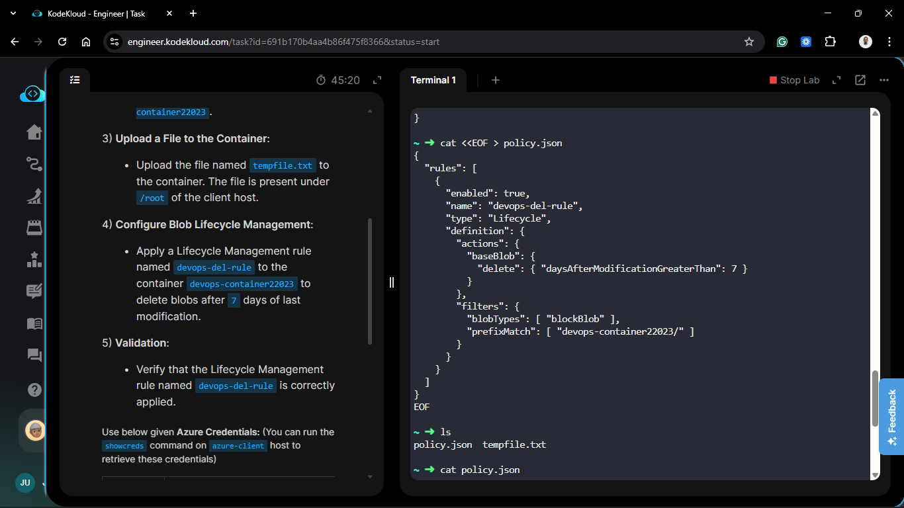
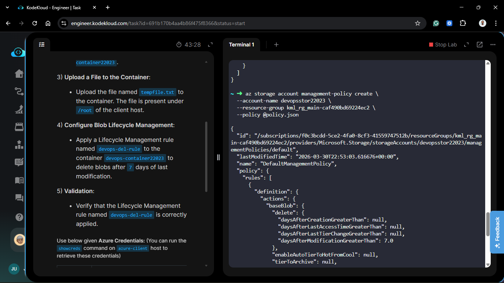
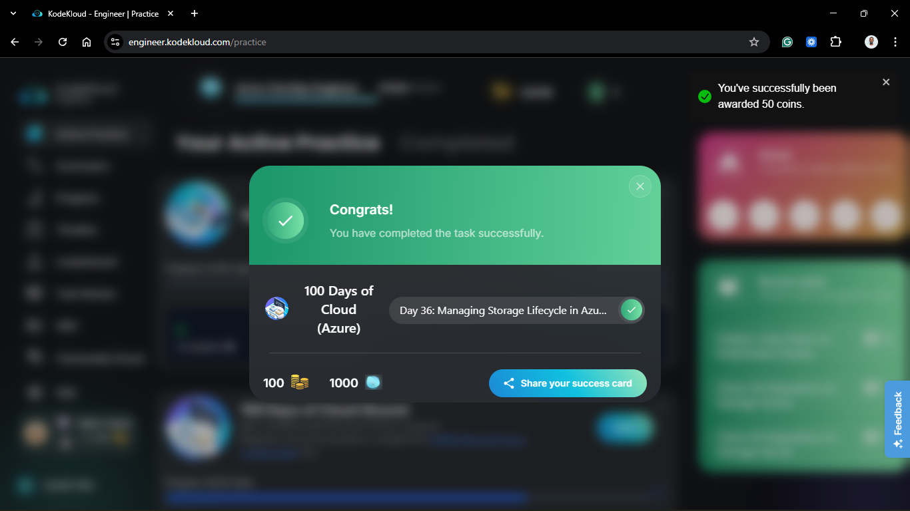

# Day 86: Managing Storage Lifecycle in Azure

## Project Description

As the Nautilus project accumulates logs, temporary data, and backups, storage costs can spiral if left unmanaged. Today's task focuses on **Cost Optimization** through automated data governance. By implementing **Blob Lifecycle Management**, we move away from manual cleanup and rely on policy-based automation to delete stale data. This ensures that our storage account remains lean and that we only pay for data that is actively providing value to the DevOps team.



**The Goal:**

Provision a storage account and container via the Azure CLI, upload a sample file, and apply a lifecycle management policy named `devops-del-rule` to automatically delete blobs 7 days after their last modification.

## Technical Specifications

| Requirement | Specification |
| :--- | :--- |
| **Storage Account** | `devopsstor22023` |
| **Region** | `eastus` |
| **Redundancy** | `Locally-redundant storage (LRS)` |
| **Container Name** | `devops-container22023` |
| **Lifecycle Rule** | `devops-del-rule` |
| **Retention Policy** | Delete after 7 days of last modification |

---

## Steps & Configuration (Azure CLI)

### 1. Provision the Storage Infrastructure

I began by creating the storage account and the target container using the Azure CLI.

```bash
# 1. Create the Storage Account
az storage account create \
  --name devopsstor22023 \
  --resource-group kml_rg_main-caf490bd69224ec2 \
  --location eastus \
  --sku Standard_LRS \
  --kind StorageV2

# 2. Create the Blob Container
az storage container create \
  --name devops-container22023 \
  --account-name devopsstor22023 \
  --auth-mode login
```




### 2. Upload the Sample File

I uploaded the `tempfile.txt` from the local root directory to simulate active data.

```bash
az storage blob upload \
  --account-name devopsstor22023 \
  --container-name devops-container22023 \
  --name tempfile.txt \
  --file /root/tempfile.txt \
  --auth-mode login
```



### 3. Define and Apply Lifecycle Management Policy

To automate the deletion, I created a policy definition and applied it to the storage account. This rule specifically targets the `devops-container22023`.

``` bash
# Define the policy in a JSON file

cat <<EOF > policy.json
{
  "rules": [
    {
      "enabled": true,
      "name": "devops-del-rule",
      "type": "Lifecycle",
      "definition": {
        "actions": {
          "baseBlob": {
            "delete": { "daysAfterModificationGreaterThan": 7 }
          }
        },
        "filters": {
          "blobTypes": [ "blockBlob" ],
          "prefixMatch": [ "devops-container22023/" ]
        }
      }
    }
  ]
}
EOF

# Apply the management policy

az storage account management-policy create \
  --account-name devopsstor22023 \
  --resource-group kml_rg_main-caf490bd69224ec2 \
  --policy @policy.json
```





## 🧠 Theory: Automating the Data Lifecycle

- **Cost Governance:** Managed disks and blobs are cheap, but "orphaned" or "stale" data adds up. Lifecycle management allows DevOps teams to implement a "Set and Forget" cleanup strategy.

- **Modification vs. Creation:** This rule uses `daysAfterModificationGreaterThan`. This is safer than "Creation" date because if a file is updated on day 6, the 7-day clock resets, ensuring active files aren't deleted.

- **StorageV2 (General Purpose v2):** Lifecycle management is a feature of GPv2 accounts. It provides a native way to transition data between Hot, Cool, and Archive tiers, or delete it entirely, without writing custom cleanup scripts.


