# Day 87 (Azure Day 37): Setting Up MySQL on a Virtual Machine in Azure

## Project Description

As the Nautilus migration progresses, we are moving beyond single-server setups to **Distributed Architectures**. Today's task involves a multi-region integration: connecting a PHP web application hosted in **East US** to a dedicated MySQL database instance in **Central US**. This exercise validates cross-region connectivity, the use of Marketplace images (Jetware), and the configuration of remote database access within the Azure cloud.

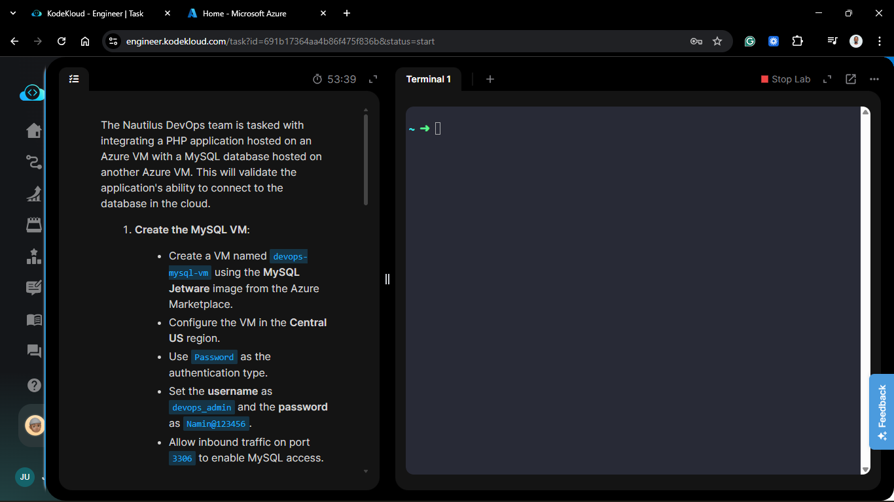

**The Goal:**

Provision a MySQL server using the Jetware marketplace image, configure a secure database and user, and update a remote PHP application to establish a successful cross-region handshake.

## Technical Specifications

| Component | Specification |
| :--- | :--- |
| **MySQL VM Name** | `devops-mysql-vm` |
| **MySQL Image** | `MySQL Jetware` (Marketplace) |
| **Region (DB)** | `Central US` |
| **Region (App)** | `East US` (`devops-php-vm`) |
| **MySQL Port** | `3306` |
| **Database** | `devops_db` |
| **MySQL User** | `devops_user` / `password123` |

---

## Steps & Configuration

### 1. Provision the MySQL VM

I deployed the `devops-mysql-vm` using the specialized Jetware image to ensure a pre-optimized MySQL environment.

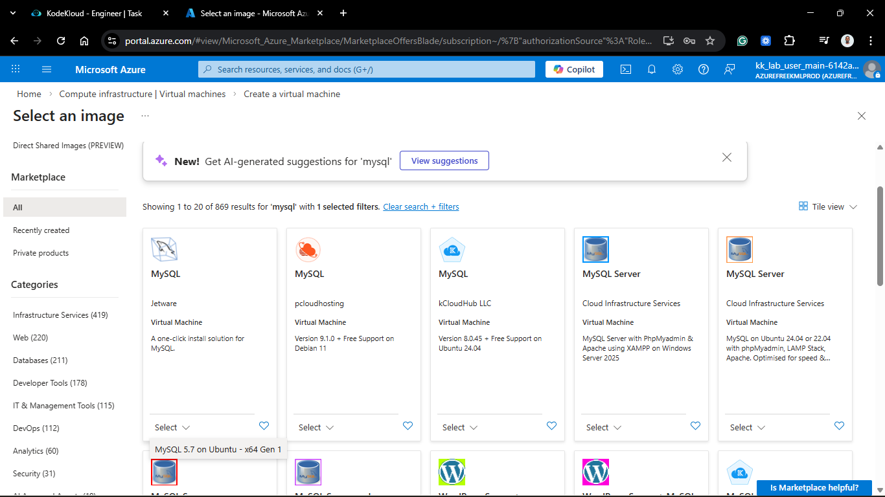

1. **Region:** `Central US`.
2. **Authentication:** Password (`devops_admin` / `Namin@123456`).
3. **Networking:** Added an inbound rule to the NSG to allow traffic on **Port 3306**.

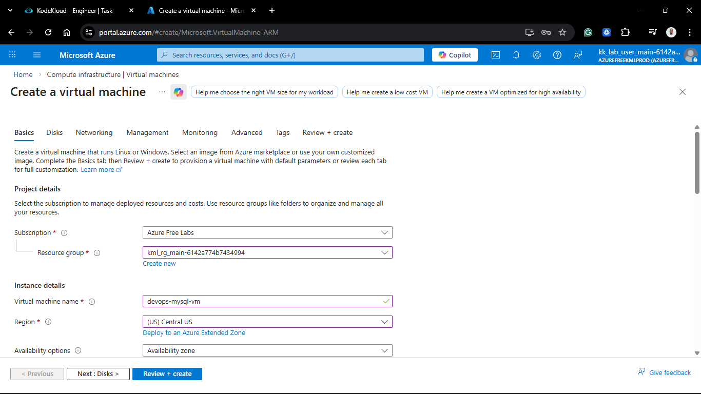

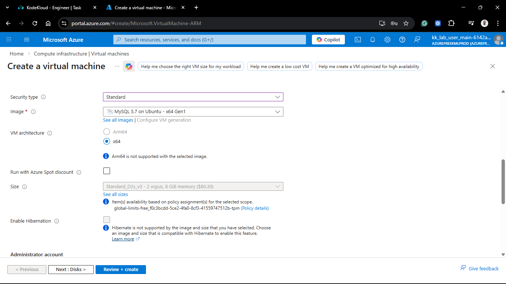

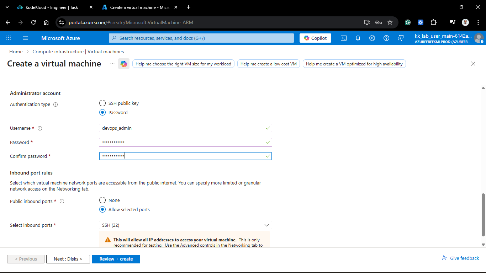

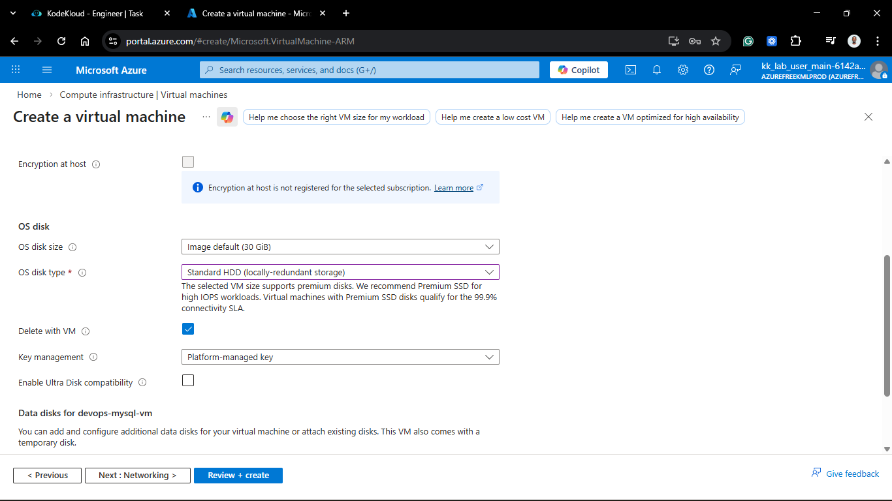

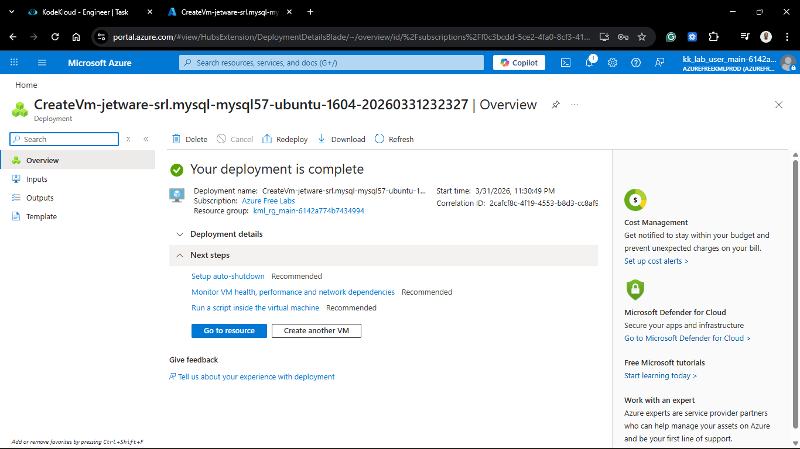

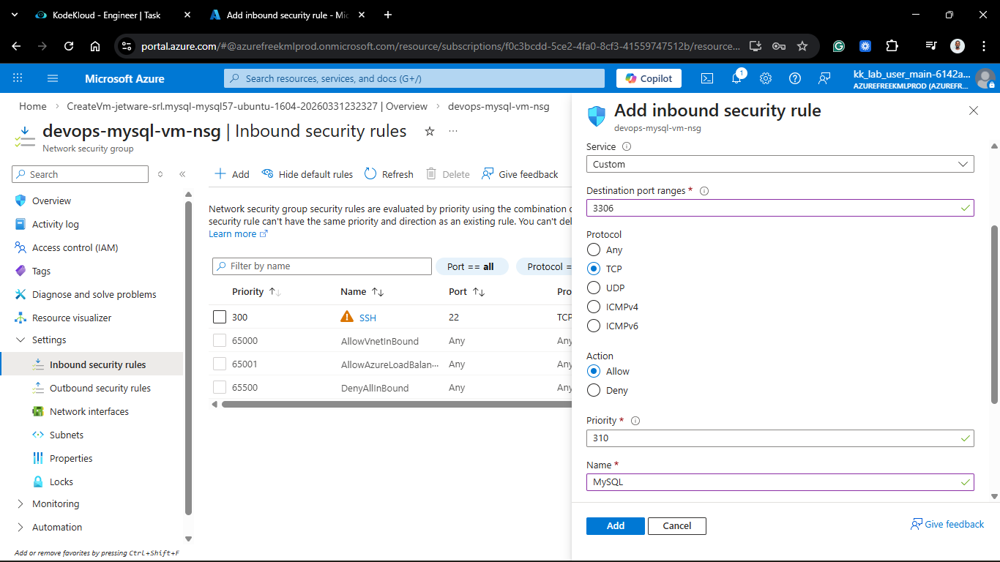

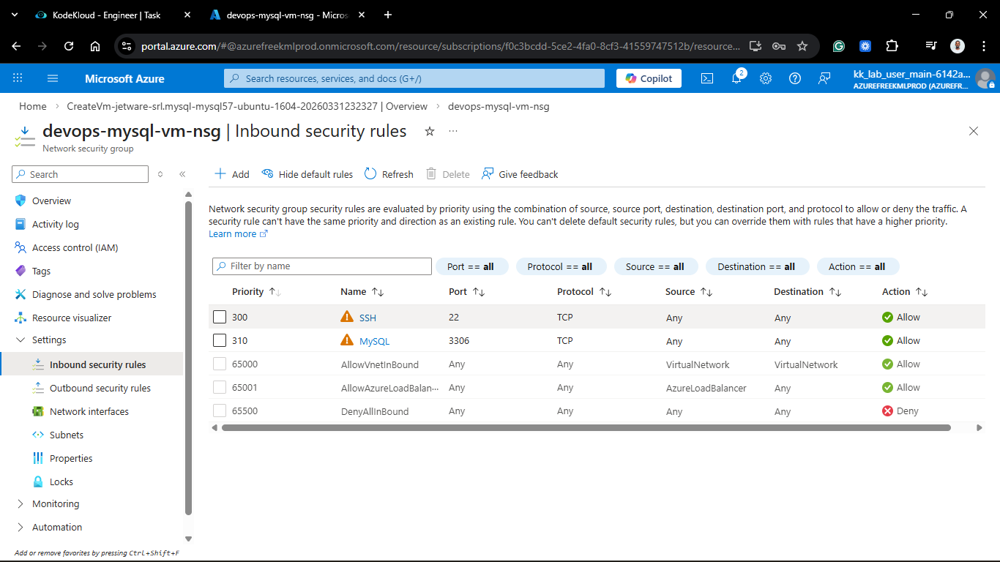

### 2. Configure the MySQL Database

Once the VM was "Running," I accessed the MySQL shell to prepare the schema and user permissions.

```bash
# SSH into the MySQL VM
ssh devops_admin@<MYSQL_VM_PUBLIC_IP>

# Enter the Jetware MySQL shell
sudo /jet/enter mysql

# SQL Commands
CREATE DATABASE devops_db;
CREATE USER 'devops_user'@'%' IDENTIFIED BY 'password123';
GRANT ALL PRIVILEGES ON devops_db.* TO 'devops_user'@'%';
FLUSH PRIVILEGES;
EXIT;
```

>**Note**: I used `'devops_user'@'%'` to allow the connection from the remote PHP VM's public IP.

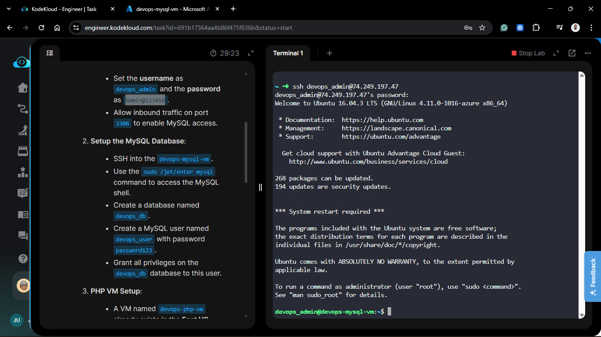

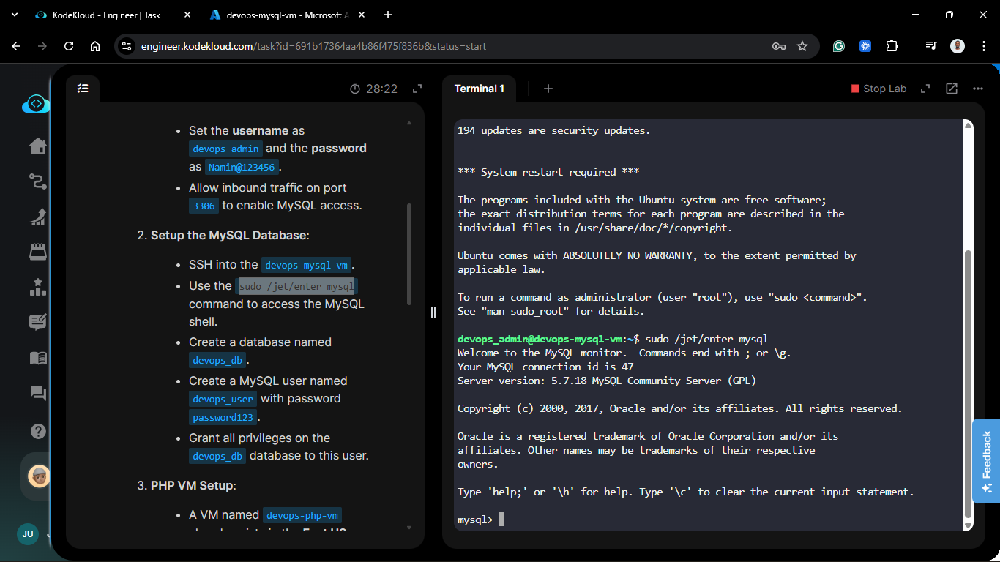

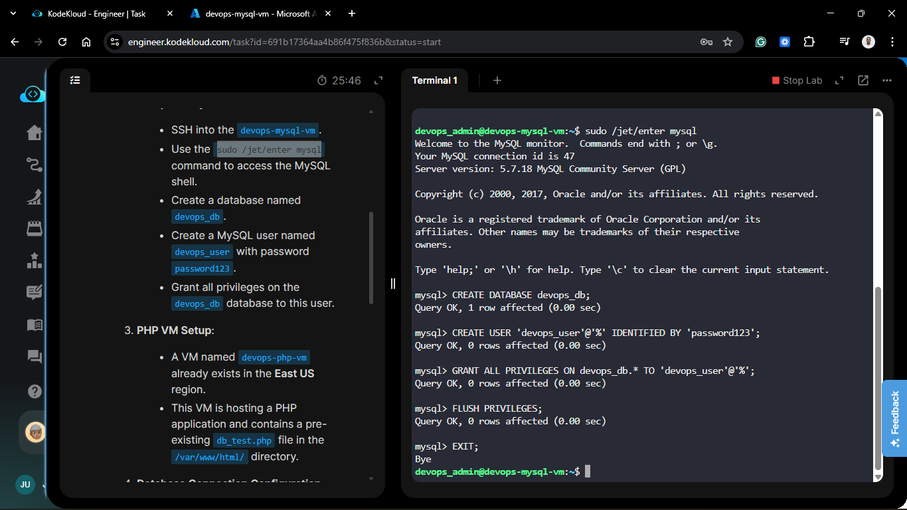

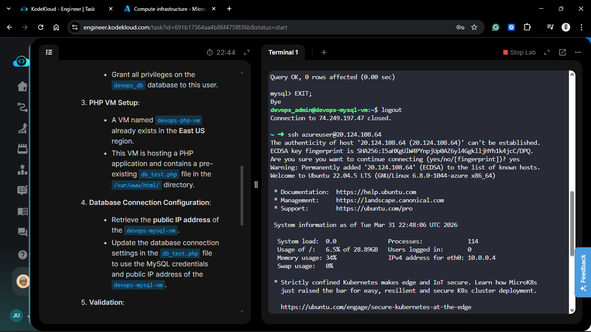

### 3. Integrate the PHP Application

On the existing `devops-php-vm` in East US, I updated the database connection script to point to our new Central US instance.

1. **File Path:** `/var/www/html/db_test.php`.

2. **Update Parameters:**
   - **Servername:** `<PUBLIC_IP_OF_DEVOPS_MYSQL_VM>`
   - **Username:** `devops_user`
   - **Password:** `password123`
   - **Database:** `devops_db`
  
  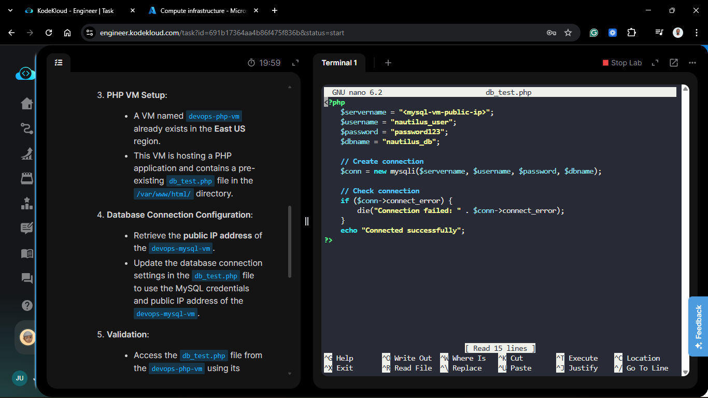

  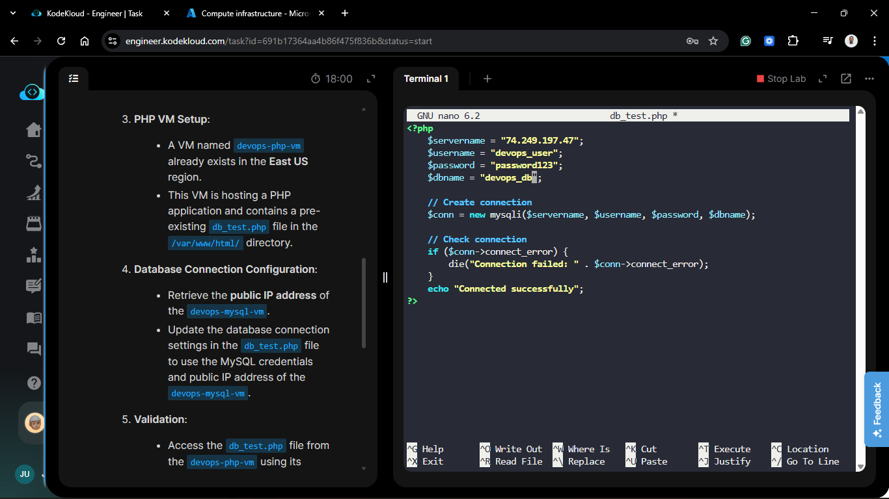

### 4. Validation

I performed a web-based check to verify the cross-region connection.

1. Opened a browser and navigated to `http://<PHP_VM_PUBLIC_IP>/db_test.php`.

2. **Result:** The page successfully displayed: "Connected successfully".

## Verification

1. **Network Access:** Confirmed Port 3306 is open and responding via `telnet` or `nc`.

2. **User Access:** Verified `devops_user` can authenticate remotely.

3. **App Logic:** The PHP `mysqli_connect` function returned a success state, confirming the multi-region bridge is operational.

## 🧠 Theory: Distributed Database Architecture

- **Marketplace Images:** Using Jetware simplifies deployment by providing a pre-configured stack. This reduces the time spent on "Day 0" installation and moves straight to "Day 1" configuration.

- **Cross-Region Latency:** Because the App is in East US and the DB is in Central US, every query travels over the internet/Azure backbone. While functional, for production workloads, we would typically use VNet Peering or keep resources in the same region to minimize latency.

- **Remote User Permissions:** MySQL users are defined by `username@host`. Setting the host to `%` (wildcard) is necessary for remote connections, but in a hardened environment, we would restrict this to the specific IP of the PHP server.

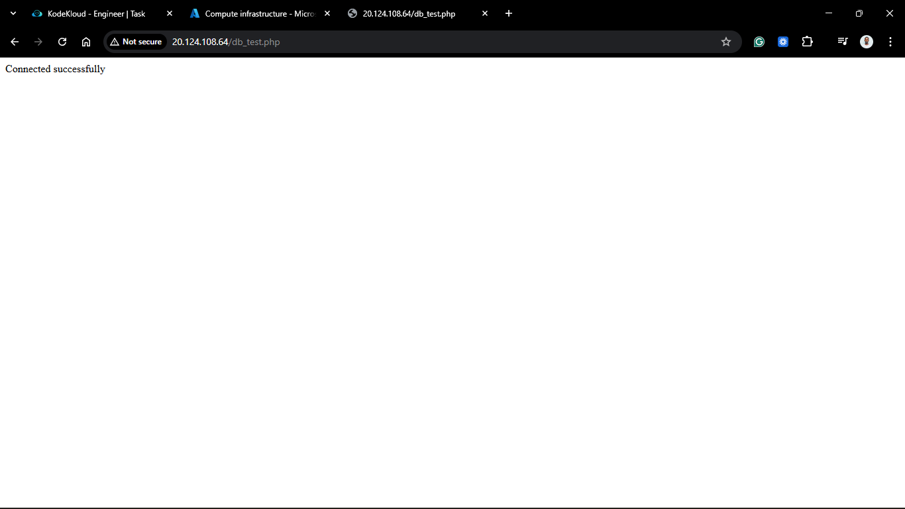

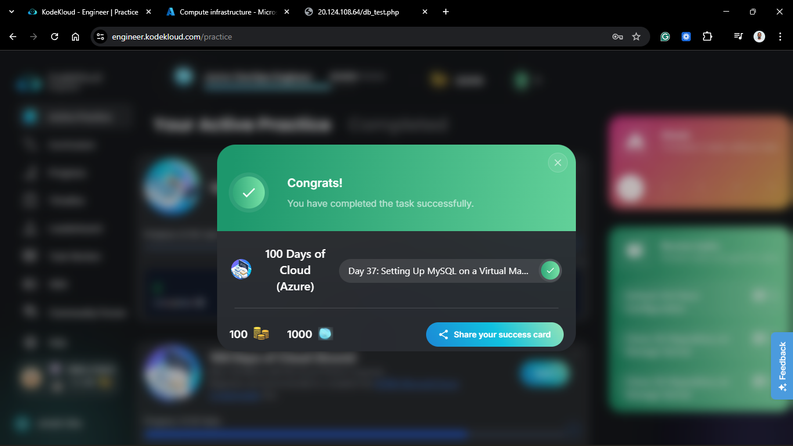
