# Day 88: Integrating Virtual Machines with Azure Blob Storage

## Project Description

As the Nautilus project scales, data persistence and off-host storage become critical. While the local disks of a Virtual Machine are great for temporary files, long-term data like logs, user uploads, and backups should be moved to a durable, scalable object store. Today's task involves establishing a secure bridge between our compute layer (`nautilus-vm`) and our storage layer (`nautilusstor18008`). By leveraging the Azure CLI directly from the VM, we can automate data exfiltration and ingestion processes seamlessly.

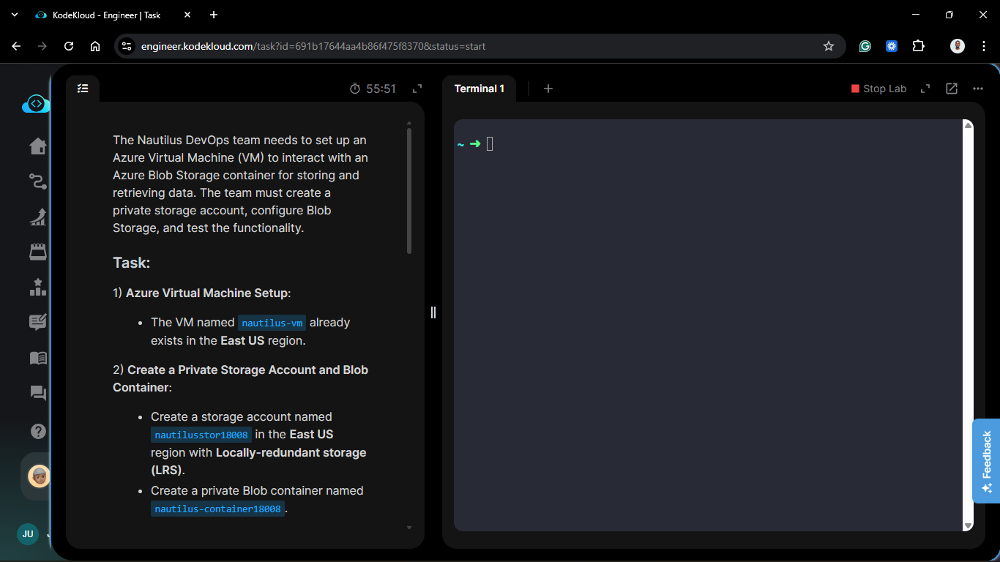

**The Goal:**
Provision a secure, private storage environment and verify that our existing compute instance can authenticate and upload data using primary access keys.

## Technical Specifications

| Component | Specification |
| :--- | :--- |
| **VM Name** | `nautilus-vm` (Existing) |
| **Storage Account** | `nautilusstor18008` |
| **Region** | `East US` |
| **Redundancy** | `LRS` (Locally-Redundant Storage) |
| **Container Name** | `nautilus-container18008` |
| **Access Method** | Storage Account Key |

---

## Steps & Configuration

### 1. Provision the Private Storage Account

Using the Azure Portal, I initialized the storage infrastructure.

1. **Name:** `nautilusstor18008`.
2. **Region:** `East US`.
3. **Performance:** Standard.
4. **Redundancy:** Locally-redundant storage (LRS).
5. **Access Tier:** Hot (default).
   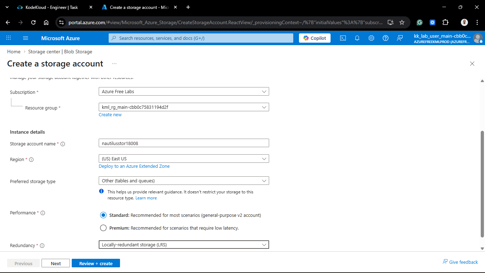
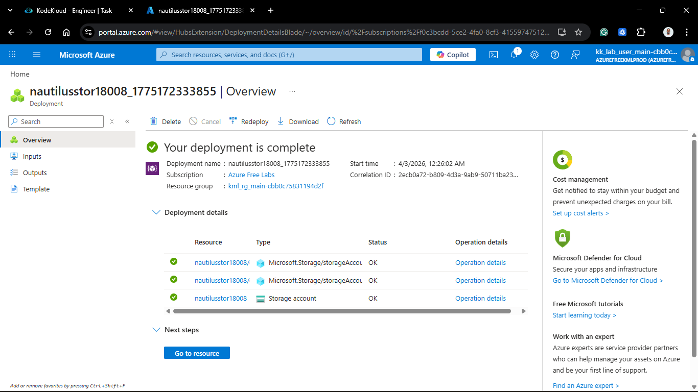

### 2. Create the Private Blob Container

Within the new storage account:

1. Navigated to **Containers**.
2. Created a new container named `nautilus-container18008`.
3. **Public access level:** Private (no anonymous access).
  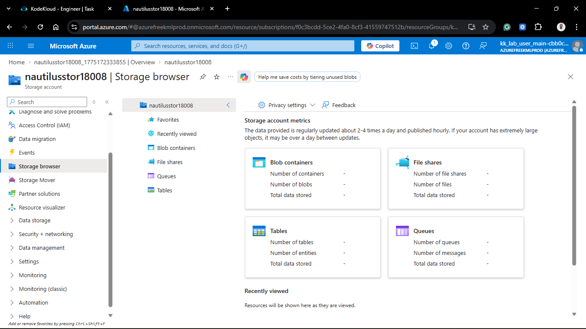
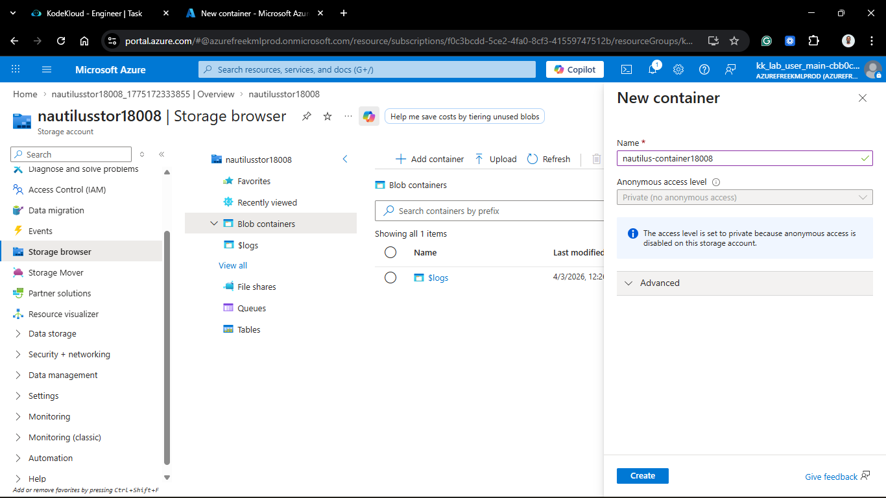
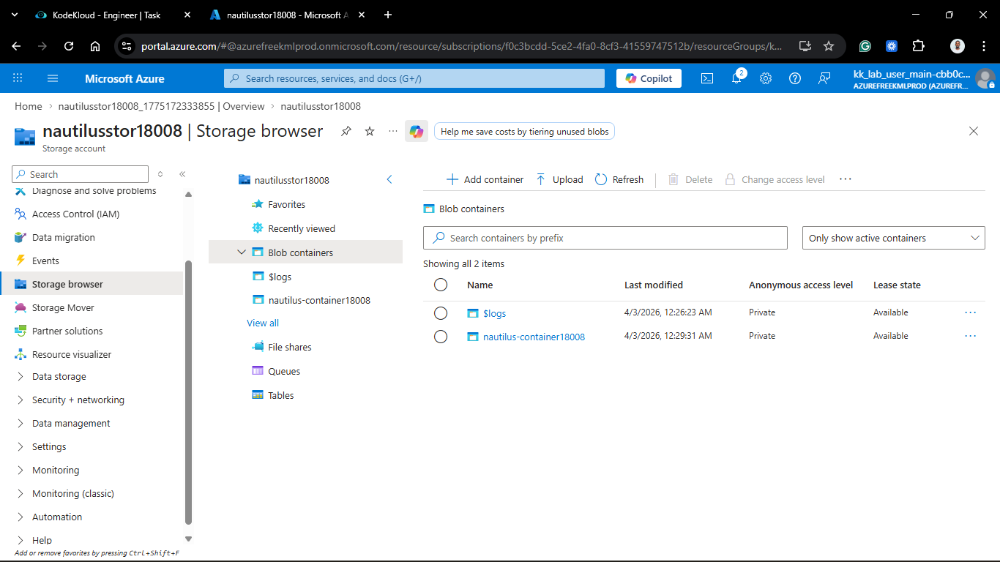

### 3. Retrieve Authentication Credentials

To allow the VM to talk to the storage account, I retrieved the **Access Key**:

1. Navigated to **Security + networking** > **Access keys**.
2. Clicked **Show** on `key1` and copied the Connection String/Key.
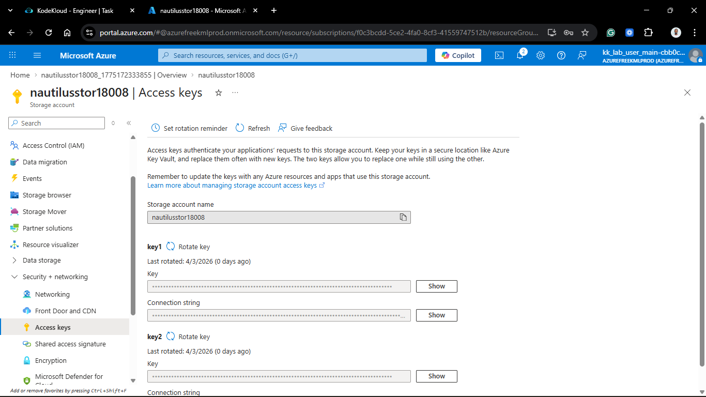

### 4. VM Side: File Creation & Upload

I established an SSH connection to `nautilus-vm` to generate the test data and perform the upload via the CLI.

```bash
# SSH into the VM
ssh azureuser@<VM_IP>

# Create the test file
echo "this is a test file" > /home/azureuser/testfile.txt

# Upload to Azure Blob Storage
az storage blob upload \
  --account-name nautilusstor18008 \
  --account-key <REDACTED_ACCESS_KEY> \
  --container-name nautilus-container18008 \
  --name testfile.txt \
  --file /home/azureuser/testfile.txt
```

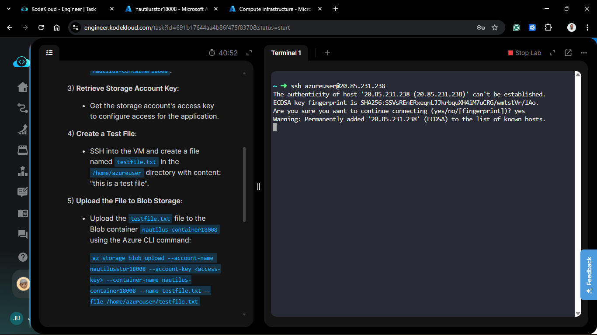

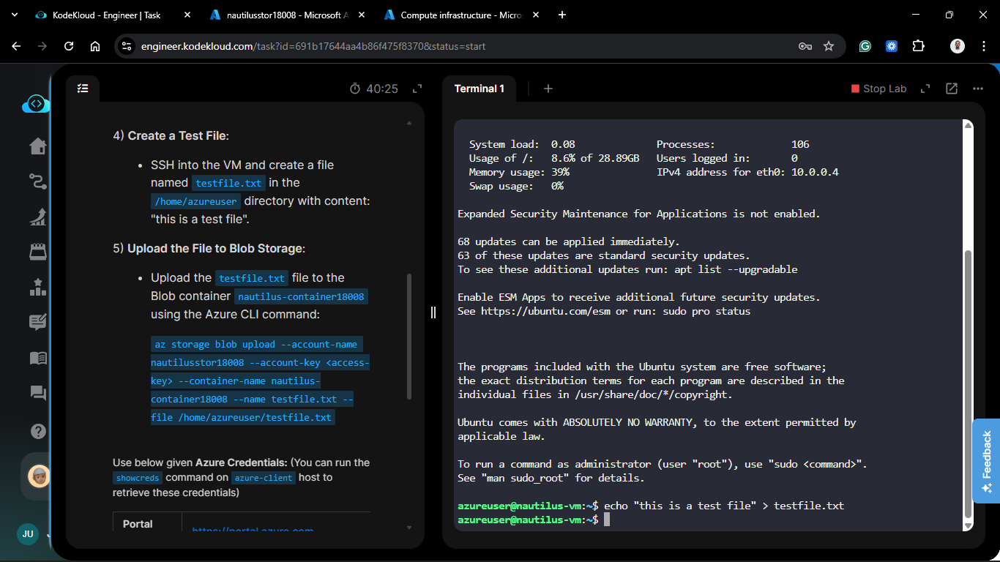

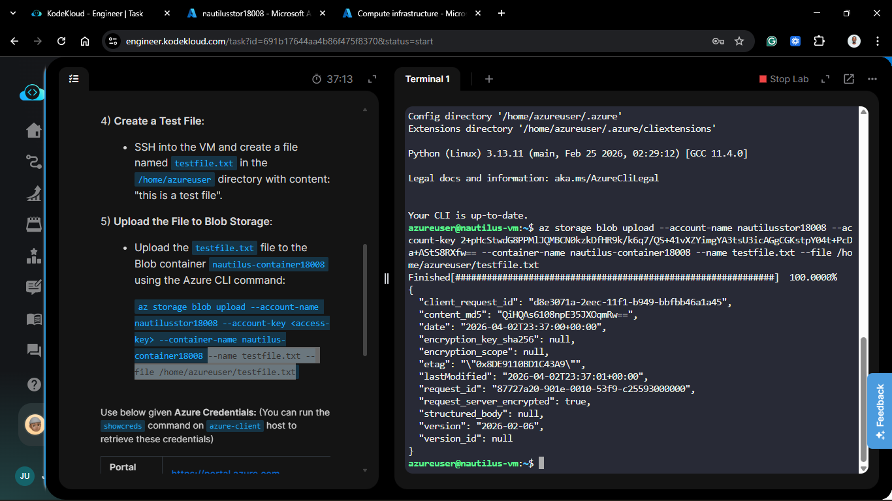

## Verification

- **CLI Output:** Confirmed the `Finished[################################]  100.0000%` status in the terminal.

- **Portal Audit:** Navigated to nautilus-container18008 in the Azure Portal and verified `testfile.txt` was present.

- **Integrity Check:** Downloaded the file from the portal and verified the content: "this is a test file".

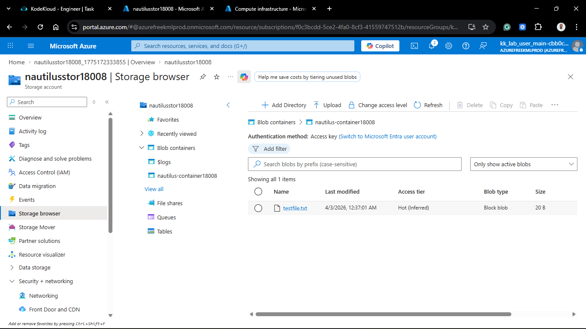

 <!-- az storage blob upload --account-name nautilusstor18008 --ac
count-key 2+pHcStwdG8PPMlJQMBCN0kzkDfHR9k/k6q7/QS+41vXZYimgYA3tsU3icAGgCGKstpY04t+PcDa+AStS8RXfw== --container-name nautilus-container18008 --name testfile.txt --file /home/azureuser/testfile.txt -->

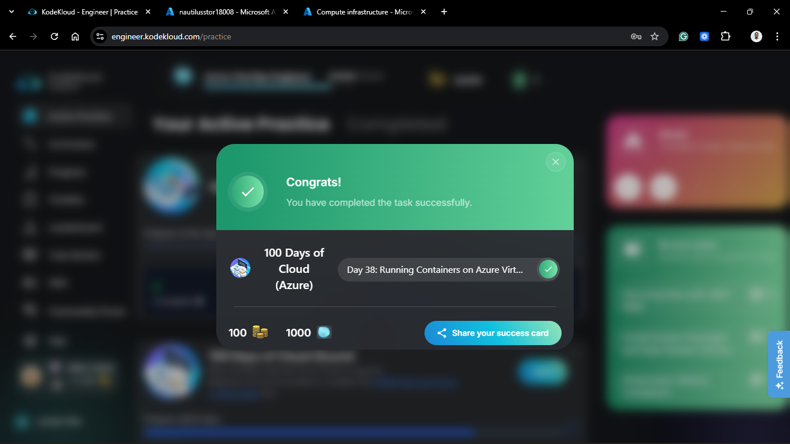
