# Day 89: Deploying a Static Website Using Azure Storage

## Project Description

As the Nautilus project expands its internal information portal, the DevOps team is leveraging **Serverless Hosting** for static content. Instead of managing a Virtual Machine or a container orchestration layer for a simple site, we are utilizing the **Static Website Hosting** feature of Azure Storage. This approach is highly cost-effective, scales automatically to meet demand, and requires zero server maintenance.

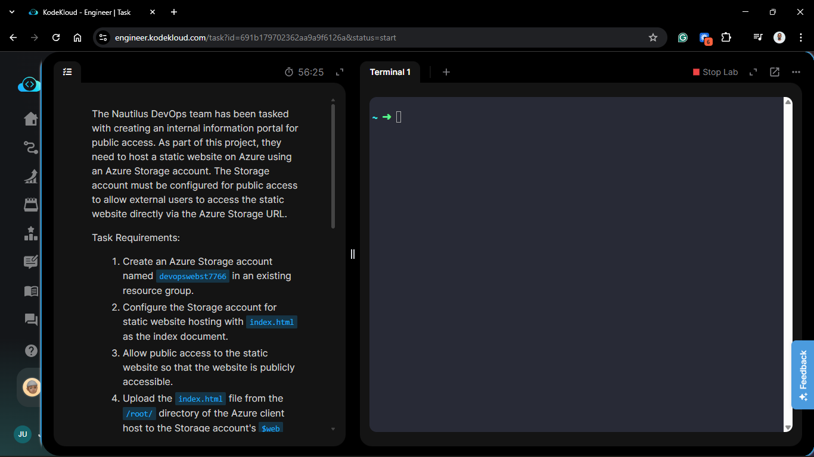

**The Goal:**
Provision a storage account named `devopswebst7766`, enable the static website hosting feature, and deploy an `index.html` file to the specialized `$web` container to make the portal publicly accessible.

## Technical Specifications

| Requirement | Specification |
| :--- | :--- |
| **Storage Account** | `devopswebst7766` |
| **Region** | `East US` |
| **Redundancy** | `LRS` (Locally-Redundant Storage) |
| **Feature** | `Static Website Hosting` |
| **Index Document** | `index.html` |
| **Container** | `$web` |

---

## Steps & Configuration (Azure Portal)

### 1. Provision the Storage Account

1. Navigate to **Storage accounts** in the Azure Portal and click **+ Create**.
2. **Resource Group:** Selected the existing lab resource group.
3. **Storage account name:** `devopswebst7766`.
4. **Region:** `East US`.
5. **Performance:** Standard.
6. **Redundancy:** Locally-redundant storage (LRS).
7. **Advanced Tab:** Ensured "Allow pipeline public access" is enabled to support static hosting.

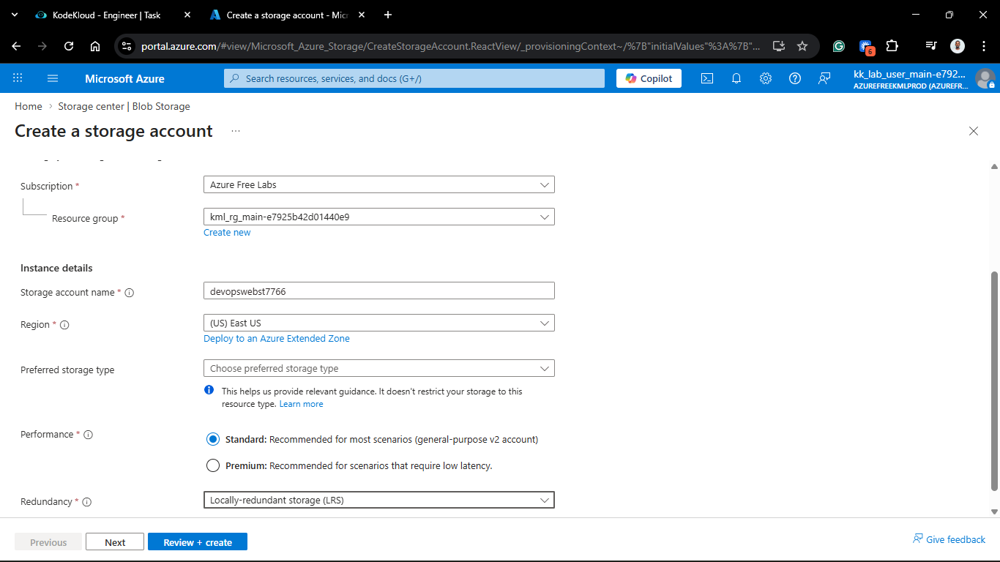

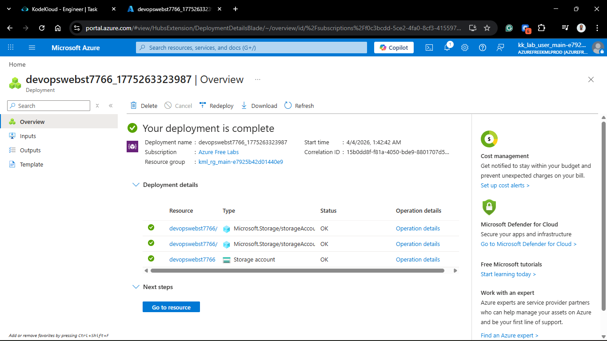

### 2. Enable Static Website Hosting

Once the account was deployed:

1. Navigated to the `devopswebst7766` resource.
2. In the sidebar under **Data management**, selected **Static website**.
3. Set **Static website** to **Enabled**.
4. **Index document name:** `index.html`.
5. **Save** the changes.
6. *Note:* This automatically creates a container named `$web`.

   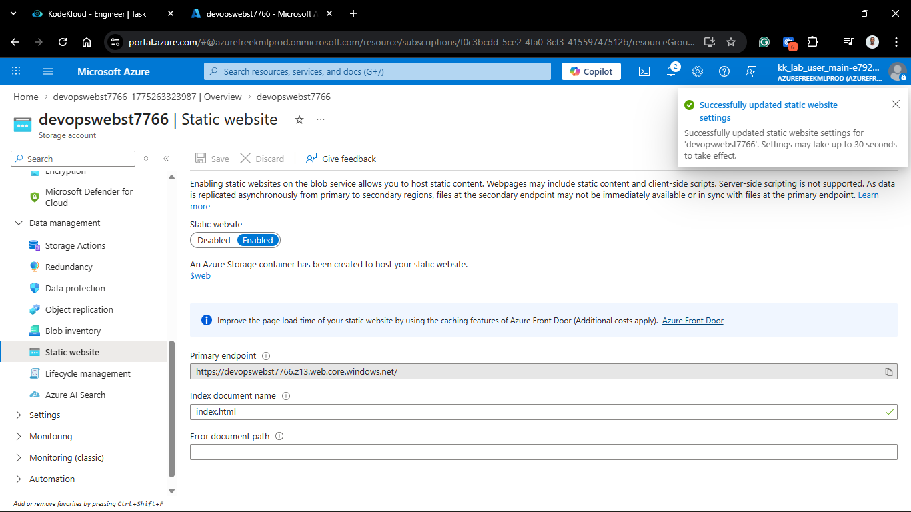

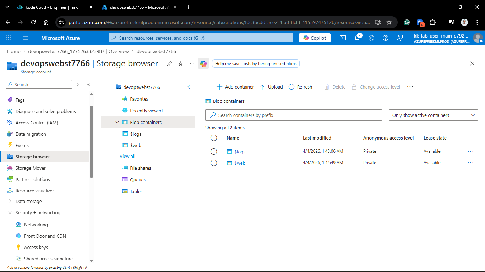

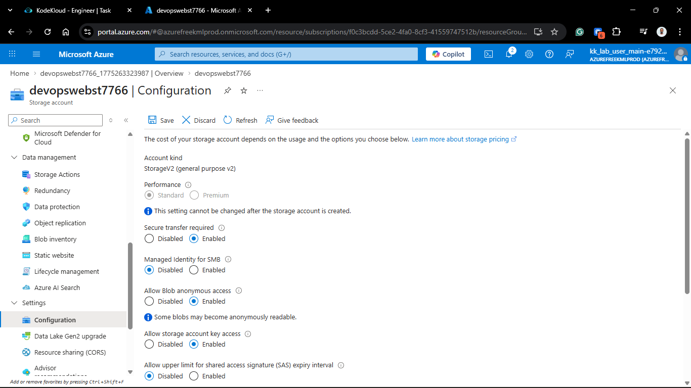

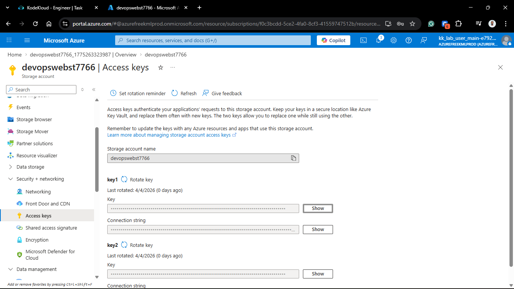

### 3. Upload Content via Azure Client

I accessed the `azure-client` host to upload the source file from the `/root/` directory directly to the new `$web` container.

```bash
# Upload index.html to the $web container
az storage blob upload \
  --account-name devopswebst7766 \
  --container-name '$web' \
  --name index.html \
  --file /root/index.html \
  --auth-mode login
```

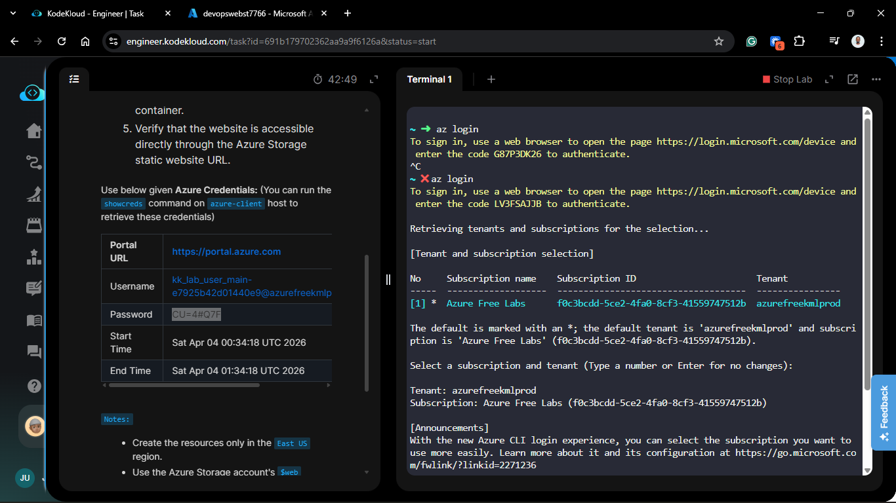

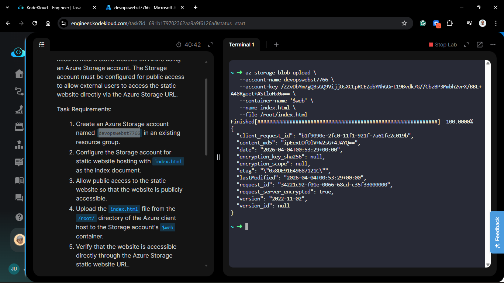

### 4. Verification

1. In the Static website blade, I copied the Primary endpoint URL (e.g., `https://devopswebst7766.z13.web.core.windows.net/`).

2. Navigated to the URL in a browser.

3. **Result:** The internal information portal loaded successfully.

   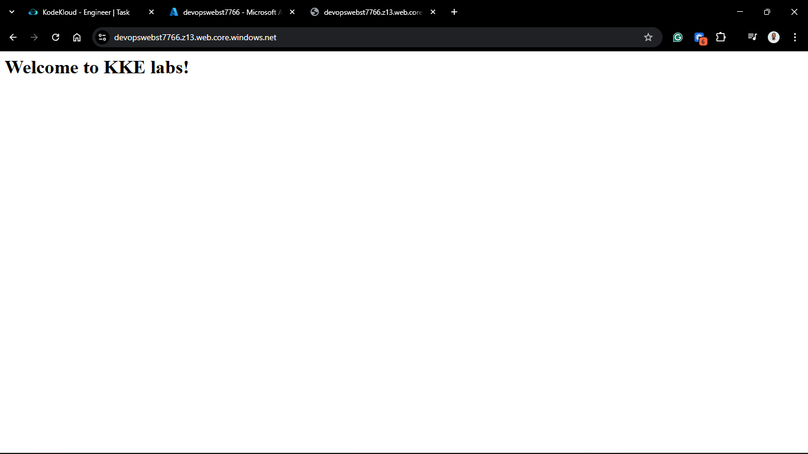

## 🧠 Theory: Why Static Website Hosting?

- **Zero Management:** There is no OS to patch, no Nginx to configure, and no runtime to update. The "Server" is managed entirely by the Azure Storage fabric.

- **Cost Efficiency:** You only pay for the storage space used and the data egress. For a static portal, this is significantly cheaper than running even the smallest VM.

- **The $web Container:** This is a special, system-reserved container. When static hosting is enabled, Azure's internal routing points any request to the primary endpoint directly to the contents of this container.

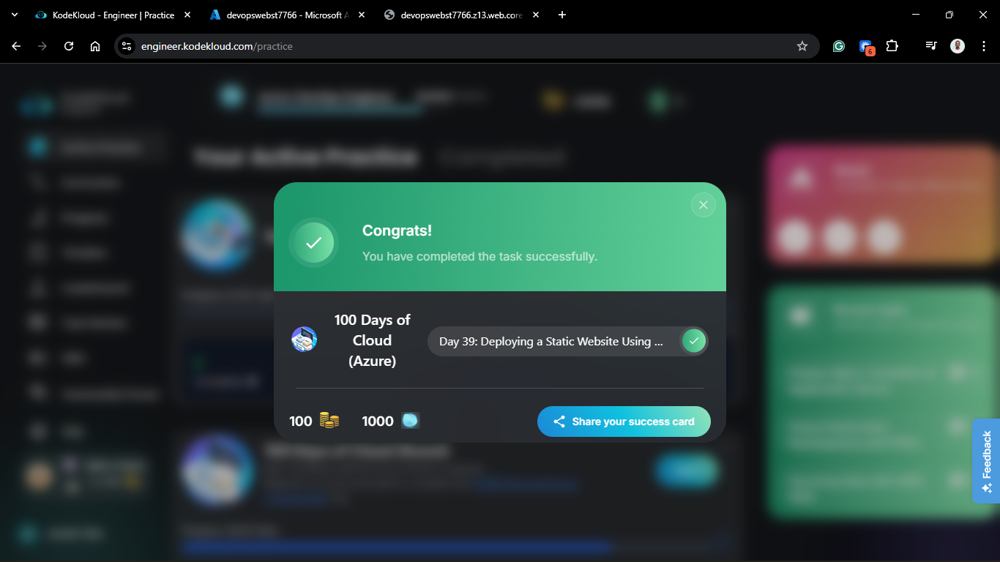
