# Day 90: Managing Secrets with Azure Key Vault

## Project Description

As the Nautilus project handles increasingly sensitive information, hardcoding secrets or storing encryption keys on local disks is no longer an option. Today's mission is to implement **Hardware Security Module (HSM)** backed protection using **Azure Key Vault**. By centralizing our cryptographic keys, we ensure that sensitive data like `SensitiveData.txt` can be encrypted and decrypted without the private key ever leaving the secure boundary of Azure's infrastructure.

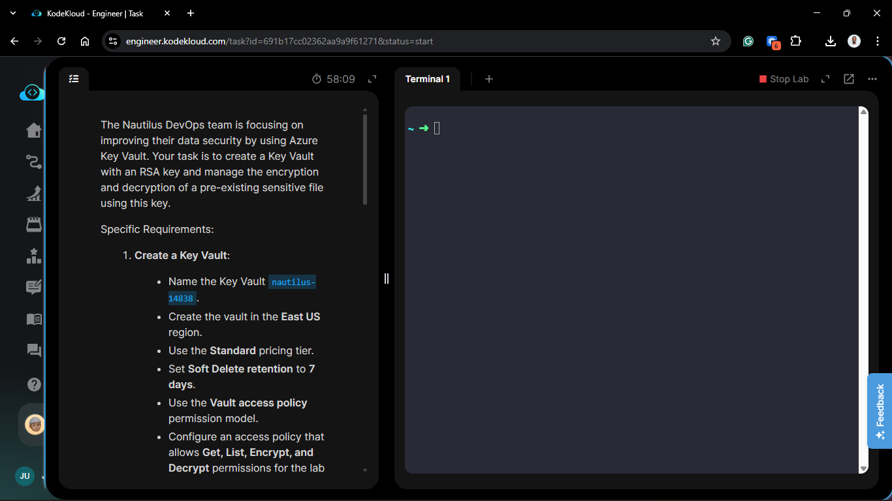

**The Goal:**
Provision a Key Vault named `nautilus-14838`, generate a 4096-bit RSA key, and perform a full encryption/decryption lifecycle on a sensitive file using the RSA-OAEP algorithm, managed entirely through the Azure Portal UI.

## Technical Specifications

| Requirement | Specification |
| :--- | :--- |
| **Key Vault Name** | `nautilus-14838` |
| **Region** | `East US` |
| **Pricing Tier** | `Standard` |
| **Soft Delete Retention** | `7 days` |
| **Permission Model** | `Vault access policy` |
| **Key Name / Type** | `nautilus-key` / `RSA 4096` |
| **Algorithm** | `RSA-OAEP` |

---

## Steps & Configuration (Azure Portal)

### 1. Create the Key Vault

1. **Search:** In the Azure Portal search bar, type **Key Vaults** and select the service.
2. **Basics Tab:**
    * Click **+ Create**.
    * **Resource Group:** Selected the existing lab resource group.
    * **Key vault name:** `nautilus-14838`.
    * **Region:** `East US`.
    * **Pricing tier:** `Standard`.
    * **Soft delete retention:** Set to `7 days`.
3. **Access Configuration Tab:**
    * **Permission model:** Selected **Vault access policy**.
    * Clicked **+ Add Access Policy**.
    * **Key permissions:** Checked `Get`, `List`, `Encrypt`, and `Decrypt`.
    * **Select principal:** Searched for the current lab user (e.g., `kk_lab_user_...`) and clicked **Select**.
    * Clicked **Add**.
4. **Review + create:** Verified settings and clicked **Create**.
   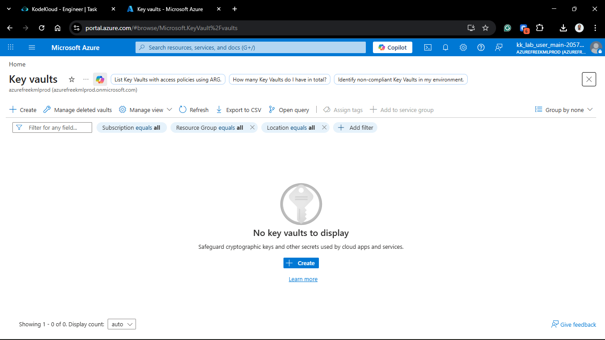
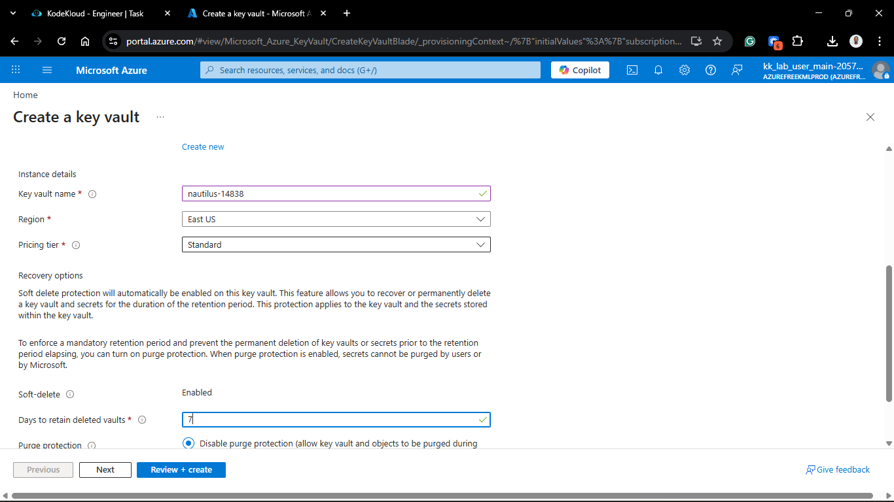
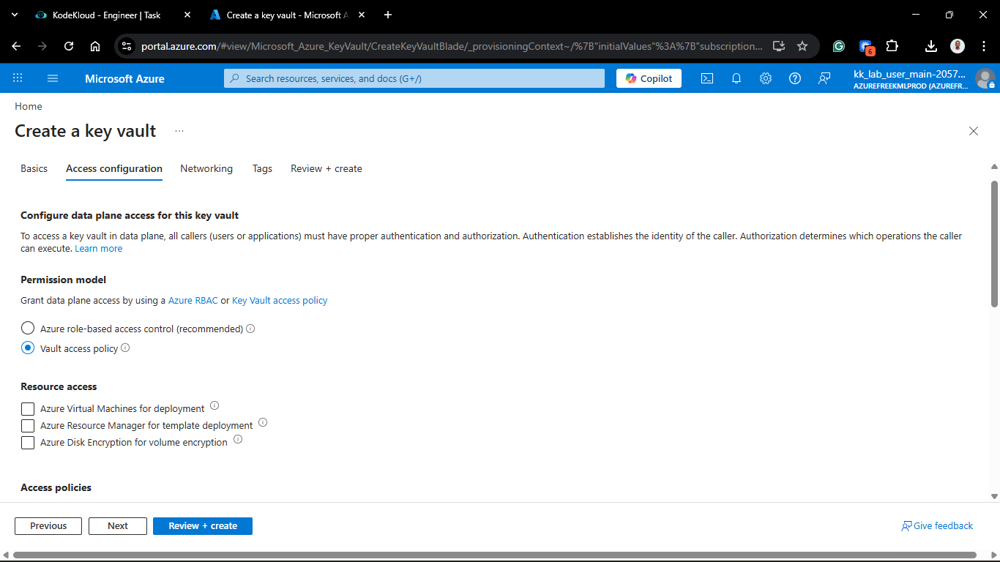
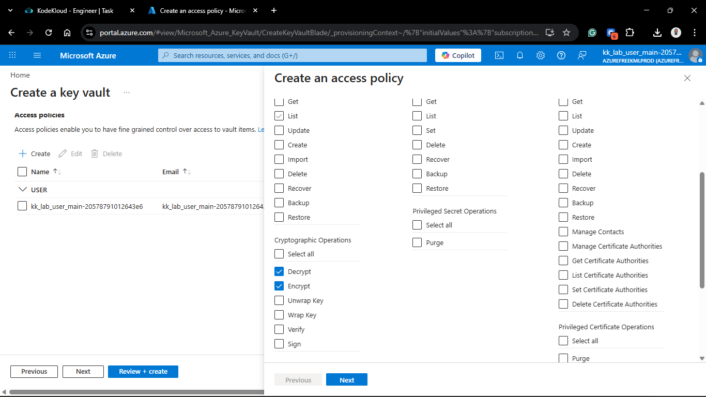
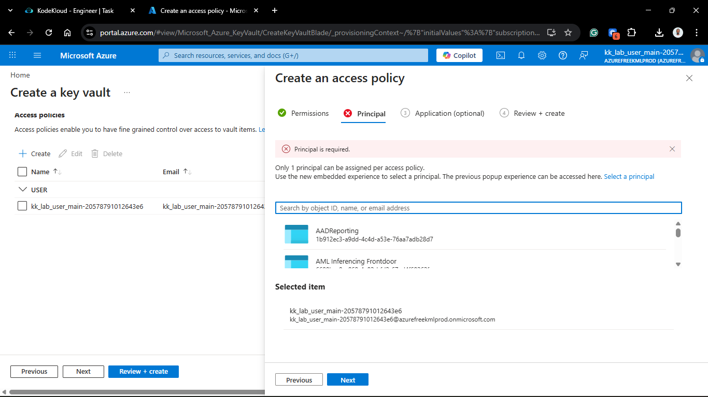

### 2. Generate the RSA Key

1. Navigate to the newly created `nautilus-14838` resource.
2. Under the **Objects** section in the sidebar, select **Keys**.
3. Click **+ Generate/Import**.
4. **Options:** `Generate`.
5. **Name:** `nautilus-key`.
6. **Key type:** `RSA`.
7. **RSA key size:** `4096`.
8. Click **Create**.
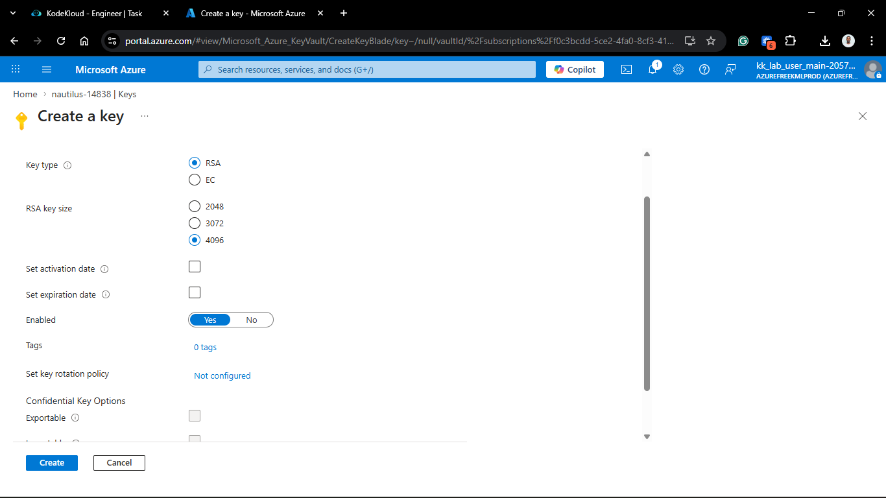
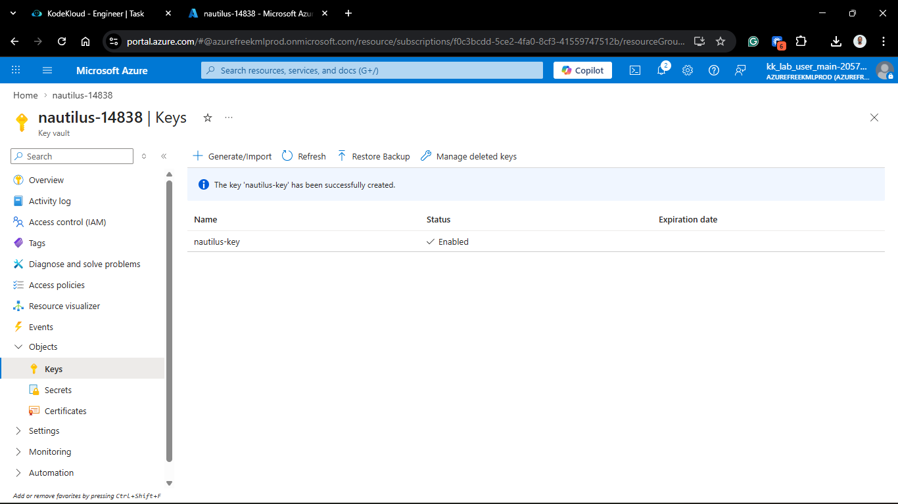

### 3. Cryptographic Operations (Azure Client)

With the Key Vault and Key managed via the Portal, I utilized the `azure-client` terminal to bridge the file system with our secure vault.

```bash
# 1. Base64 encode the plaintext (Requirement for Key Vault API)
cat /root/SensitiveData.txt | base64 > /root/plaintext.b64

# 2. Encrypt the data using the Key Vault Key
az keyvault key encrypt \
  --vault-name nautilus-14838 \
  --name nautilus-key \
  --algorithm RSA-OAEP \
  --value $(cat /root/plaintext.b64) \
  --output-file /root/EncryptedData.bin

# 3. Decrypt the data to verify
az keyvault key decrypt \
  --vault-name nautilus-14838 \
  --name nautilus-key \
  --algorithm RSA-OAEP \
  --value @/root/EncryptedData.bin \
  --query result -o tsv > /root/decrypted.b64

# 4. Base64 decode the result back to text
cat /root/decrypted.b64 | base64 -d > /root/DecryptedData.txt
```

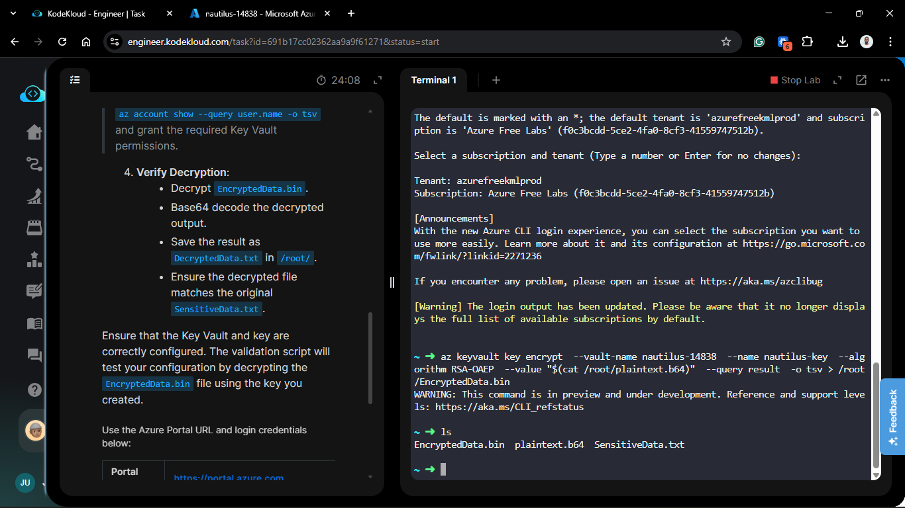

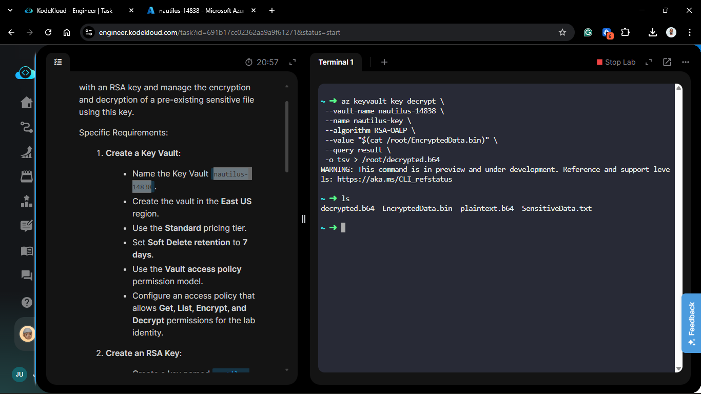

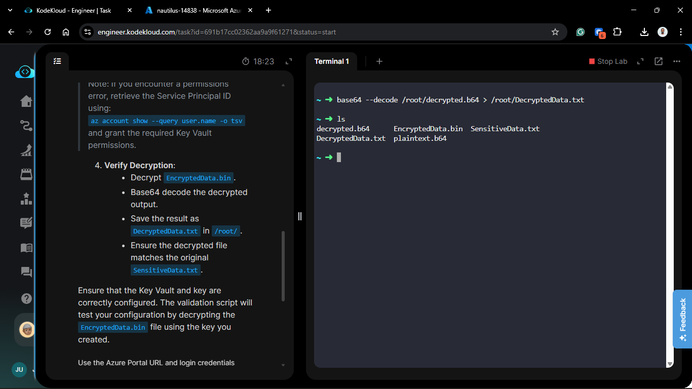

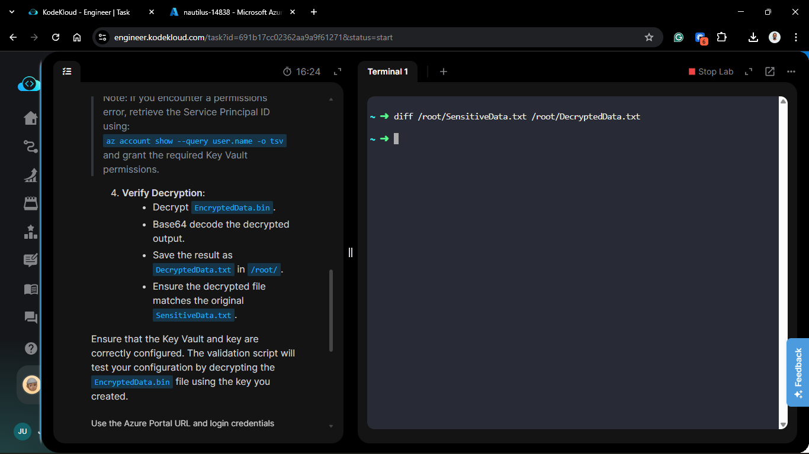

## Verification

1. **Identity Verification:** Confirmed via the Access policies blade that the lab identity has the specific cryptographic permissions required.

2. **Integrity Check:** Ran `diff /root/SensitiveData.txt /root/DecryptedData.txt`.


3. **Result:** No differences found. The original data was recovered perfectly, while the actual encryption was offloaded to the Azure HSM.

## 🧠 Theory: Why RSA 4096 & Access Policies?

* **Vault Access Policy vs. RBAC:** While RBAC is the modern standard, Access Policies are object-specific and highly granular. They allow us to grant "Encrypt" rights without giving "Delete" rights, perfect for service accounts and automated pipelines.

* **Asymmetric Encryption (RSA):** By using a 4096-bit key, we ensure that even with the binary `EncryptedData.bin`, an attacker cannot recover the plaintext without the private key, which never leaves the Key Vault's secure boundary.

* **Soft Delete:** The 7-day retention period is a safety net. If the vault or key is accidentally deleted, it can be recovered within that window, preventing catastrophic data loss for encrypted backups.

<!-- az keyvault key encrypt  --vault-name nautilus-14838  --name nautilus-key  --algorithm RSA-OAEP  --value "$(cat /root/plaintext.b64)"  --query result  -o tsv > /root/EncryptedData.bin

az keyvault key encrypt \
 --vault-name nautilus-14838 \
 --name nautilus-key \
 --algorithm RSA-OAEP \
 --value "$(cat /root/plaintext.b64)" \
 --query result \
 -o tsv > /root/EncryptedData.bin

az keyvault key decrypt \
 --vault-name nautilus-14838 \
 --name nautilus-key \
 --algorithm RSA-OAEP \
 --value "$(cat /root/EncryptedData.bin)" \
 --query result \
 -o tsv > /root/decrypted.b64
WARNING: This command is in preview and under development. Reference and support levels: <https://aka.ms/CLI_refstatus> -->

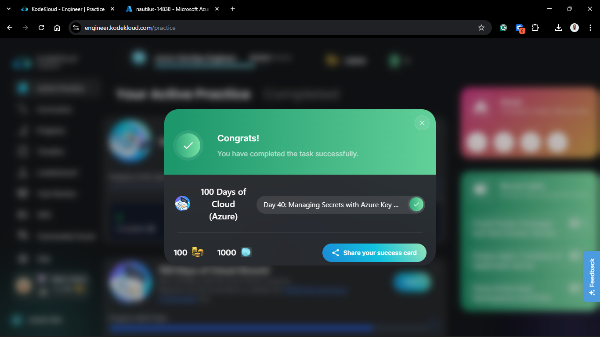
