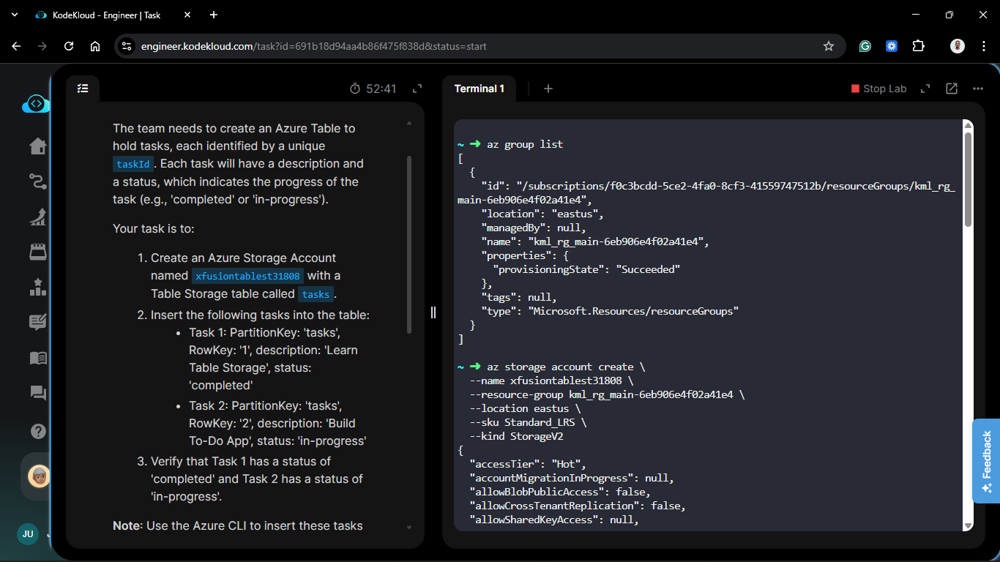
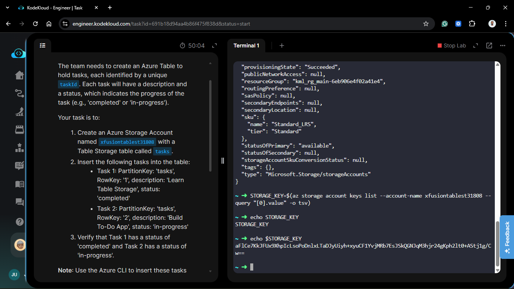
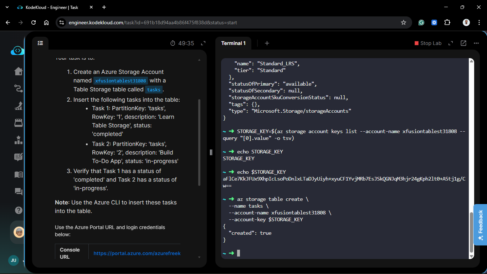
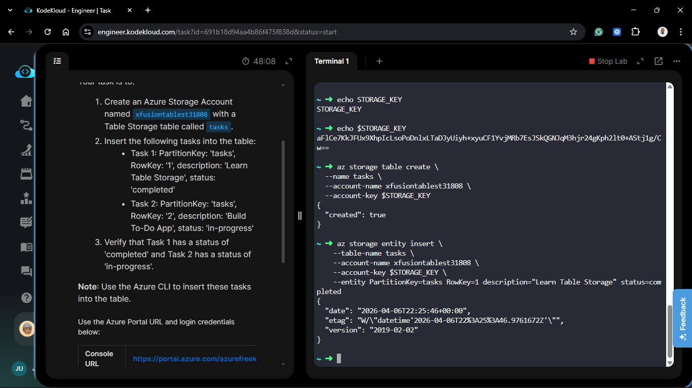
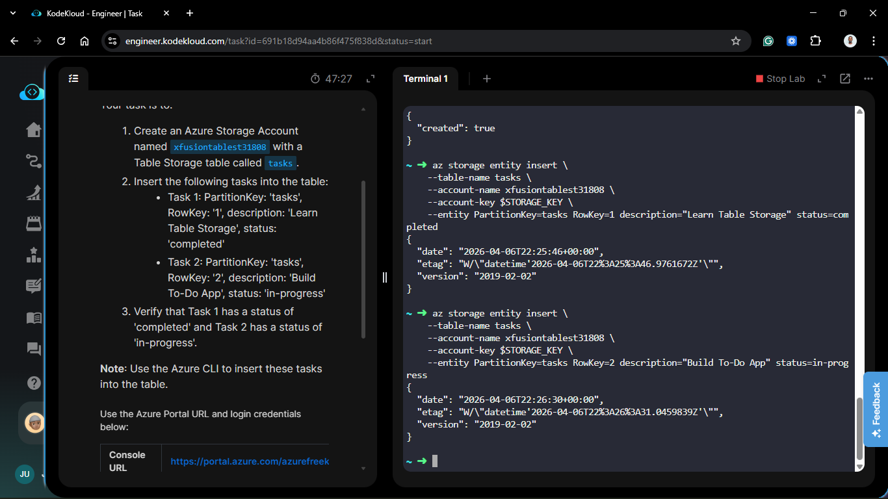
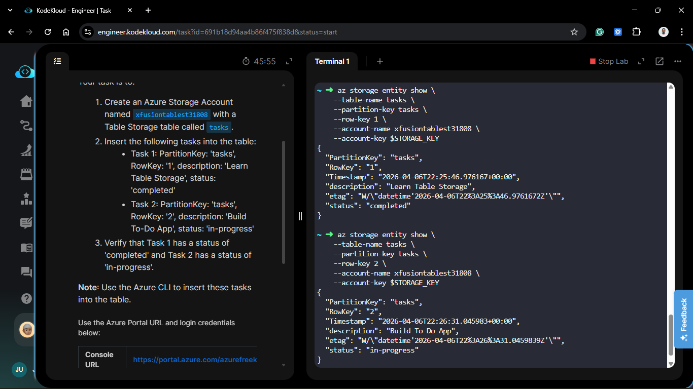
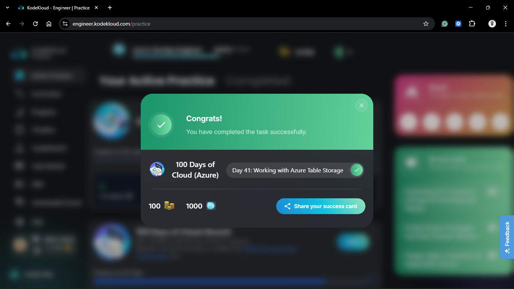

# Day 91: Working with Azure Table Storage

## Project Description

As the Nautilus project expands into lightweight application development, the team is exploring **NoSQL** solutions for high-velocity, low-cost data storage. Today's task involves setting up **Azure Table Storage** to power a 'To-Do' application. Unlike relational databases (SQL), Table Storage is schema-less and highly scalable, making it perfect for simple key-value datasets where performance and cost-efficiency are the primary drivers.

**The Goal:**
Provision a Storage Account named `xfusiontablest31808` in **East US**, create a table named `tasks`, and utilize the Azure CLI to programmatically insert and verify application entities.

## Technical Specifications

| Requirement         | Specification              |
| :------------------ | :------------------------- |
| **Storage Account** | `xfusiontablest31808`      |
| **Storage Service** | Table Storage              |
| **Table Name**      | `tasks`                    |
| **Region**          | `eastus`                   |
| **Data Format**     | NoSQL Entities (Key-Value) |
| **Redundancy**      | `Standard_LRS`             |

---

## Steps & Configuration (Azure CLI)

### 1. Provision the Storage Account

I initialized the storage account with the `StorageV2` kind to ensure support for all modern data services.

```bash
az storage account create \
  --name xfusiontablest31808 \
  --resource-group <RG_NAME> \
  --location eastus \
  --sku Standard_LRS \
  --kind StorageV2
```



### 2. Retrieve Connection Credentials

To interact with the table service via CLI, I retrieved the primary access key.

```bash

# Get the connection string or key

STORAGE_KEY=$(az storage account keys list --account-name xfusiontablest31808 --query "[0].value" -o tsv)
```



### 3. Create the 'Tasks' Table

I created the logical table structure to hold our application data.

```bash
az storage table create \
  --name tasks \
  --account-name xfusiontablest31808 \
  --account-key $STORAGE_KEY
```



### 4. Insert Entities (Tasks)

Using the Azure CLI, I inserted the two initial tasks for the To-Do app. This process demonstrates how NoSQL entities handle custom attributes like description and status.

```bash

# Insert Task 1

az storage entity insert \
    --table-name tasks \
    --account-name xfusiontablest31808 \
    --account-key $STORAGE_KEY \
    --entity PartitionKey=tasks RowKey=1 description="Learn Table Storage" status=completed

# Insert Task 2

az storage entity insert \
    --table-name tasks \
    --account-name xfusiontablest31808 \
    --account-key $STORAGE_KEY \
    --entity PartitionKey=tasks RowKey=2 description="Build To-Do App" status=in-progress
```





## Verification

1. **Data Retrieval:** I ran a query to confirm the status of the newly created tasks.

```bash
az storage entity show \
    --table-name tasks \
    --partition-key tasks \
    --row-key 1 \
    --account-name xfusiontablest31808 \
    --account-key $STORAGE_KEY
```



1. **Audit:**
   - **Task 1:** Verified status is completed.
   - **Task 2:** Verified status is in-progress.

2. **Portal Check:** Navigated to **Storage Browser** > **Tables** in the portal to visually confirm the rows are present with their respective attributes.

## 🧠 Theory: The NoSQL Advantage

- **PartitionKey & RowKey:** These are the only mandatory attributes. The `PartitionKey` is used for load balancing across servers, while the `RowKey` is the unique ID within that partition. Together, they form the primary key for the entity.

- **Schema-less Design:** Notice we didn't define "description" or "status" when creating the table. In Table Storage, entities are just property bags. You can add new fields to new rows without affecting the old ones.

- **Cost-Efficiency:** For simple metadata like To-Do lists, Table Storage is orders of magnitude cheaper than provisioning a full SQL Server or Cosmos DB instance.


