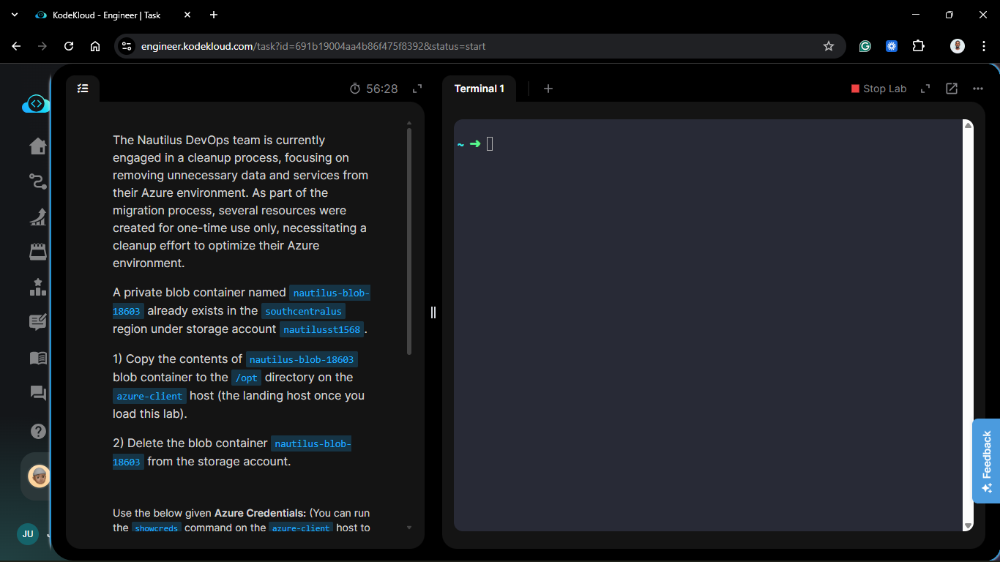
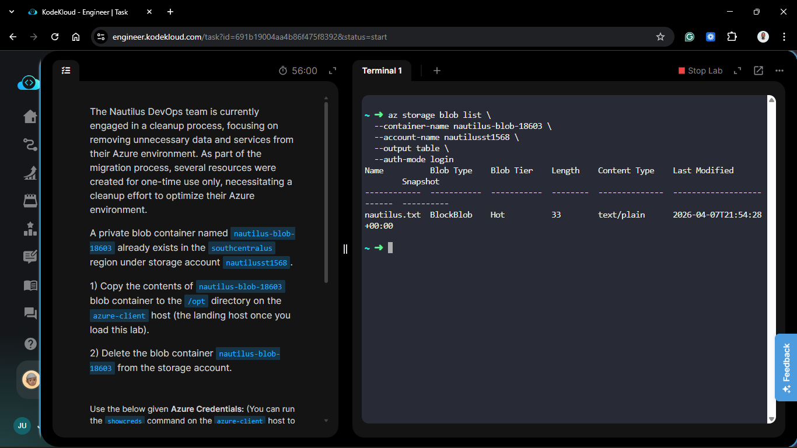
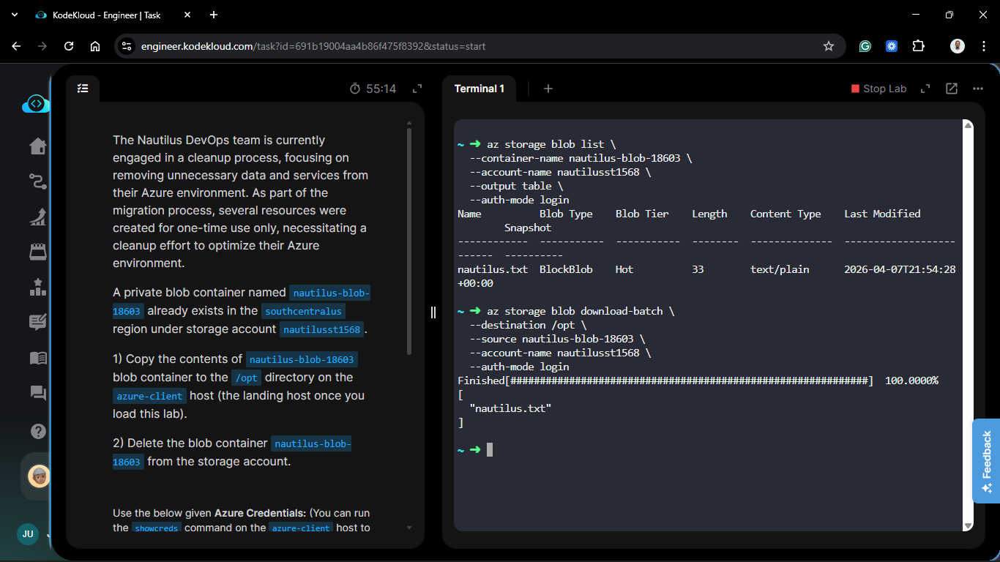
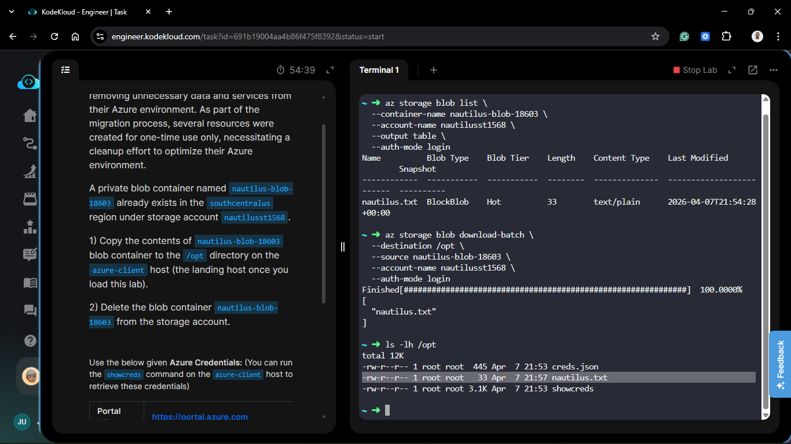
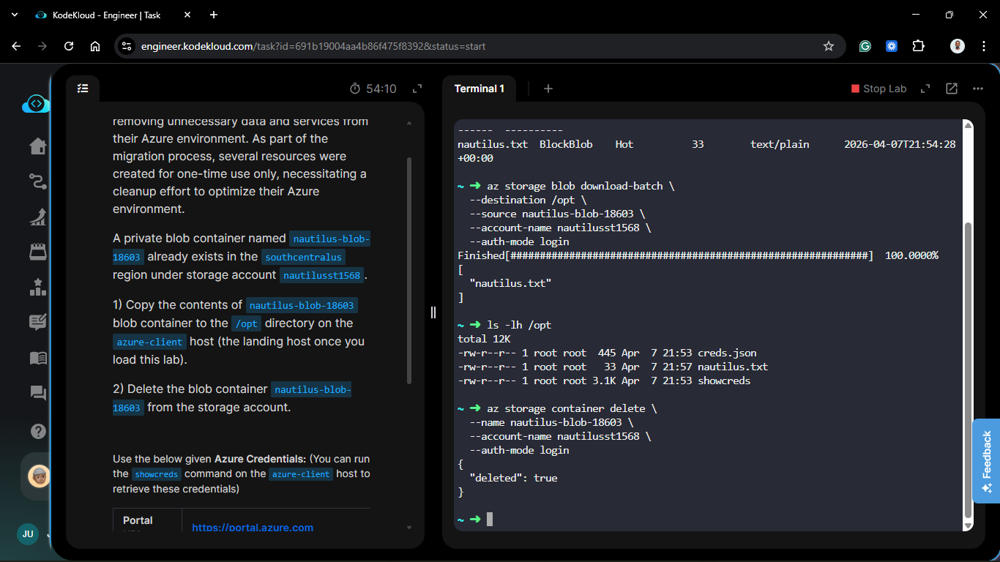
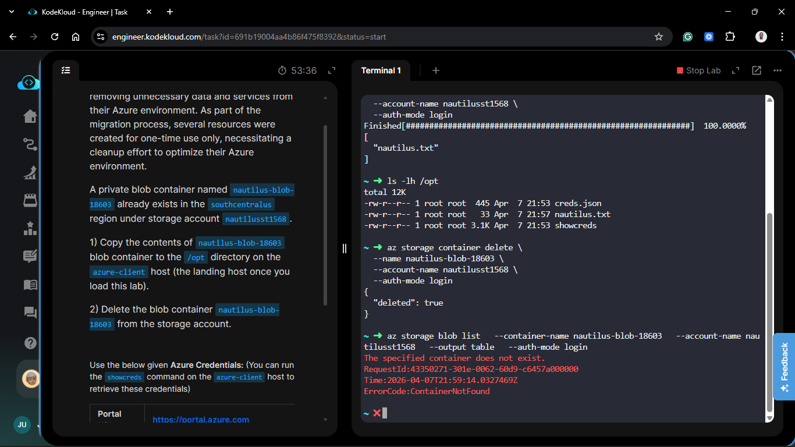
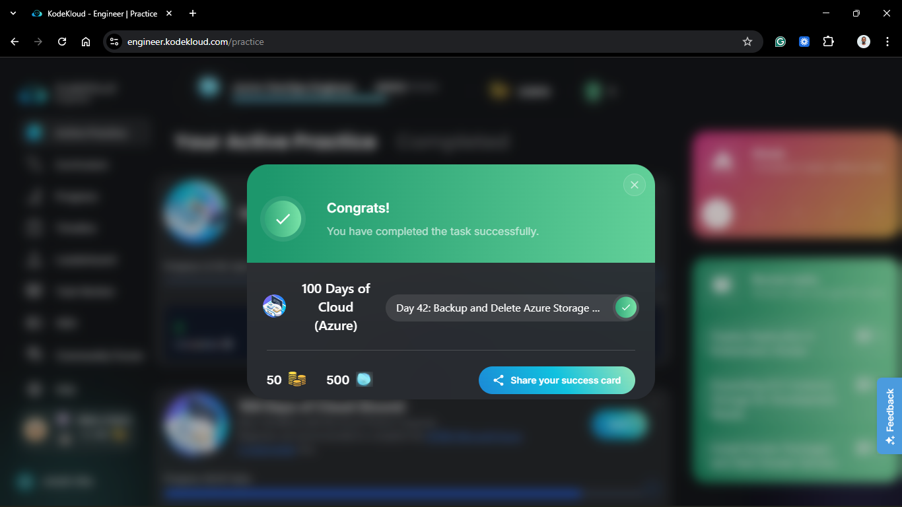

# Day 92 (Azure Day 42): Backup and Delete Azure Storage Blob Container

## Project Description

Resource lifecycle management is a vital part of the Nautilus DevOps team's daily operations. As we move out of the initial migration phase, we must clean up "ephemeral" or "one-time use" resources to optimize costs and reduce our security surface area. Today's task involves a **Safe Decommissioning** workflow: backing up critical data from a temporary container (`nautilus-blob-18603`) to our local landing host before permanently deleting the cloud resource.



**The Goal:**
Migrate all contents from the `nautilus-blob-18603` container to the `/opt` directory on the `azure-client` host and then remove the container from the `nautilusst1568` storage account.

## Technical Specifications

| Requirement            | Specification         |
| :--------------------- | :-------------------- |
| **Storage Account**    | `nautilusst1568`      |
| **Source Container**   | `nautilus-blob-18603` |
| **Region**             | `southcentralus`      |
| **Backup Destination** | `/opt` (Local)        |
| **Final State**        | Container Deleted     |

---

## Steps & Configuration (Azure CLI)

### 1. Verification of Source Data

Before starting the backup, I listed the contents of the container to ensure we had a baseline for verification.

```bash
az storage blob list \
  --container-name nautilus-blob-18603 \
  --account-name nautilusst1568 \
  --output table \
  --auth-mode login
```



### 2. Execute the Backup (Download Batch)

To pull all files at once without manual iteration, I used the `download-batch` command. This effectively "mirrors" the cloud container to the local filesystem.

```bash
az storage blob download-batch \
  --destination /opt \
  --source nautilus-blob-18603 \
  --account-name nautilusst1568 \
  --auth-mode login
```



### 3. Verify Local Backup

I confirmed that the files were successfully written to the /opt directory.

```bash
ls -lh /opt
```



### 4. Delete the Cloud Container

With the data safely backed up locally, I proceeded to decommission the container to stop further storage costs.

```bash
az storage container delete \
  --name nautilus-blob-18603 \
  --account-name nautilusst1568 \
  --auth-mode login
```



## Verification

1. **Local Integrity:** Verified that all blobs listed in Step 1 now exist in `/opt`.

2. **Cloud Deletion:** Attempted to list the container again; received a `ResourceNotFound` error, confirming the deletion was successful.
   

3. **Result:** Storage optimization complete. The environment is cleaner, and our data is archived locally.

## 🧠 Theory: The "Archive-Before-Delete" Principle

- **Data Persistence:** In the cloud, "Delete" is often permanent (unless Soft Delete is enabled). In a DevOps context, you never delete a resource until you have a verified backup in a different failure domain (like a local host or a separate storage tier).

- **download-batch:** This CLI command is a high-level wrapper that handles the recursive downloading of all blobs in a container. It is much more efficient for bulk operations than individual blob download calls.

- **Cost Governance:** Deleting unused containers immediately stops the storage consumption meter. In a multi-region environment like Nautilus, cleaning up South Central US resources while focusing on East US helps maintain a predictable monthly spend.


