# Day 94: Integrating Azure Event Hub with Virtual Machines

## Project Description

As the Nautilus project transitions toward real-time telemetry and monitoring, the need for a scalable data ingestion service is paramount. Today's task involves setting up **Azure Event Hubs**—a big data streaming platform and event ingestion service. We are integrating our `datacenter-vm` to stream logs directly into a centralized "Hub," allowing for downstream processing, archival, or real-time analysis. This setup ensures that we can handle massive amounts of log data without overwhelming our storage or compute layers.

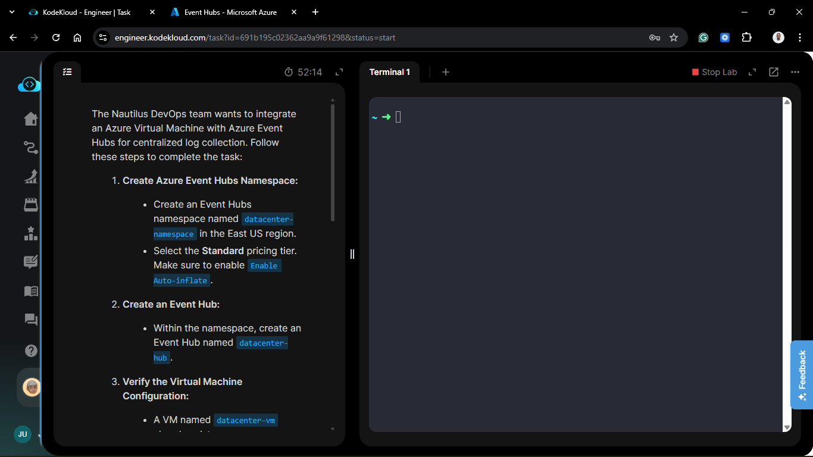

**The Goal:**
Provision an Event Hubs Namespace and a specific Hub, then execute a Python-based log generator from our backend VM to verify high-throughput data ingestion via Azure's monitoring metrics.

## Technical Specifications

| Component | Specification |
| :--- | :--- |
| **Namespace Name** | `datacenter-namespace` |
| **Event Hub Name** | `datacenter-hub` |
| **Pricing Tier** | `Standard` |
| **Feature** | `Auto-inflate` Enabled |
| **Region** | `East US` |
| **Source VM** | `datacenter-vm` |
| **Ingestion Script** | `send_logs.py` |

---

## Steps & Configuration (Azure Portal)

### 1. Create the Event Hubs Namespace

1. Navigate to **Event Hubs** in the portal and click **+ Create**.
2. **Basics Tab:**
    * **Namespace name:** `datacenter-namespace`.
    * **Location:** `East US`.
    * **Pricing tier:** `Standard`.
3. **Features Tab:**
    * **Auto-inflate:** Set to **Enabled**. (This allows the service to automatically scale Throughput Units if ingestion exceeds our limit).
4. Click **Review + create** and then **Create**.

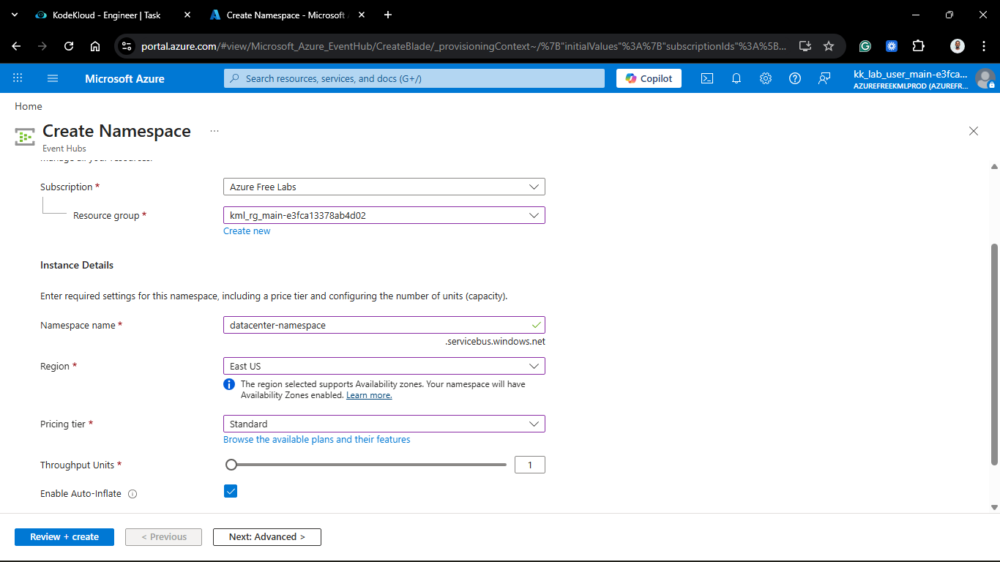
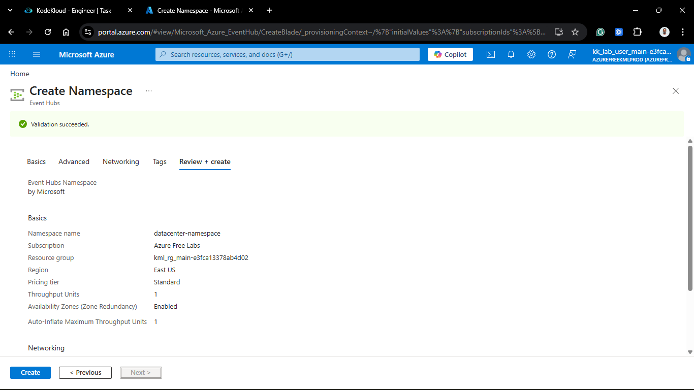
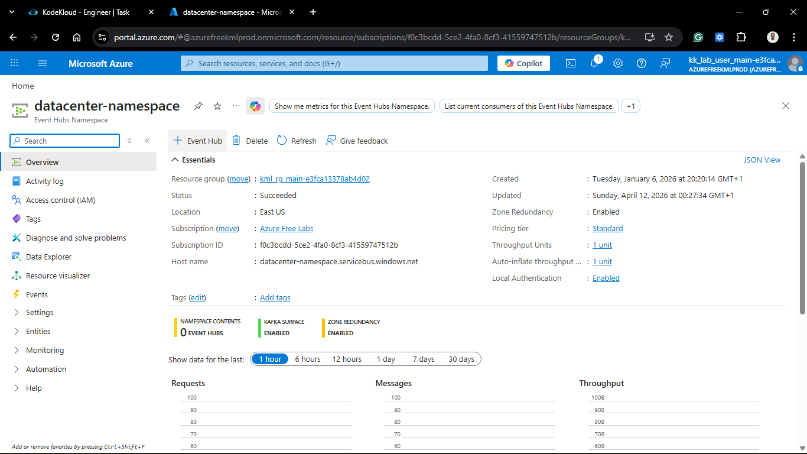

### 2. Provision the Event Hub

Once the namespace was active:

1. Navigated to the `datacenter-namespace` resource.
2. Clicked **+ Event Hub**.
3. **Name:** `datacenter-hub`.
4. Kept Partition Count and Retention settings at default for this lab.
5. Click **Create**.

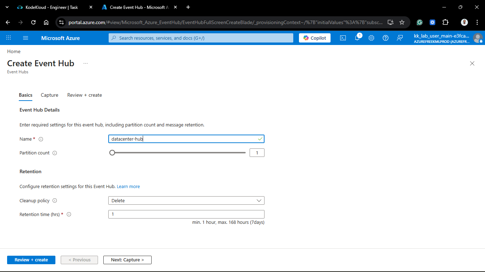
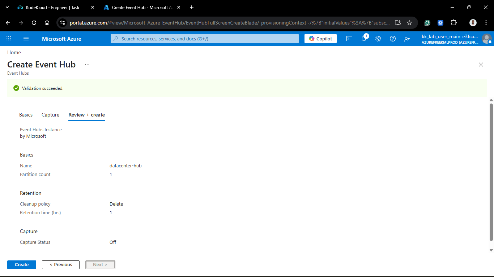
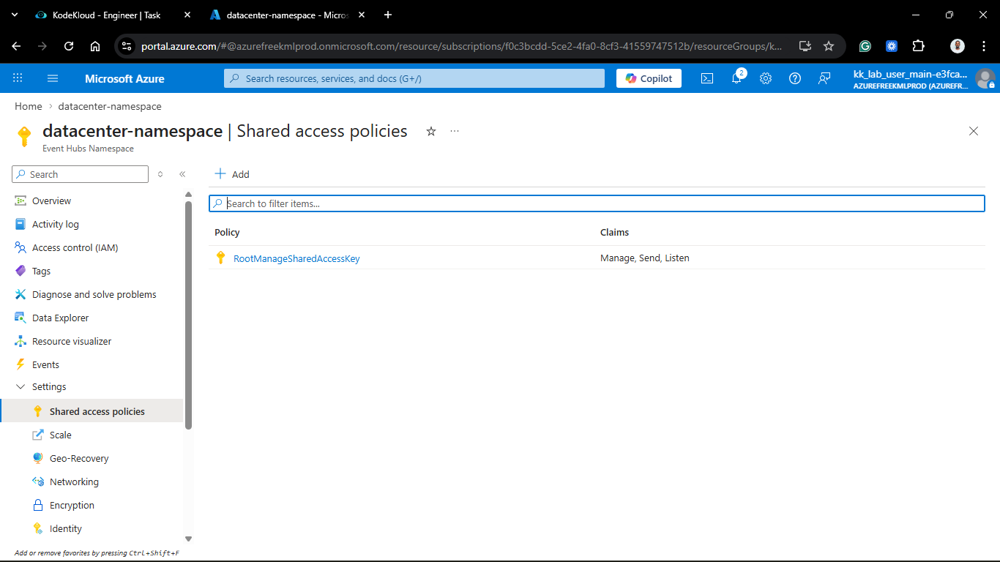
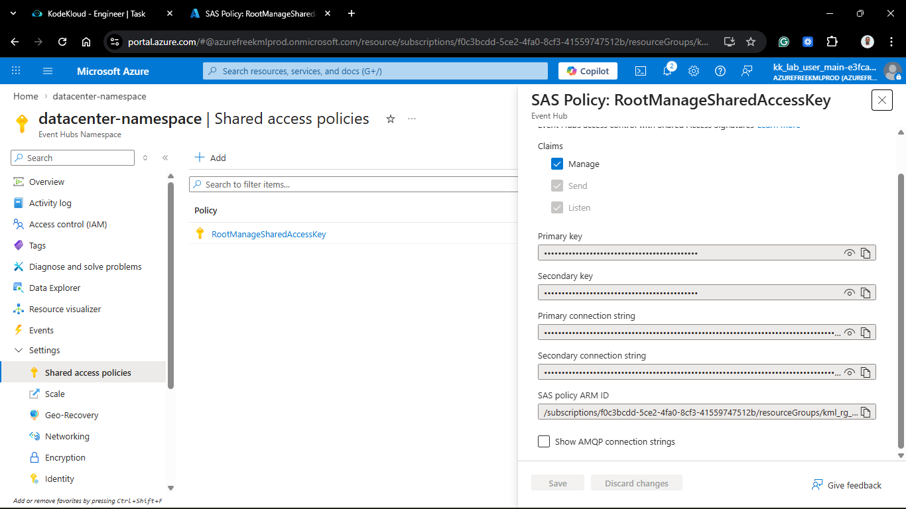

### 3. Log Generation and Ingestion

I accessed the existing `datacenter-vm` to trigger the log stream.

1. **SSH** into the VM as `azureuser`.
2. Located the script at `/home/azureuser/send_logs.py`.
3. **Executed** the script multiple times to simulate a heavy log burst:

```bash
python3 /home/azureuser/send_logs.py
python3 /home/azureuser/send_logs.py
python3 /home/azureuser/send_logs.py
```

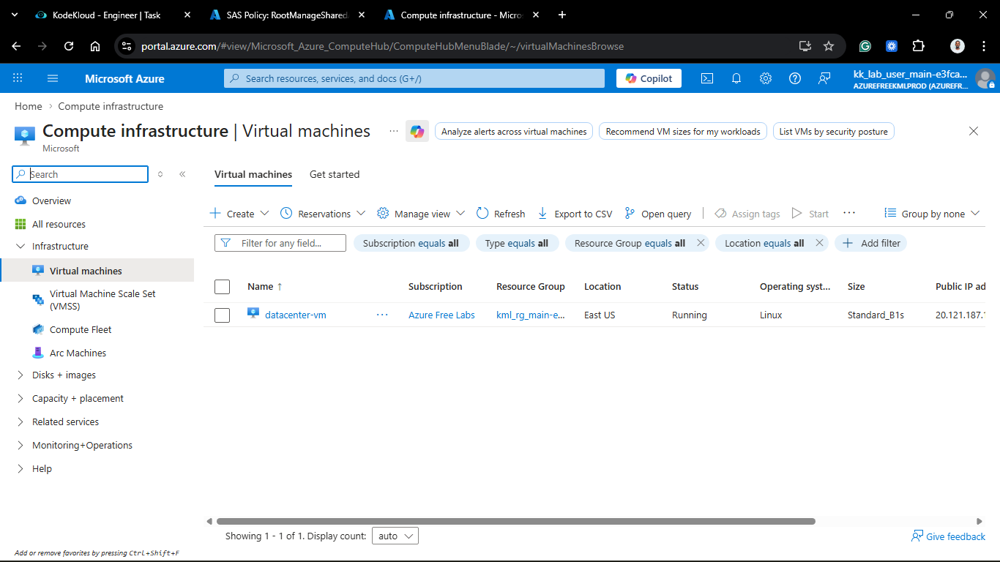
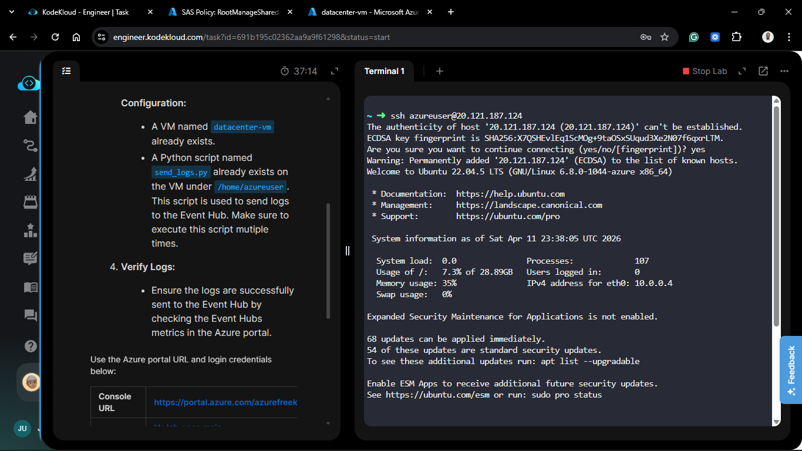
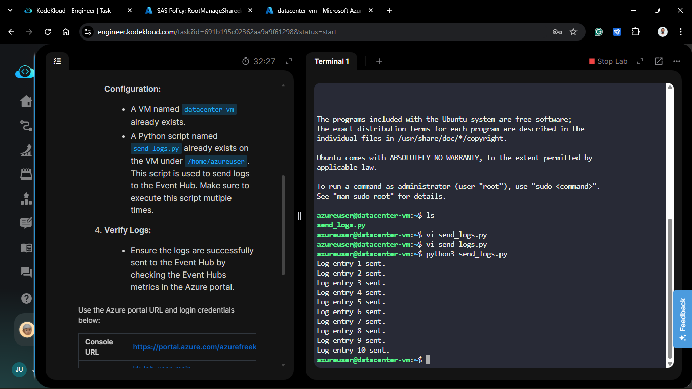

## Verification

1. **Metric Audit:** Navigated to the **Overview** blade of the `datacenter-hub`.

2. **Visual Check:** Monitored the **Messages** chart.
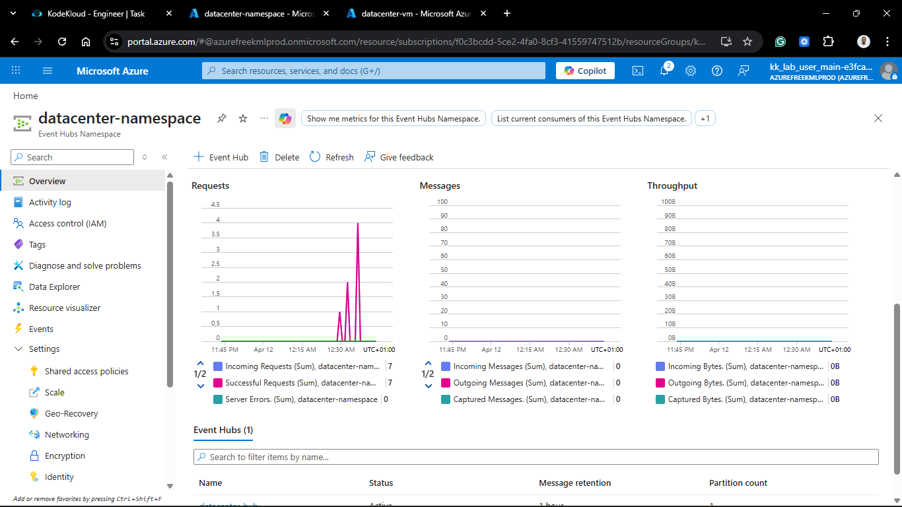

3. **Result:** Confirmed a spike in **Incoming Messages**, verifying that the Python script successfully authenticated and pushed log events into the hub.

## 🧠 Theory: Why Event Hubs for Logging?

* **Decoupling Producers & Consumers:** The VM (Producer) doesn't need to know who is reading the logs. It just pushes to the Hub. This allows multiple consumers (like Azure Stream Analytics or Splunk) to read the data at their own pace.

* **Auto-inflate:** This is a crucial "Set and Forget" feature in the Standard tier. It prevents "429 Too Many Requests" errors by automatically scaling your Throughput Units up to a specified limit when traffic spikes.

* **Partitions:** Event Hubs use a partitioned consumer model. Think of partitions as "lanes on a highway." This allows the hub to scale horizontally to handle millions of events per second.

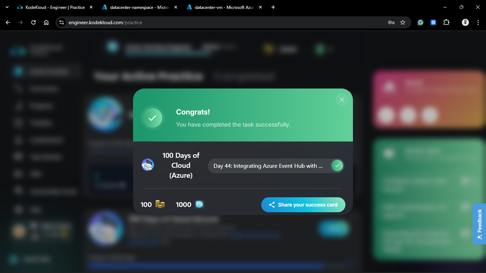
