# Day 95: Azure Kubernetes Service (AKS) Setup and Management

## Project Description

As the Nautilus project enters its most advanced phase of migration, the team is moving from standalone Virtual Machines and App Services to **Kubernetes Orchestration**. Today's task involves provisioning a production-grade **Azure Kubernetes Service (AKS)** cluster. This isn't a standard setup—the requirements emphasize **Security (Private Endpoint)** and **Availability (Autoscaling)**. By keeping the cluster endpoint private, we ensure that the Kubernetes API is not exposed to the public internet, fulfilling a critical "Zero Trust" security requirement for our backend workloads.

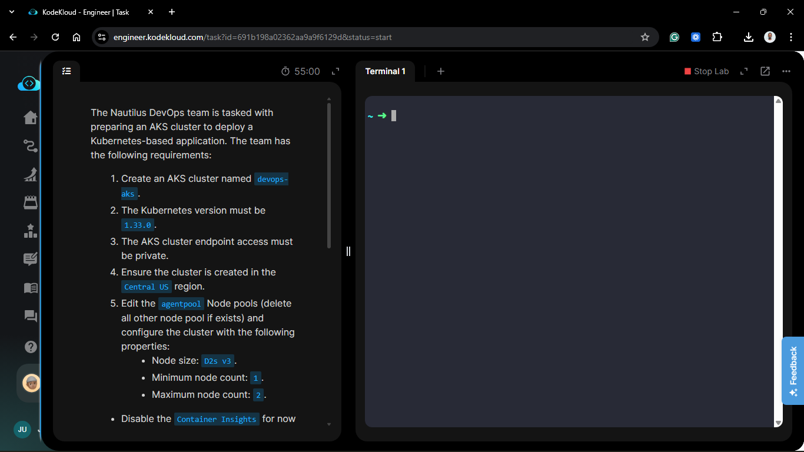

**The Goal:**
Deploy a private AKS cluster named `devops-aks` in **Central US** running Kubernetes version **1.33.0**, optimized with a cost-effective autoscaling node pool and hardened by disabling external monitoring for the initial bootstrap phase.

## Technical Specifications

| Requirement | Specification |
| :--- | :--- |
| **Cluster Name** | `devops-aks` |
| **Kubernetes Version** | `1.33.0` |
| **Region** | `Central US` |
| **Network Access** | `Private` (Private Endpoint) |
| **Node Size** | `Standard_D2s_v3` |
| **Autoscaling** | `Enabled` (Min: 1, Max: 2) |
| **Monitoring** | `Disabled` (Container Insights OFF) |

---

## Steps & Configuration (Azure Portal)

### 1. Basics & Cluster Presets

1. **Service:** Searched for **Kubernetes services** and clicked **+ Create** > **Create a Kubernetes cluster**.
2. **Project Details:** Selected the existing resource group.
3. **Cluster Details:**
    * **Name:** `devops-aks`.
    * **Region:** `Central US`.
    * **Kubernetes version:** Selected `1.33.0` specifically.
    * **Automatic upgrade:** Disabled (for manual version control).
  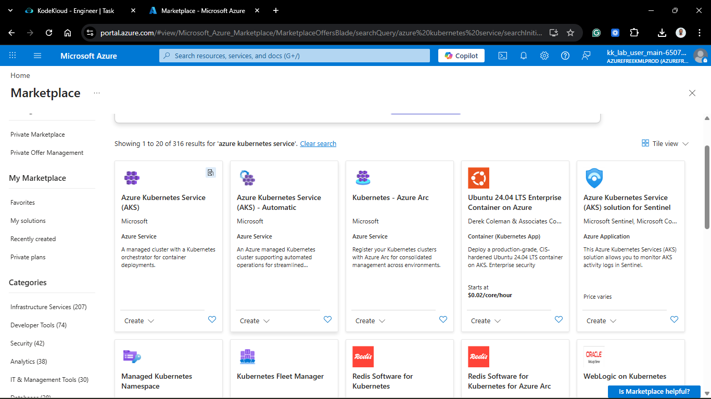
  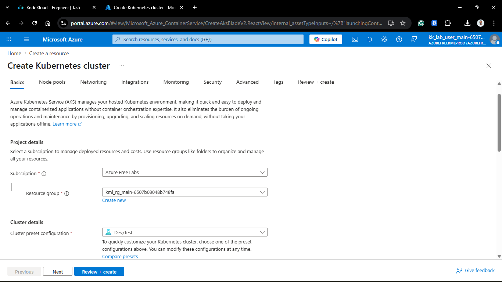

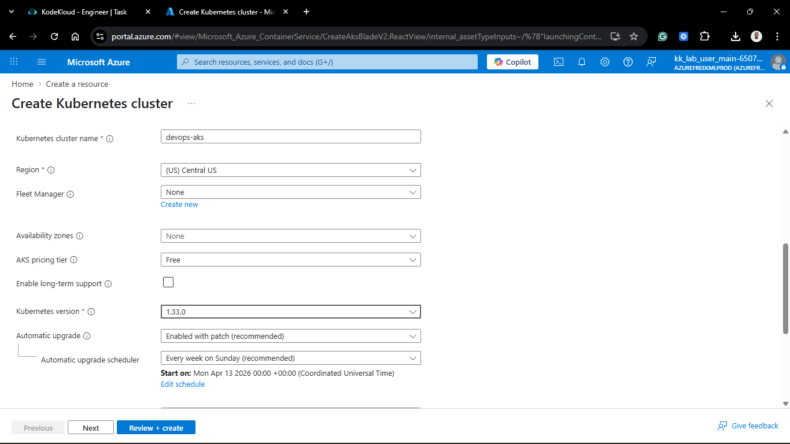

### 2. Node Pool Configuration (`agentpool`)

1. Selected the default `agentpool` and clicked **Edit**.
2. **Node size:** Changed to `Standard_D2s_v3` (2 vCPUs, 8 GiB RAM).
3. **Scale method:** Selected **Autoscale**.
4. **Node count range:** Set Minimum to `1` and Maximum to `2`.
5. Verified no other node pools were present.

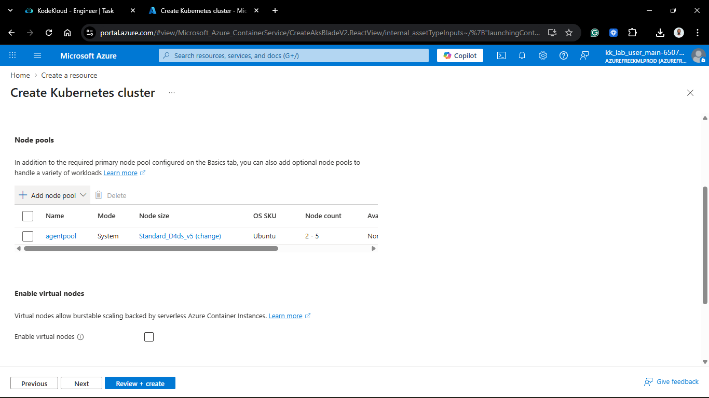

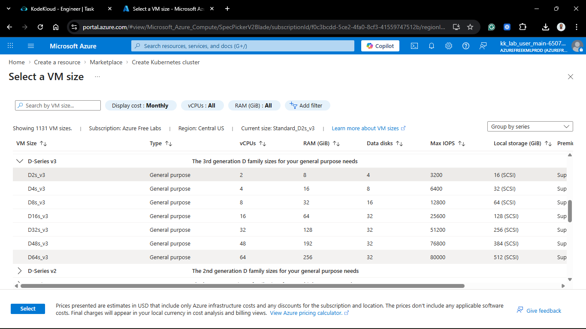

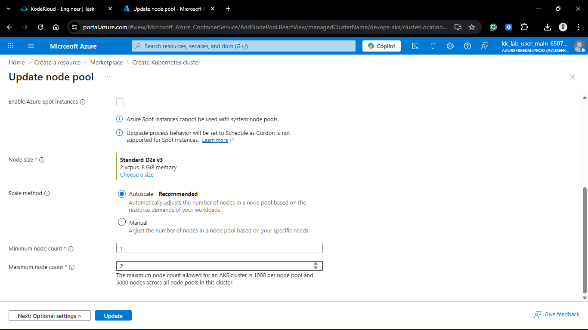

### 3. Networking (The Private Perimeter)

1. Navigated to the **Networking** tab.
2. **Network configuration:** `Azure CNI`.
3. **Cluster endpoint access:** Selected **Private**.
    * This ensures the Kubernetes API server is assigned a private IP within the VNet, accessible only via a VPN, Bastion, or Peered VNet.
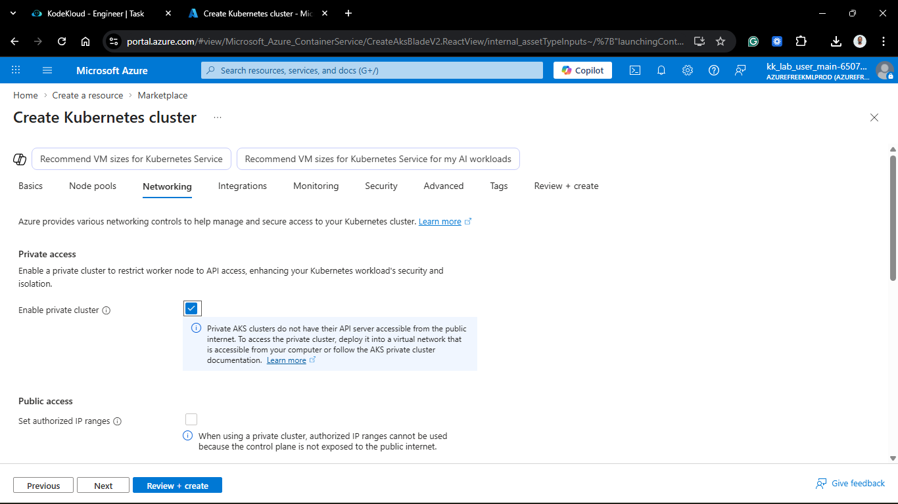

### 4. Integrations & Monitoring

1. Navigated to the **Integrations** tab.
2. **Container insights:** Unchecked "Enable container insights".
3. Ensured all other Azure Monitor and alerting integrations were toggled **Off** as per the task requirement to maintain a clean initial deployment.
  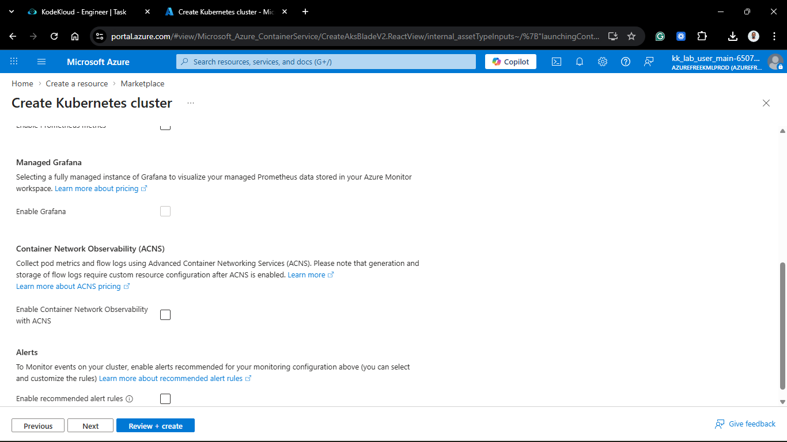

### 5. Review and Create

1. Clicked **Review + create**.
2. Validated the Kubernetes version was exactly `1.33.0`.
3. Clicked **Create** and waited for the deployment (approx. 10-15 minutes).

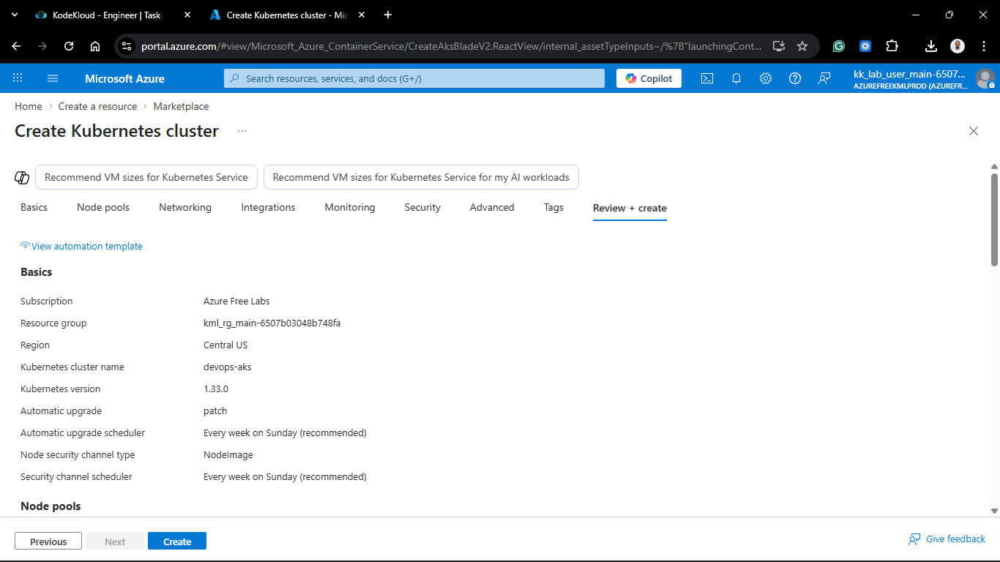

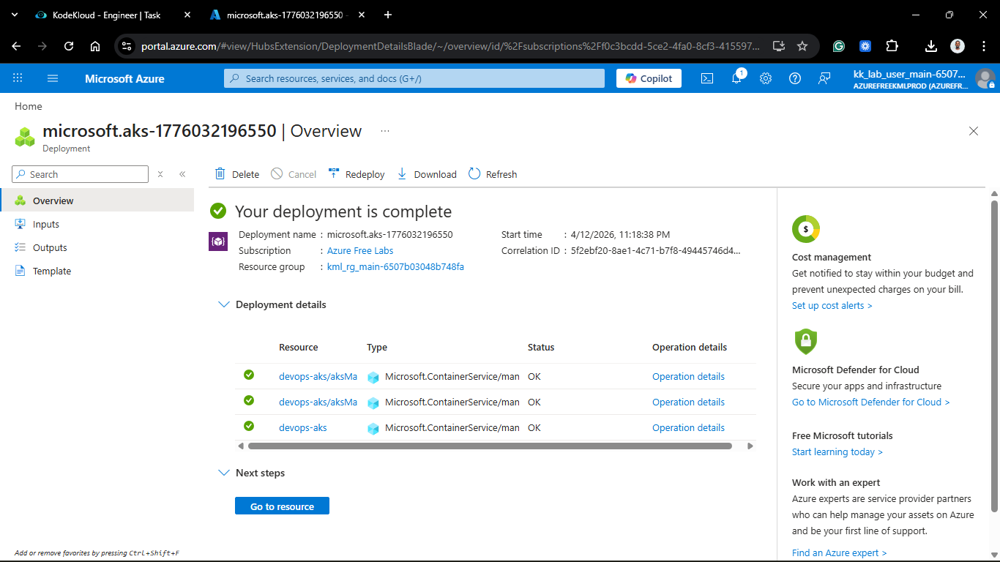

---

## Verification

1. **Access Check:** Confirmed the cluster Overview shows **API server address** as a private endpoint.
2. **Version Audit:** Verified the "Kubernetes version" is locked at `1.33.0`.
3. **Scale Check:** Verified the `agentpool` displays "Autoscaling: Enabled (1-2 nodes)".
4. **Status:** The cluster state is **Succeeded (Running)**.

## 🧠 Theory: Private Clusters & Kubernetes 1.33

* **Private Endpoint Access:** In a public AKS cluster, the API server has a public IP. In a private cluster, Azure creates a **Private Link** to the API server. This means even if an attacker has your credentials, they cannot reach the Kubernetes control plane unless they are inside your network.
* **Kubernetes 1.33.0:** Running a cutting-edge version allows us to leverage the latest API features and security patches. By specifying the version exactly, we ensure consistency across the Nautilus dev, test, and prod environments.
* **D2s v3 Nodes:** These provide a balanced ratio of CPU to Memory, ideal for general-purpose workloads like our microservices, while the `s` suffix denotes support for Premium SSD caching.

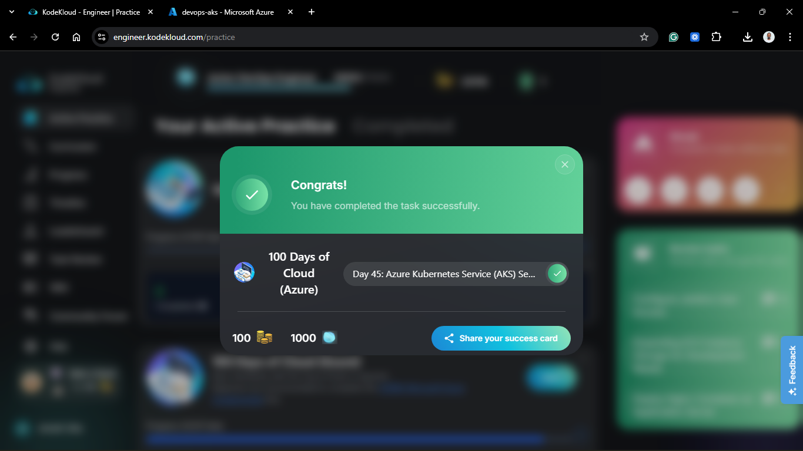
